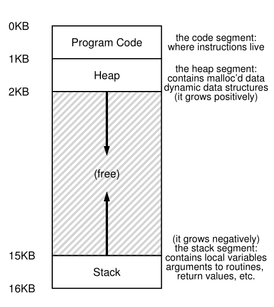

# Parte I &rarr; Virtualizacion

Temas:

* [Procesos](./Procesos.md)
* [API de procesos](./API-de-procesos.md)
* [Ejecucion directa limitada](./Ejecucion-directa.md)
* [Planificacion](./Planificacion.md)
* [Planificacion multinivel](./Planificador-multinivel.md)
* [La abstraccion del espacio de direcciones](#la-abstraccion-espacios-de-memoria): &larr; Usted esta aqui

  * [Primeros Sistemas](#primeros-sistemas)
  * [Tiempo compartido y multiprogramacion](#tiempo-compartido-y-multiprogramacion)
  * [Objetivos](#objetivos)

* [API de memoria](./API-memoria.md)
* [El mecanismo de traduccion de direcciones](./Traduccion-direcciones.md)
* [Segmentacion](./Segmentacion.md)
* [Administracion de espacio libre](./Espacio-libre.md)
* [Paginacion](./Paginacion.md)
* [TLBs](Virtualizacion-TBLs.md)
* [Archivo de intercambio, mecanismo y politica](Virtualizacion-Archivo-de-intercambio-mecanismos-politica.md)

Bibliografia: [OSTEP Cap - 13 The Abstraction: Address Spaces](https://pages.cs.wisc.edu/~remzi/OSTEP/vm-intro.pdf)

## La Abstraccion: Espacios de Memoria

&emsp;En las primeras epocas, contruir sistemas computacionales era facil. Te preguntaras, porque? Porque los usuarios no esperaban mucho. Son esos malditos usuarios con sus expectativas de "facilidad de uso", "alto rendimiento", "confiabilidad", etc., que han llevado todos esos dolores de cabeza. La proxima vez que te cruces con uno de esos usuarios agradeceles por todos los problemas que causaron. 

### Primeros Sistemas

&emsp;Desde la perspectiva de memoria, las primeras maquinas no proporsionaban mucha abstraccion a los usuarios. Basicamente, la memoria fisica de la maquina lucia como en la siguiente imagen. 

&emsp;Los OS eran un conjuto de rutinas (una librearia realmente) que se ubicaba en la memoria (empezando en la direccion fisica 0 en este ejemplo), y podia haber un programa (un proceso) en la memoria fisica (empezando por la direccion fisica 64k en este ejemplo) y usaba el resto de la memoria. Habia un par de ilusiones, y los usuarios no esperaban mucho del Os. La vida era facil para los desarrolladores. 

### Tiempo compartido y multiprogramacion

&emsp;Despues de un tiempo, dado que las maquinas eran caras, la gente empezo a compatir maquinas mas efectivamente. Por lo tanto la era de la multiporgramacion nacio, en la cual muchos procesos estaban listo para ejecutarse en un momento dado, y el OS debia cambiar entre ellos, por ejemplo cuando uno queria hacer una I/O. Hacer eso aumentaba la efectividad de la utilizacion de la CPU. Increamentar la efectividad era particularmente importante en eso dias donde cada maquina costa miles de cientos o incluso millos de dolares. 
&emsp;Sim embargo, muy pronto, la gente comenzo a demanr mas maquinas, y la era del tiempo compartido nacio. Especificamente, mucha gente se dio cuente de las limitacion de la computacion por lotes, particularmente los mismos programadores, quienes se cansaron de los largos e ineficientes ciclos para debuguear programas. La nocion de interactividad fue importante, como muchos usuarios usarian la maquina al mismo tiempo, cada uno esperaba una respuesta oportuna de sus tareas. 
&emsp;Una forma de implementar el tiempo compartido fue ejecutar un procesos por un corto periodo de tiempo, dandole acceso a toda la memoria, luego frenaba, guardaba todo su estado en alguna especie de disco, cargaba algun otro estado de proceso, lo ejecutaba por un tiempo, por lo tanto implementaba algun tipo de compartir tosco de la maquina. 
&emsp;Desafortunadamente este enfoque tiene un problema: es muy lento; particularmente a medida que crece la memoria. Mientras que guardar y recuperar estados de resgistor de nivel (PC, registros de propsito general, ect.) es relativamente rapido, guardar el contenido completo de la memoria al disco es muy lento. Por lo tanto, lo que hicieron fue dejar el proceso en la memoria mientras cambia entre ellos, permitiendole al OS implementar el tiempo compartido mas eficientemente. 

&emsp;En el diagrama hay 3 procesos (A, B, y C) el cualc ada uno de ellos tiene una parte chica de 512KB de la memoria fisica reservado para ellos. Suponiendo que tenemos un solo CPU, el OS elige ejecutar uno de esos procesos (diremos A), mientras los otros (B y C) estan en la cola de procesos listos, esperando a que los ejecuten. 
&emsp;Como el tiempo compartido paso a ser mas popular, como podras suponer, las demandas fueron puestas en el OS. En particular, permitir que multiples programas residan en la memoria concurrentemente hace de la proteccion un inconveniente importante; no quieres que un proceso sea capaz de leer, o peor, escribir algun otro proceso de la memoria. 

### El espacio de direcciones

&emsp;Sin embargo, tenemos que mantener esos malditos usuarios en mente, y hacerlo requiere que el OS cree una abstraccion facil de usar de la memoria fisica. Llamamos a esta abstraccion el **espacio de direcciones**, y es la vista del programa en ejecucion de la memoria en el sistema. Entender esta abstraccion de la memorio del OS es fundamental para entender como es virtualizada la memoria. 
&emsp;El espacio de direcciones de un proceso contiene todo el estado de memoria del programa en ejecucion. Por ejemplo, el codigo de un programa (las instrucciones) tiene que vivir en algun lugar de la memoria, y por lo tanto ellos estan en el espacio de direcciones. El programa, mientras se esta ejecutando, usa el **stack** para mantener seguimiendo de en donde se encuentra en la cadena de llamada a funciones, asi como tambien para asignar variables locales, pasar parametros y devolver valores para y de las rutinas. Finalmente, el **heap** es usado para asignasiones dinamicas, manejo de memoria del usuario, como las que deberias recibir de una llamada a *malloc()* in C o *new* en un languaje orientado a objetos como C++ o Java. Obviamente, hay mas cosas, como variables iniciadas estaticamente, pero por ahora asumamos solo esos tres componentes: code, stack y heap. 

&emsp;En el siguiente ejemplo, tenemos un espacio de direccion chico (solo 16KB). El codigo del programa vive en la parte superior del espacio de direcciones (comenzando desde 0 en este ejemplo, y es empaquetado en el 1K del espacio de direcciones). El codigo es estatico (y por lo tanto facil de ubicar en la memoria), entonces podemos ubicarlo en la parte superior del espacio de direcciones y saber que no necesitremos mas memoria mientras se ejecuta el programa. 
&emsp;Despues, tenemos dos regiones de espacio de direcciones que podrian crecer (y encogerse) mientras el programa se ejecuta. Estas estan en el heap (arriba) y en el stack (abajo). Las ubicamos de esa forma porque cada cual debe ser capaz de agrandarse, y poniendolas en los extremos opuestos del espacio de memoria, podemos permitir el crecimiento: solo tiene que expandirse en direcciones opuestas. Por lo tanto el heap empieza justo despues del codigo (en el KB 1) y crece hacia abajo (digamos cuando un usuario pide memoria via *malloc()*); el stack comienza en el KB 16 y crece hacia arriba (digamos cuando un usuario hace una llamda a un procedimiento). Sin embargo, esta forma de ubicar heap y stack es solo una convencion; tu podrias ordenar el espacio de direcciones de una forma diferente si lo deseas (como veremos mas adelante, cuando multiples *hilos* coexisten en un espacio de direcciones no es bueno divirdir el espacio de direcciones de esta forma) 

&emsp;Por supuesto, cunado describimos el espacio de direccionamiento, lo que estamos describiendo es la **abstraccion** que el OS proporsiona a los programas en ejecucion. Realmente el programa no esta en memoria en las direcciones fisicas de 0 hasta 16KB; mas bien es cargada en alguna direcciones fisicas arbitrarias. Examinando los procesos A, B y C de la imagen anterior podemos ver como cada proceso es cargado en la memoria en diferentes direcciones. Y aqui yace el problema: Como puede el OS construir de un espacio de direcciones privado y potencialmente largo multiples procesos en ejecucion (todos compartiendo memoria) en la cima de una sola memoria fisica? 
&emsp;Cuando el OS hace esto, decimos que el OS esta **virtualizando memoria**, porque el programa en ejecucion cree que esta cargado en la memoria en una direccion particular (digamos 0) y que tiene un espacio de direcciones potencialmente grande (digamos 32 o 64 bits); la realidad es un poco diferente. 

&emsp;Por ejemplo, cuando un proceso A intenta realizar una carga en la direccion 0 (la cual llamaremos **direccion virtual**), de alguna forma el OS, con ayuda de soporte del hardware, tendra que asegurarse de que la carga no vaya realmente a la direccion fisica 0 sino mas bien a la direccion fisica 320KB ([donde A esta cargado en memoria](#tiempo-compartido-y-multiprogramacion)). Esta es la clave para la virtualizacon de la memoria, la cual subyace en cada sistema de computacion moderno del mundo. 

### Objetivos

&emsp;El OS no solo virtualizara memoria, ademas; lo hara con estilo. Para asegurarnos, necesitamos algunos objetivos para guiarnos. Hemos visto estos objetivos antes, y los veremos de nuevo, pero es bueno repettirlos. 
&emsp;Uno de los mayores objetivos de un sitema de memoria virtual (VM) es la **transparencia**. El OS debe implementar la memoria virtual de una forma que sea invisible para los programas en ejecucion. Por lo tanto, el programa no podra ser conciente de la memoria esta virtualizada; mas bien, el programa se comporta como si fuera su propia memoria fisica privada. Detras de escena, el OS (y el hardware) hace todo el trabajo para multiplicar la memoria entre diferentes trabajos, y aqui se implementa la ilusion. 
&emsp;Otro objetivo de la Vm es la **eficiencia**. El OS debera luchar en hacer la virtualizacion lo mas eficiente posible, ambos en terminos de tiempo (es decir, no hacer que los programas se ejecuten mucho mas lento) y espacio (es decir, no usar demaciada memoria para estructuras necesarias para soportar la virtualizacion). En la implementacion de la virtualazion eficientemente con respecto al tiempo, el OS tendra que confiar en la ayuda del hardware, incluyendo las caracteristicas del hardware como el TLBs. 
&emsp;Finalmente, un tercer objetivo de la VM es la **proteccion**. El OS debera asegurase de **proteger** de otros procesos asi com tambien al mismo OS de otros procesos. Cuando un proceso hace una carga, un guardado, o una isntruccion de busqueda, no deberia afectar de ninguna forma al contenido de la memoria de otro proceso o del mismo OS. Por lo tanto la proteccion nos permite dar la propiedad de **aislamiento** entre procesos; cada proceso debe ejecutarse en su propio capullo aislado, seguro de procesos defectuoso o incluso maliciosos. 

[Anterior](./Planificador-multinivel.md) [Siguiente](./API-memoria.md)
