# Parte I &rarr; Virtualizacion

Temas:

* [Procesos](./Procesos.md)
* [API de procesos](./API-de-procesos.md)
* [Ejecucion directa limitada](./Ejecucion-directa.md)
* [Planificacion](./Planificacion.md)
* [Planificacion multinivel](./Planificador-multinivel.md)
* [La abstraccion del espacio de direcciones](./Espacio-direcciones.md)
* [API de memoria](./API-memoria.md)
* [El mecanismo de traduccion de direcciones](./Traduccion-direcciones.md)
* [Segmentacion](./Segmentacion.md)
* [Administracion de espacio libre](#administracion-del-espacio-libre): &larr; Usted esta aqui

  * [Suposiciones](#suposiciones)
  * [Mecanismos de bajo nivel](#mecanismos-de-bajo-nivel):

    * [Division y Fusion](#division-y-fusion)
    * [Rastreando el tamaño de las regiones asignadas](#rastreando-el-tamaño-de-las-regiones-asignadas)
    * [Embebiendo una **Free List**](#embembiendo-una-fee-list)
    * [Agrandando el heap](#agrandando-el-heap)

  * [Estrategias basicas](#estrategias-basicas):

    * [Best Fit](#best-fit)
    * [Worst Fist](#worst-fist)
    * [First Fit](#first-fit)
    * [Next Fit](#next-fit)
    * [Ejemplos](#ejemplos)

  * [Otros enfoques](#otros-enfoques):

    * [Listas separadas](#listas-separadas)
    * [Buddy Allocation](#buddy-allocation)
    * [Otras ideas](#otras-ideas)

* [Paginacion](./Paginacion.md)
* [TLBs](./TLBs.md)
* [Archivo de intercambio, mecanismo y politica](Virtualizacion-Archivo-de-intercambio-mecanismos-politica.md)

Bibliografia: [OSTEP Cap - 17 Free-Space Management](https://pages.cs.wisc.edu/~remzi/OSTEP/vm-freespace.pdf)

## Administracion del espacio libre

&emsp;En este capitulo, vamos a tomar un pequeño descando de nuestra discusion de virtualizacion de memoria para discutir un aspecto fundamentales de cualquier sistema de administracion de memoria, ya sea una libreria malloc o el mismo OS. Especificamente, discutiremos los problemas alrededor de la **administracion del espacio libre**.</br>
&emsp;Vamos a hacer el problema mas especifico. Administra espacio libre puede ser ciertamente facil, como veremos cuando discutamos sobre **paginacion**. Es facil cuando el espacio que administras es divido en unidades redimencionadas; en ese caso manten una lista de esas unidades redimencionadas y cuando un cliente pida por una de ella solo devuelve la primer entrada.</br>
&emsp;Cuando la administracion del espacio libre se vuelve mas dificil (e instersante) es cuando el espacio libre que estas administrando consiste de unidades de dimensiones variables; esto surge con una librearia de asignacion de memoria a nivel de usuario (como con *malloc()* y *free()*) y con un OS administrando memoria fisica cuando usan **segmentacion** para implementar memoria virtual. En cualquier caso, el problema que existe es conocido como **fragmentacion externa**: el espacio libre es cortado en pequeñas piezas de diferentes tamaños y por lo tanto fragmentadas; peticiones subsecuentes pueden fallar a casusa de no tener espacio libre contiguo que pueda satisfacer la peticion, inlcuso aunque la cantidad total de espacio libre exceda el tamaño de la peticion.</br>

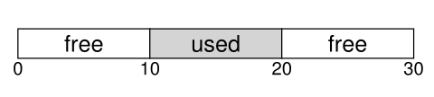

&emsp;La figura muestra un ejemplo de este problema. En este caso, el espacio total disponible es 20 bytes; desafortunadamente, esta fragmentado en dos chunks de 10 bytes cada uno. Como resultado, una peticion por 15 bytes fallara a pesar de que hay 20 bytes libres. Y aqui llegamos al problema tratado en este capitulo.</br>

### Suposiciones

&emsp;La mayor parte de la discucion estara centrada en el historial de asiganciones hechas en las librerias de asignacion de memoria a nivel de usuario.</br>
&emsp;Asumiremos una interfaz basica como la que proporsiona *malloc()* y *free()*. Especificamente *void \* malloc(size_t size)* toma un solo parametro, *size*, el cual es el numero de bytes pedidos por la aplicacion; y le llega un puntero a la region de ese tamaño. La rutina complementaria *void free(void \*ptr)* toma un puntero y libera el chunk correspondiente. Notar la implicacion de la interfaz: el usurario, cuando libera el espacio, no informa a la libreria del tamaño; por lo tanto; la libreria deber ser capaz de descubrir que tan grande es el chunk de memoria cuando solo le entregan un puntero. Descubriremos como lo hace mas adelante en este capitulo.</br>
&emsp;El espacio que esta libreria administra es conocido historicamente como *heap*, y la estructura de datos generica usada para administrar el espacio libre en el heap es algun tipo de **free list**. Esta estructura contiene referencias a todos los chunks libres del espacio de la region de memoria administrada. Obviamente, esta estructura de datos no necesita ser una lista per se, solo algun tipo de estructura de datos para rastrear el espacio libre.</br>
&emsp;Tambien asumimos que nos vamos a centrar en la **fragmentacion externa**, comod escribimos arriba. Los asignadores por supuesto tambien tienen problemas de **fragmentacion interna**; si un asignador recibe chubks de memoria mas grandes de los que pidio, tal espacio es considerado **fragmentacion interna** y es otro ejemplo de espacio desperdiciado. Sin embargo, por motivos de simplicidad, y porque es el tipo de fragmentacion mas interesante de los dos, solo nos vamos a centrar en la fragmentacion externa.</br>
&emsp;Tambien supondremos que una vez que la memoria es entrega a un cliente no puede ser reubicada en otra ubicacion de la memoria. Por ejemplo, si un programa llama a *malloc()* y le entregan un puntero a algun espacio en el heap, esa region de la memoria es esencialmente "propiedad" del programa (y no puede ser movida por la libreria) hasta que el programa la devuelva a traves de la correspodiente llamada a *free()*. Por lo tanto, no compactaremos el espacio libre si es posible, lo cual debera ser util para combatir la fragmentacion. La compactacion deberia, sin embargo, ser usada en el OS para tratar con la fragmentacion cuando implementa **segmentacion**.</br>
&emsp;Finalmente, supondremos que el asignador administra una region contigua de bytes. En algunos casos, un asignador podria requerir que una region crezca; por ejemplo, una libreria de asignacion de memoria a nivel de usuario podira llamar dentro del kernel para agrandar el hep. Sin embargo, por simplicidad, supondremos que la region es de un solo tamaño en toda su vida.</br>

### Mecanismos de bajo nivel

&emsp;Antes de profundizar en algunos detalles de las politicas, vamos a cubrir algunos mecanismos comunes usados en muchos asignadores. Primero, discutiremos una lista simple dentro del espacio libre para rastrear que esta libre y que no.</br>

#### Division y Fusion

&emsp;Una free list contiene un conjunto de elementos que describen el espacio libre que todavia queda en el heap. Por lo tanto, asumiremos el siguiente heap de 30 bytes: </br>

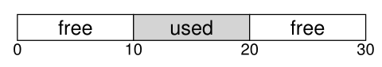

&emsp;La free list para este heap deberia tener dos elementos. Una entrada describe el primer segmento de 10 bytes (bytes 0-9), y otra entrada describe el otro segmento libre (bytes 20-29).</br>

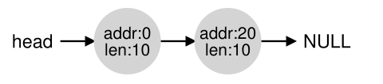

&emsp;Como describimos arriba, una peticion por cualquier cosa mas grande de 10 bytes fallara y retornara NULL; no hay un unico chunk contiguo de memoria disponilble de este tamaño. Una peticion para exactamente 10 bytes se podria satisfacer facilmente por cualquira de los chunks libres. Pero que pasa si la peticion es por algo *mas chico* de 10 bytes.</br>
&emsp;Supongamos que tenemos una peticion de un solo byte de memoria. En este caso, el asignador hara una accion conocida como **division**: encontrara un chunk libre de memoria que pueda satisfacer la peticion y lo dividira en dos. El primer chunk lo retornara al que hizo la peticion; y el segundo permanecera en la lista. Por lo tanto, en nuestro ejemplo de arriba, si se hace una peticion por un byte, y el asignador decide usar el segundo de los dos elementos de la lista para satisfacer la peticion, la llamada a malloc() retornara 20 (la direccion de la region asiganda de 1 byte) y la lista quedara algo asi:</br>

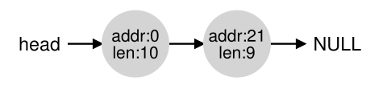

&emsp;En la imagen, puedes ver que basicamente la lista se mantuvo intacta; el unico cambio es que la region libre ahora comienza en 21 en vez de 20, y el largo de esa region ahora es 9. Por lo tanto, la division es comunmente usada en los asignadores cuando una peticion es menor que el tamaño de algun chunk libre en particular.</br>
&emsp;Un mecanismo adicional encontrado en muchos asignadores es conocido como **fusion** del espacio libre. Tomemos nuestro ejemplo de arriba una vez mas (10 bytes libres, 10 bytes usados, y otros 10 bytes libres).</br>
&emsp;Dado este (diminuto) heap, que sucede cuando una aplicacion llama a free(10), y por lo tanto retorna el espacio en el medio del heap? Si simplemento lo sumamos al espacio libre de nuevo a nuestra lista sin pensar mucho, terminaremos con una lista como esta:</br>

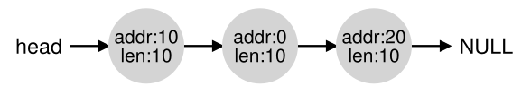

&emsp;El problema: a pesar de que el heap entero esta libre, parece estar dividio en tres chunks de 10 bytes cada uno. Por lo tanto, si un usuario hace una peticion de 20 bytes, no encontrara un chunk libre de esas caracteristicas, y fallara.</br>
&emsp;Lo que hacen los asignadores para evitar este probmea es fusionar el espacio libre cuando un chunk de memoria el liberado. La idea es simple: cuando retorna un chunk liberado en memoria, mira cuidadosamente que esta retornando y a las chunk libres cercanos; si el nuevo espacio libre esta al lado de un (o dos en este ejemplo) chunk libre, los ordena en un solo chunk mas grande. Por lo tanto, con la fusion, nuestra lista final seria asi:</br>

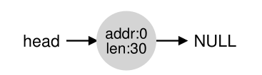

&emsp;Por su puesto, asi es como se ve el heap al inicio, antes de que se haga cualquier asignacion. Con la fusion, un asignador puede tener la certeza que grandes extensiones libres estan disponibles para la aplicacion.</br>

### Rastreando el tamaño de las regiones asignadas

&emsp;Debes haber notado que la interfaz para *free(void \*ptr)* no toma por parametro un tamaño; por lo tanto es asumido por le puntero dado, la libreria malloc puede determinar rapidamente la dimension de la region de memoria a liberar y puede incorporar de vuelta en la lista libre.</br>
&emsp;Para completar esta tarea, muchos asignadores guardan un poco de informacion extra en el encabezado del bloque el cual mantiene en la memoria, usualmente justo antes de devolver el chunk de memoria. Veamos un ejemplo de nuevo:</br>

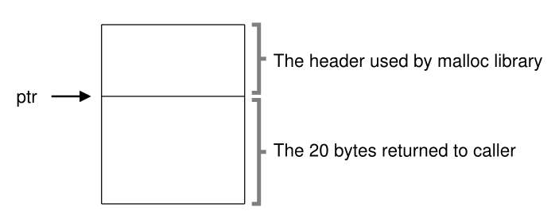

&emsp;En este ejemplo estamos examinando un bluque asignado de 20 bytes, aputnado por *ptr*; imagina que el usuario llamo a *malloc()* y guardo el resultado en *ptr*, es decir, *ptr = malloc(20)*.</br>
&emsp;El header como minimo contiene el tamaño de la region asignada (en este caso 20); y tambien debe contener punteros adicionales para acelerar la desasignacion, un numero magico para proposionar verificacion de integridad adicional, y otra informacion. Asumamos un encabezado simple el cual contiene el tamaño de la region y un numero magico, como este:</br>

```c
typedef struct{
  int size;
  int magic;
} header_t;
```

&emsp;El ejemplo de arriba podria verse algo asi:</br>

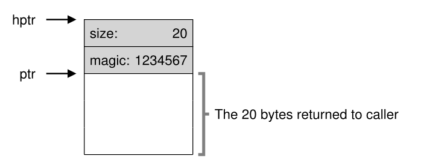

&emsp;Cuando el usuaria llama a *free(ptr)*, la libreria usa un puntero aritmetico simple para descubrir donde comienza el encabezado:</br>

```c
void free(ptr){
  header_t *hptr = (header_t *) ptr-1;
  ...
  }
```

&emsp;Despues de obtener dicho puntero al encabezado, la libreria puede determinar facilmente si el numero magico coincide con el valor esperado (*assert(htpr->magic) == 1234567*) y calcular el tamaño total de la region recien liberada a por medio de la matemacica (es decir, sumando el tamaño del encabezado al tamaño de la region). notar el pequeño pero critico detalle de la ultima oracion: el tamaño de la region libre es el tamaño del encabezado mas el tamaño del espacio asignado al usuario. Por lo tanto, cuando un usuario pide N bytes de memorio, la libreria no busca un chunk libre de tamaño Nñ sino, busca un chun libre de tamaño N mas el tamaño del encabezado.</br>

#### Embembiendo una **Fee List**

&emsp;Hasta aca hemos tratado a nuestra free list simple como una entidad conceptual; es solo una lista que describe los chunk libres de la memoria en el heap. Pero como construimos dicha lista dentro del mismo espacio libre?</br>
&emsp;En una lista mas tipica, cuando asignamos un nuevo nodo, solo llamamos a *malloc()* cuando necesitamos espacio para el nodo. Desafortunadamente, en la libreria de asignacion de memoria, no puedes hacer esto! En cambio, necesitas construir la lista *dentro* del mismo espacio libre. No te preocupes si suena un poco raro; lo es, pero no tan raro como para que no puedas hacerlo.</br>
&emsp;Asusamos que tenemos un chunk de memoria de 4096 bytes para administrar (es decir, el heap es de 4KB). Para administrar esta free list, primero tenemos que inicializar dicha lista; inicialmente, la lista deberia hacer una entrada, de tamaño 4096 (menos el tamaño del encabezado). Aca esta la descripcion de un nodo de la lista:</br>

```c
typedef struct __node_t {
  int size;
  struct ___note_t * next;
} node_t;
```

&emsp;Ahora vemos algo del codigo que inicializa el heap y pone el primer elemento de la free list dentro de este espacio. Estamos asumiendo que el heap es construido dentro de algun espacio libre adquirido via una llamada a la system call *mmap()*; esta no es la unica forma para construir dicho heap pero nos sirve en este ejemplo. Aqui esta el codigo:</br>

```c
// mmap() returns a pointer to a chunk of free space
node_t *head = mmap(NULL, 4096, PORT_READ|PORT_WRITE,
                    MAP_ANON|MAP_PRIVATE, -1, 0);
head->size = 4096 - sizeof(t);
head->next = NULL;
```

&emsp;Despues de ejecutar este codigo, el estado de la lista es que tiene una sola entrada, de tamaño 4088. Si, es un hep pequeño, pero es un buen ejemplo para nosotros. El puntero *head* conteine el incio de la direccion de este rango; vamos a asumir que es 16KB. Visualmente, el heap luciria asi:</br>

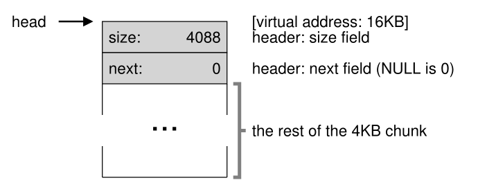

&emsp;Ahora imaginemos que un chunk de memoria es pedido, diagmos de tamaño de 100 bytes. Para cumplir con esta peticion, la libreria primero encontrara una chunk del largo suficiente para acomodar la peticion; dado que es hay un solo chunk libre (tamaño: 4088), elegira este chunk. Entonces, el chunk sera **dividido** en dos: un chunk suficientemente grande par servir a la peticion (mas el encabezado), y el resto como chunk libre. Asumamos un encabezado de 8 bytes, el espacio en el heap ahora se veria asi:</br>

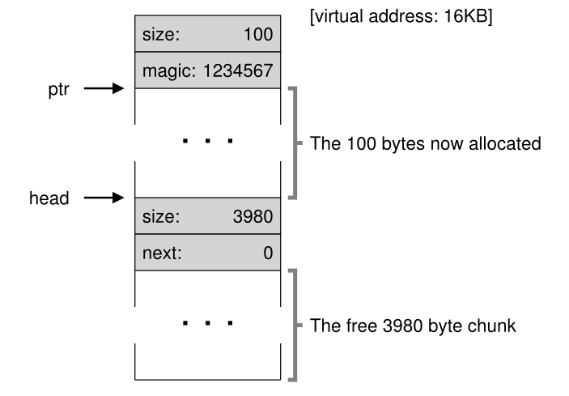

&emsp;Por lo tanto, por la peticion de 100 bytes, la libreria asignara 108 bytes del existente chunk libre, retornara un puntero al el, escondera la informacion del encabezado inmediatamente antes de la asignacion de espacio para el futuro uso de *free()*, y reducira el unico nodo libre en la lista a 3980 bytes (4088 -108).</br>
&emsp;Ahora vemoa al heap cuando tiene asiganadas tres regiones, cada una de 100 bytes (108 incluyendo el encabezado):</br>

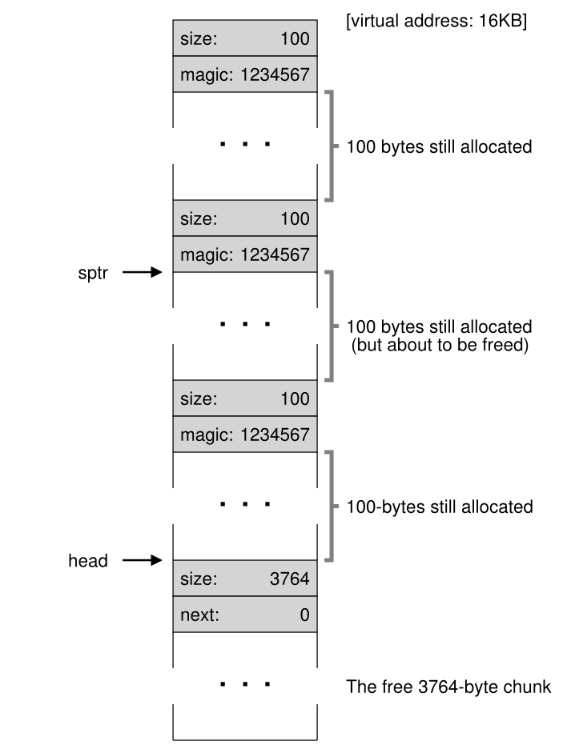

&emsp;Como ver ver ahi, los primero 324 bytes del heap ahora estan asignados, y se pueden ver tres encabezados en ese espacio. La free list sigue siendo poco interesante: un solo node (siendo apuntado por *head*), pero ahora solo tiene 3764 bytes de tamaño despues de las tres divisiones. Pero que sucede si el programa devuelve algo de memoria usando *free()*?</br>
&emsp;En este ejemplo, la aplicacion devuelve medio chunk de memoria asignada, llamadno a *free(16500)* (se llega al valor 16500 sumando el inicia de la region de memoria, 16384, a los 108 del chunk anterior y los 8 bytes del encabezado de ese chunk). Este valor esta aputnado por *sptr* en le diagrama anterior.</br>
&emsp;La libreria inmediatamente se da cuenta del tamaño de la region libre, y entonces agrega el chunk libre de nuevo en la free list. Asumiendo que insertamos en el head de la free list, el espacio ahora luciria asi:</br>

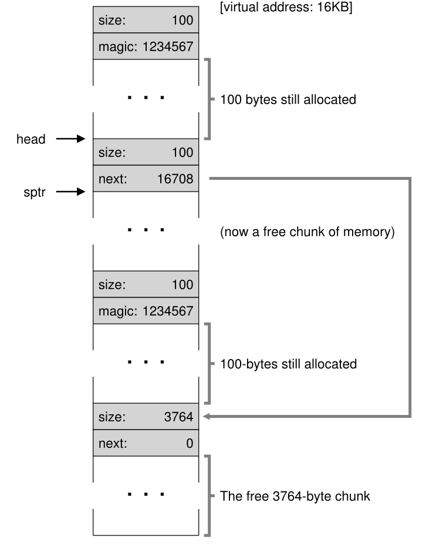

&emsp;Ahora tenemos una lista que empieza con un chunk libre pequeño (100 bytes apuntados por el head de la lista) y un chunk libre grande (3764 bytes). NUestra lista finalmente tiene mas de un elemento. Y si, el espacio libre es fragmentado, una desafortuanada pero comun ocurrencia.</br>
&emsp;Un ultimo ejemplo: asumamos ahora que los ultimos dos chunk que estan en uso son liberados. Sin fusion, terminarios con fragmentacion:</br>

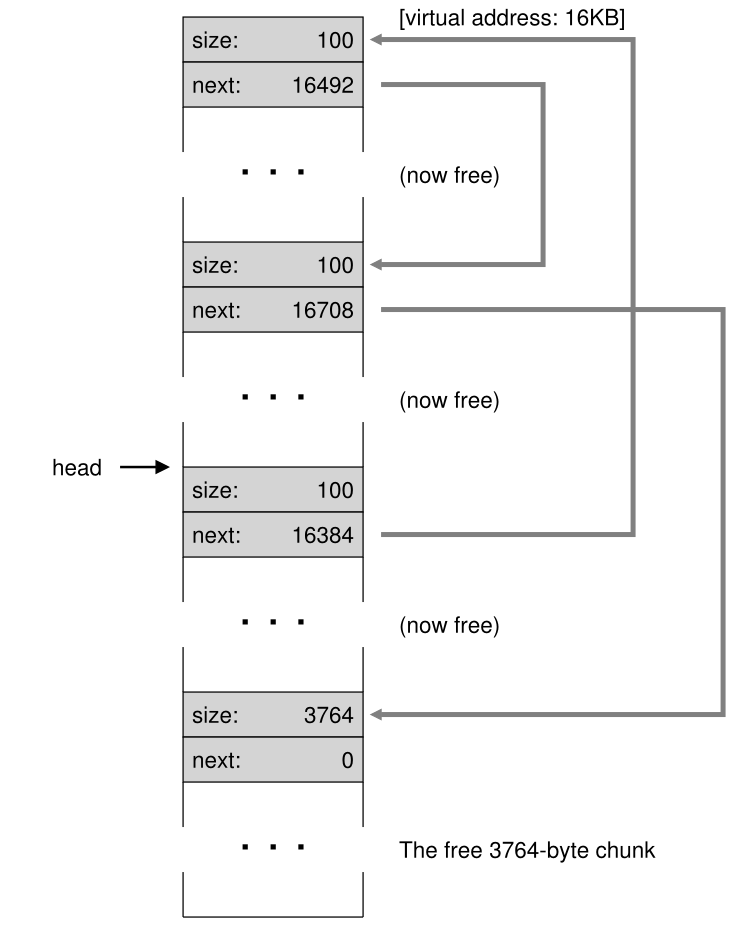

&emsp;Como se puede ver en la imagen, tenemos un gran desorden! Porque? Simple, olvidamos **fusionar** la lista. A pesar de que toda la memoria esta libre, esta cortado en piezas, por lo tanto aparenta ser una memoria fraccionada y no una sola. La solucion es simple: vamos a traves de la lista y **ordenamos** los chunks vecinos; cuando terminemos, el heap estara completo otra vez.</br>

#### Agrandando el heap

&emsp;Deberiamos discutir un ultimo mecanismo entontrado dentro de cualquier libreria de asignacion. Especificamente, que debriamos hacer si el heap no alcanza para el espacio?El enfoque mas simple esta por fallar. En algunos casos es la unica opcion, y por lo tanto retornar NULL es un enfoque honorable. No te sientas mal! Lo intentaste, y aunque fallaste, diste una buena pelea.</br>
&emsp;Los asignadores mas traducionles inician con un heap chico y piden mas memoria el OS cuando la necesitan. Tipicamente, esto significa que hacen algun tipo de system call (ej, *sbrk* en muchos sistemas UNIX) para agrandar el heap, y entonces asignar los nuevos chunk ahi. Para satisfacer la peticion *sbrk*, el OS encuentra paginas fisicas libres en el espacio de direcciones del proceso que hizo la peticion, y entonces retorna el valor del final del nuevo heap; en este punto, un heap mas grande esta disponible, y la peticion puede ser atendida satisfactoriamente.</br>

### Estrategias basicas

&emsp;Ahora que tenemos algo de maquinaria, veamos algunas estrategias basicas para administrar espacio libre. Estos enfoques estan comenmente basados en politicas simples que puedes pensar por ti mismo.</br>
&emsp;El asignador ideal es rapido y minimiza la fragmentacion. Desafortunadamente, dado que la cadana de asignacion y libreaciones puede ser arbitraria, cualquier estrategia particular puede ser un poco mala dado una mala sucesion de entradas. Por lo tanto, no describiremos la "mejor" estrategia, pero hablaremos de algunos enfoques basicos y discutiremos sus ventajas y desventajas.</br>

#### Best Fit

&emsp;La estrategia **Best Fit** es simple: primero, buscamos a traves de la free list y contramos chunks de memoria libre que sean igual o mas grande que el tamaño pedido. Entonces, retornamos el mas chico de ese grupo de candidatos; este chunk es llamado el chunk **best fit**. Un recorrido a traves de la lista es suficiente para encontrar el bloque adecuado para retornar.</br>
&emsp;La intuicion detras de este enfoque es simple: retornar un bloque que este proximo a lo que el usario pide, best fit intenta reducir el espacio desperdiciado. Sin embargo, a un costo, las implementacion ingenuas para un alto costo de desempeño cuando hacen una busqueda exhaustiva para entonctrar el bloque libre correcto.</br>

#### Worst Fist

&emsp;El enfoque **worst fit** es lo opuesto a best fit; encuentra el chunk mas grande y devuelve la cantidad solicitada; mantiene el resto del chunk en la free list. Worst fit intenta dejar grandes chunks libres en vez de muchos chunks chicos. Otra vez, sim embargo, una busqueda completa del espacio libre es requerida, y por lo tanto este enfoque puede ser costoso. Peor aun, muchos estudios muestras que este enfoque de desempaña peor, dejando exceso de fragmentacion y aun teniendo muchos costos.</br>

#### First Fit

&emsp;El metodo **first fit** simplemente encuentra el primero bloque de memoria que sea suficientemente grande retorna la cantidad pedida al usuario. Como antes, el resto del espacio libre lo matiene en la free list para futuras peticiones.</br>
&emsp;First fit tiene la ventaja de la velocidad pero a veces contamina el inicio de la free list con obtejos pequeños. Por lo tanto, como el asignador administra el orden de la free list puede ser un problema. Un enfoque es usar **orden basado en las direcciones**; manteniendo la lista ordenada por las direccion del espacio libre, fusionar pasa a ser mas facil, y se tiende a reducir la fragmentacion.</br>

#### Next Fit

&emsp;En vez de siempre empezar el first-fit por el inicio de la lista, el algoritmos **next fit** mantiene un puntero extra a la ubicacion en la lista donde busco la ultima vez. La idea es expandir la busqueda de espacio libre a traves de la lista mas uniformemente, por lo tanto evitando divir la lista al inicio. El desempeño de este enfoque es muy similar a first fit, una vez mas se evita la busqueda exhaustiva.</br>

#### Ejemplos

&emsp;Aqui hay algunos ejemplos de las estrageias de arriba. Visualiza una free list con tres elementos, de tamaños 10, 30, y 20 (ignoraremos los encabezados y otros detalles, solo nos centraremos en como funcionan las estrategias):</br>


&emsp;Asumamos una peticion de asignacion de tamaño 15. Un enfoque best-fit buscaria en la lista entera y encontraria que 20 es el best fit, porque es el menor espacio libre que puede servir para la peticion. El resultado de la free list:</br>

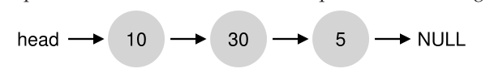

&emsp;Como sucede en este ejemplo, y como sucede a menudo con el enfoque best-fit, queda un chunk libre pequeño. Un enfoque worst-fit es similar pero encambio busca el chunk mas grande, en este ejemplo 30. La lista resultante:</br>


&emsp;La estrategia first-fit, en este ejemplo, hace lo mismo que wors-fit, encontrar el primer bloque libre tambien puede satisfacer la peticion. La diferencia es en el costo de la busqueda.</br>
&emsp;Estes ejemplos solo rascan la superficie de las politicas de asignacion. Analisis mas vanzados don cargas de trabajo reales y asignadores con comprtamientos mas complejos requieren un conocimiento mas profundo.</br>

### Otros enfoques

&emsp;Detras de los enfoques basicos descriptos antes, hay un ejercito de tecnicas y algoritmos sugeridos y para mejorar la asignacion de memoria de alguna forma. Listamos algunos de ellos para tu consideracion.</br>

#### Listas separadas

&emsp;UN enfoque interesante que ha estado rondando por algun tiempo es el uso de **listas separadas**. Esta idea basica es simple: si una aplicaion particular tiene una (o varias) peticiones de tamaños populares, mantener una lista separada solo para administrar objetos de ese tamaño; todas las otras peticiones se reenvian a un asignador de memoria mas general.</br>
&emsp;Los beneficios de ese enfoque son obvio. Tener un chunk de memoria dedicado a peticiones de un tamaño particular, la fragmentacion es una preocupacion menos; ademas, las peticiones de asignacion y liberacion pueden ser tratadas mas rapidamente cunado tienen el tamaño adecuado, ya que no se requiere una busqueda complicada de una lista.</br>
&emsp;Justo como cualquier buena idea, este enfoque tambien introduce comliaciones al sistema. Por ejemplo, cuanta memoria le podemos dedicar al grupo de memoria que sirve a peticiones especializadas de un tamaño dado, a diferencia del grupo general? Un asignador particular, el **slab allocator** maneja este problema de una buena forma.</br>
&emsp;Especificamente, cuando el kernel inicia, asigna un numero de **object caches** para el kernel que probablemente seran pedidos frecuentemente; el object caches son free list separadas de un tamaño dado que sirven a las peticiones de asignacion y liberacion de memoria rapidamente. Cuando un cache determinado se esta quedando sin memoria, pide algunos **slabs** de memoria al asignador de memoria general (la cantidad de memoria total pedida es un multiplo del tamaño y el objeto en cuestion). Por el contrario, cuanto el conteo de referencia de los objetos dentro de un **slab** dado llegan a cero, el asignador general puede reuperarlos del asignador especializado, lo que a menudo se hace cuando el sistema de VM necesita mas memoria.</br>
&emsp;El asignador **slab** va mas alla del enfoque de listas separadas manteniendo los objetos libres en la lista en un estado pre-inicializado. Bonvwick muestra que la inicializacion y destruccion  de estructuras de datos es costoso; manteniendo los objetos libres en una lista particular en su estado inicializado, el asignador slab puede evitar inicilizaciones frecuentes y ciclos de destruccion por objeto y por lo tanto bajo los costos notablemente.</br>

#### Buddy Allocation

&emsp;Dado que la fusion es cretitica para un asignador, algunos enfoques han sido disiñados haciendo fusion simple. Un buen ejemplo es encontrado en el **binary buddy allocator**.</br>
&emsp;En dicho sistema, la memoria libre primero es pensado como un gran espacio de tamaño $2^N$. Cuando se hace una peticion de memoria, la busqueda de espacio libre recursivamente divide el espacio libre en dos hasta que encuentra un bloque lo suficientemente grande para acomodar la peticion. En este punto, el bloque pedido es retornado al usuario. UN ejemplo de un espacio libre siendo dividido en la busqueda de un blque de 7KB:</br>


&emsp;En el ejemplo, el bloque de 8KB mas a la izquierda es asignado (como lo indica la sombre gris oscura) y retornado al usuario; notar que este esquema puede sufrir de **fragmentacion interna**, dado que solo puede dar bloques de tamaño multiplo de potencias de dos.</br>
&emsp;Lo lindo de **buddy allocation** en contrar que sucede cuando un bloque es liberado. Cuando devuelve el bloque de 8KB a la free list, el asignador verifica si el "buddy (vecino? compañero?)" de 8KB esta libre; si lo esta, los fusiona en un bloque de 16KB. Entonces, el asignador comprueba si el vecino del bloque de 16KB esta libre; si lo esta, los fusiona. Esta fusion recursiva continua por el arbol, hasta que restaura todo el espacio libre o parando cuando un vecino esta en uso.</br>
&emsp;La razon por la que **buddy allocation** funciona tan bien es que es simple determinar el vecino de un bloque en aprticular. Como, te preguntas? Piensa en las direcciones de los bloques en el espacio libre de arriba. Si sos suficientemente cuidadoso, veras que la direccion de cada par de vecinos difiere en un solo bit, el cual es determinado por el nivel en el arbol de veninos. Y por lo tanto tiene una idea basica de como funciona el esquema binary buddy allocation.</br>

#### Otras ideas

&emsp;Un problema mayor con muchos de los enfoques descriptos arriba es su falta de **escalabilidad**. Especificamente, buscar en listas puede ser muy lento. Por lo tanto, asignadores mas anvazados usan estructuras de datos mas complejas para direccionar estos costos, cambiando simplicidad por eficiencia. Algunos ejemplos son arboles binarios balanceados, splay trees, o arboles parcialemente ordenados.</br>
&emsp;Dado que los sitemas modernos a menudo tiene multiples procesadores y ejecutan cargas de trabajo multihilo, no sorprende que muchos de los esfuerzos han sido centrados en que los asginadores funciones bien en sistemas basados en multiprecesadores.</br>

[Anterior](./Segmentacion.md) [Siguiente](./Paginacion.md)
