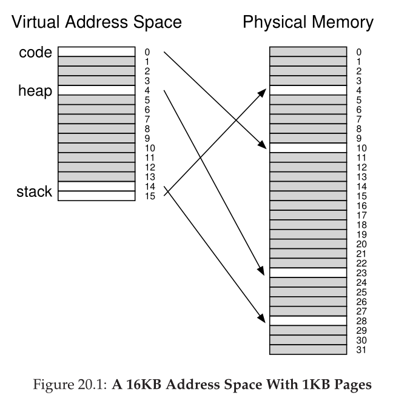
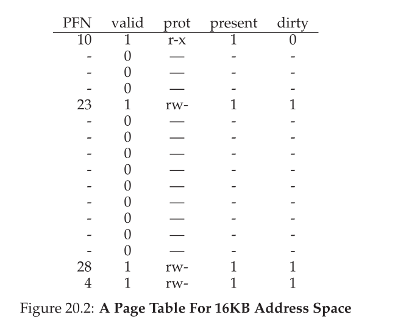
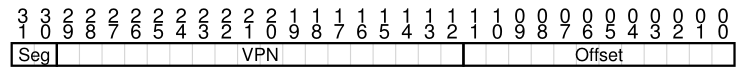
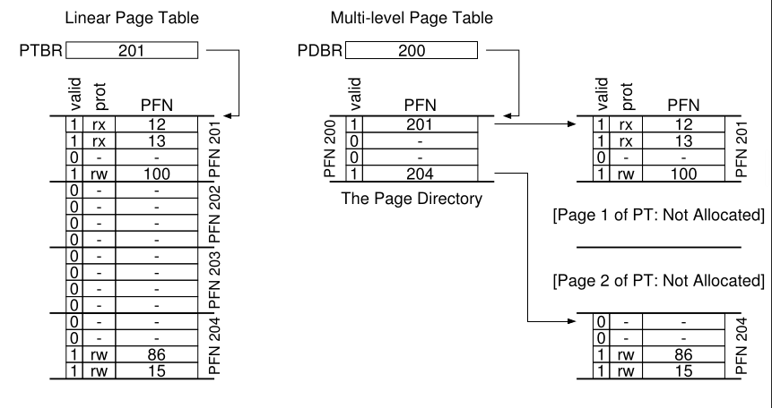
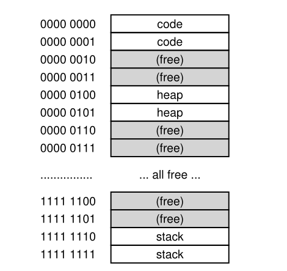
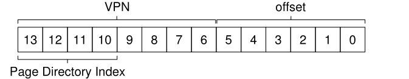
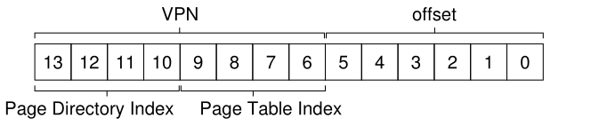
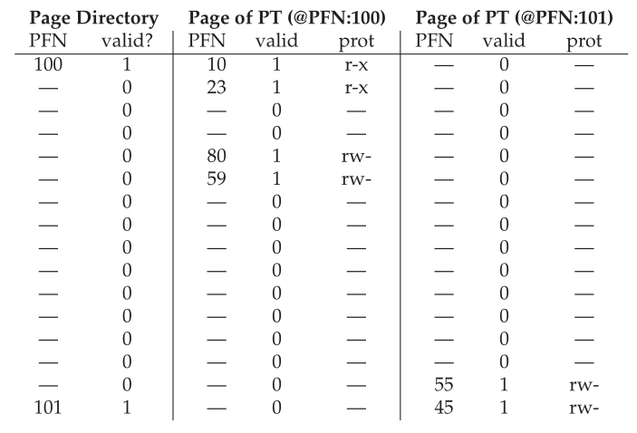
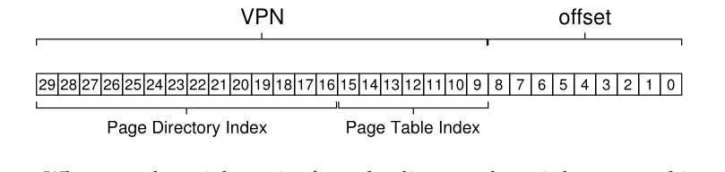
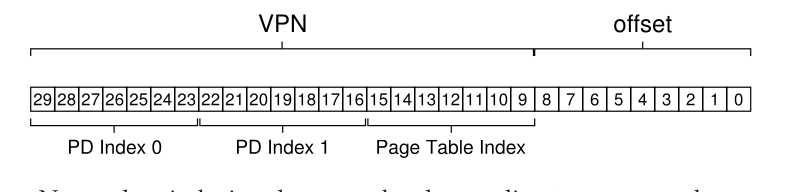

# Parte I &rarr; Virtualizacion

Temas:

* [Procesos](./Procesos.md)
* [API de procesos](./API-de-procesos.md)
* [Ejecucion directa limitada](./Ejecucion-directa.md)
* [Planificacion](./Planificacion.md)
* [Planificacion multinivel](./Planificador-multinivel.md)
* [La abstraccion del espacio de direcciones](./Espacio-direcciones.md)
* [API de memoria](./API-memoria.md)
* [El mecanismo de traduccion de direcciones](./Traduccion-direcciones.md)
* [Segmentacion](./Segmentacion.md)
* [Administracion de espacio libre](./Espacio-libre.md)
* [Paginacion](./Paginacion.md)
* [TLBs](./TLBs.md)
* [Paginacion multinivel](#paginación-tablas-más-chicas): &larr; Usted esta aqui

  * [Solución simple: Páginas más grandes](#solución-simple-páginas-más-grandes)
  * [Enfoque híbrido: Páginas y segmentos](#enfoque-híbrido-páginas-y-segmentos)
  * [Page Tables Multinivel](#page-tables-multinivel)
  * [Un ejemplo detallado de Multinivel](#un-ejemplo-detallado-de-multinivel)
  * [Más de dos niveles](#más-de-dos-niveles)
  * [Page tables invertidas](#page-tables-invertidas)
  * [Cambiando la page table al disco](#cambiando-la-page-table-al-disco)

Bibliografia: [OSTEP Cap - 20 Paging: Smaller Tables](https://pages.cs.wisc.edu/~remzi/OSTEP/vm-smalltables.pdf)

## Paginación: Tablas más chicas

&emsp;Ahora vamos a abordar el segundo problema que introduce la paginacón: las page tables son demasiado grandes y consumen demasiada memoria. Comencemos con una page table lineal. Como podrás recordar, las page tables lineales son muy grandes. Asumamos un espacio de direcciones de 32 bits ($2^{32}$ bytes), con páginas de 4KB ($2^{12}$ bytes) y entradas de la page table de 4 bytes. Un espacio de direcciones tiene aproximadamente un millón de paginas virtuales ($\frac{2^{32}}{2^{12}}$)</br>

### Solución simple: Páginas más grandes

&emsp;Podemos reducir el tamaño de la page table de una forma simple: usar páginas más grandes. Tomamos de nuevo nuestro espacio de direcciones de 32 bits, pero esta vez usamos páginas de 16KB. Por lo tanto deberíamos tener VPN de 18 bits más un offset de 14 bits. Asumiendo el mismo tamaño para cada PTE (4 bytes), ahora tenemos $2^{18}$ entradas en nuestra page table lineal y por lo tanto un tamaño total de 1MB por page table, un factor de reducción de 4 en la page table (la reduccion es un espejo del factor de 4 de incremento en el tamaño de página).</br>
&emsp;El mayor problema con este enfoque es que las páginas grandes llevan a un desperdicio en cada página, un problema conocido como **fragmentación interna**. Por lo tanto las aplicaciones terminan pidiendo y teniendo páginas pocos bits y piezas de cada una. Por lot anto, muchos sistemas usan tamaños de páginas relativamente chicos (4 u 8 KB).</br>

### Enfoque híbrido: Páginas y segmentos

&emsp;Hace años, al creador de Multics se le ocuriió una idea en la construccion del sistema de memoria virtual de Multics. Específicamente, tuvo la idea de combinar paginacón y segmentación para reducir el gasto de memoria de las pag tables. Podemos ver porqué esto fucniona examinando una page table lineal. Asumamos que tenemos un espacio de direcciones en el cual las porciones de heap y stack usadas son chicas. Por ejemplo, usamos un espacio de direcciones de 16KB con 1KB de páginas:</br>



&emsp;La page table para este espacio de direcciones:</br>



&emsp;Este ejemplo asume que la única página de código (VPN 0) esta mapeada a la página física 10, el heap de una sola página (VPN 4) a la página física 23, y el stack de dos páginas en el otro extremos del espacio de direcciones (VPNs 14 y 15) estan mapeados a la página física 28 y 4 respectivamente. Como se puede ver en la imágen, gran parte de la page table está sin usar, llena de entradas inválidas.</br>
&emsp;Por lo tanto, nuestro enfoque híbrido: en vez de tener una sola page table para el espacio de direcciones entero del proceso, porqué no tener una por cada segmento lógico? En este ejemplo, podríamos tener tres page tables, una para el código, otra para el stack y otra para el heap.</br>
&emsp;Ahora, recordemos que con segmentación tenemos un registro base que donde dice donde vive cada segmento en la memoría física, y un registro límite que nos dice el tamaño de cada segmento. En nuestro enfoque híbrido, todavía tenemos esas estructuras en la MMU; aca, no usamos la base para apuntar al segmento en si pero si para mantener el *espacio de direcciones del la page table* de cada segmento. Los registro límite es usado para indicar el final de la page table (es decir, cuántas páginas validas tiene).</br>
&emsp;Hagamos un ejemplo para clarificar. ASumamos un espacio de direcciones virtuales de 32 bits con $Kb de páginas, y un espacio de direccion dividido en cuatro segmentos. Solo usaremos tres segmentos para este ejemplo, code, heap, stack.</br>
&emsp;Para determinar a qué segmento se refiere una dirección usaremos los primeros dos bits del espacio de direcciones. Asumamos que el 00 el segmento sin usar, el 01 para el código, el 10 para el heap, y el 11 para el stack. Por lo tanto, una dirección virtual luciría algo asi:</br>



&emsp;Asumamos que en el hardware hay tres pares de base/límite una para cada una de las partes, code, heap, stack. Cuando un proceso se está ejecutando, el registro base de cada uno de esos segmentos contiene la dirección física de una page table linealpara cada segmento; por lo tanto, cada preceso en el sistema ahora tiene tres page tables asocidadas. En un cambio de contexto, estos registros deben ser cambiados para reflejar la unicación de las page tables de nuevo proceso.</br>
&emsp;En un TLB miss (hardware-managed TLB), el hardware usa los bits de segmento (SN) para determinar que par base/limite usar. Entonces el hardware toma la dirección física de ahi y la combina con el VPN para formar la dirección de la entrada de la page table (PTE):</br>

```assembly
SN              = (VirtualAddress & SEG_MASK) >> SN_SHIFFT
VPN             = (VirtualAddress & VPN_MASK) >> VPN_SHIFFT
AddressOfPTE    = Base[SN] + (VPN * sizeof(PTE))
```

&emsp;Esta secuancia te debería resultar familiar; es virtualmente idéntica a la que vimos antes con las page tables lineales. La única diferencia es el uso de uno de los registros base de tres segmentos en lugar del registro base de la page table.</br>
&emsp;La diferencia crítica en nuestro esquema híbrido es la presencia de un registro límite por segmento; cada registro límite mantiene el valor de la máxima página válida en el segmento. Por ejemplo, si el segmento del código está usando las primeras tres páginas (0,1,2), la page table del segmento del código tendrá solo tres entradas y el registro límite será seteado en 3; los accesos a memoria mas allá del final del segmento generarán una excepción y probablemente conducirá a la terminación del proceso. De esta manera, nuestro enfoque híbrido ahorra mucha memoria comparado con la page table lineal.</br>
&emsp;Sin embargo, como habrás notado, este enfroque no está libre de problemas. Primero, todavia requiera el uso de segmentación; y como discutimos antes, las segmentación no es tan flexible como nos gustaría, ya que asume un patrón de uso del espacio de direcciones; si tenemos un heap grande pero poco usado, aún podemos terminar con una gran cantidad de desperdicio de page table. En segundo lugar, es enfoque de nuevo causa fragmentación externa. Mientras mucha de la memoria es manejada en unidades de tamaños de página, las page tables ahora pueden ser de tamaño arbitrario (en múltiplos de PTEs). Por lo tanto, encontrar espacio libre para ellas es complicado. Por estas razones, la gente continuó buscando mejores formas de implementar page tables más chicas.</br>

### Page Tables Multinivel

&emsp;Un enfoque diferente no depende de la segmentación pero ataca el mismo problema: como deshacerse de todas esas regiones inválidad en la page table en vez de mantenerlas en la memoria? A este enfoque lo llamamos **Page Table Multinivel**, convierte la page table lineal en algo parecido a un árbol</br>
&emsp;La idea básica detrás de la page table multinivel es simple, Primero, dividimos la page table en unidades de tamaño de página; entonces, si una página entera de una PTE es inválida, no asignamos esa página de la page table. Para rastrear si una página de la page table es válida o no, usamos una nueva estructura, llamada **page directory**. La page directory puede ser usada para que nos diga donde está una página de la page table o si toda la página de la page table contiene páginas no válidas.</br>
&emsp;La siguiente imágen muestra un ejemplo:</br>



&emsp;A la izquierda de la figura hay una page table lineal clásica; aunque más de la mitad de las regiones no son válidas, aún necesitamos espacio de la page table para esas regiones. A la derecha hay una page table multinivel. La page directory marca solo dos páginas de la page table como válidas; por lo tanto, solo esas dos páginas de la page table están en la memoria.</br>
&emsp;La page directory en una tabla de dos dimensiones contiene una entrada para cada página de la page table. Consiste de un número de **page directory entries (PDE)**. Una PDE (mínimamente) tiene un **valid bit** y un PFN. Sin embargo, como marcamos arriba, el significado de ese **valid bit** es un poco diferente: si la PDE es válida, significa que al menos una de las páginas a las que apunta la page es válida, es decir, en al menos una PTE de la página apuntada por esa PDE, el valid bit esta seteado en uno. Si la PDE no es válido, del resto de los PDE no estan definidos.</br>
&emsp;Las page tables multinivel tiene algunas ventajas obvias sobre los enfoques que vimos. Primero, y quizás el mas obvio, la página multinivel solo asigna espacio de page table en proporción a la cantidad de espacio de direcciones que estes usando; por lo que generalmente es compacta y soporta espacio de direcciones poco usados.</br>
&emsp;En segundo lugar, si es construida cuidadosamente, cada porción de la page table encanja perfectamente dentro de una página, haciendo facil manejar la memoria; el OS puede simplemente tomar la siguiente página libre cuando necesita asignar o hacer crecer una page table. En contraste con una page table lineal, la cual es solamente un array de pTEs indexada por VPN; con esa estructura, la page table entera debe estar en la memoria en un espacio contiguo. Para una page table grande (4MB), encontrar ese espacio de memoria contiguo sin usar puede ser dificil. Con una estructura multinivel, agregamos un nivel de direccionamiento indirecto a través del uso de la page directory, la cual apunta a las piezas de la page table; este direccionamiento indirecto nos permite ubicar la page table donde querramos en la memoria física.</br>
&emsp;Es importante notar que tiene un costo; en un TLB miss, se necesitarán dos cargas de memoria la correcta traducción de la page table, en contraste con solo una carga de la page table. Por lo tanto, la page table multinivel es un claro ejemplo de un **intercambio de timepo-espacio**. Queríamos páginas mas chicas, pero no es gratis; a pesar de que en los casos más comunos (TLB hit), el desempeño es obviamente idéntico, un TLB miss sufre un gran costo.</br>
&emsp;Otro punto en contra es la complejidad. Ya sea que el OS o el hardware manejen la búsqueda en la page table (TLB miss), hacerlo es sin duda mas complicado que una búsqueda en una simple page tabel lineal. </br>

### Un ejemplo detallado de Multinivel

&emsp;Para entender mejor la idea detrás de las page tables multinivel hagamos un ejemplo. Imaginemos un espacio de direcciones chico de 16KB, con páginas de 54 bytes. Por lo tanto, tenemos un espacio de direcciones virtuales de 14bits, con 8 bits para la VPN y 6 bits de offset. Una página lineal debería tener $2^8$ (256) entradas, incluso si una pequeña porción del espacio de direcciones está en uso.</br>



&emsp;En este ejemplo, las páginas virtuales 0 y 1 son para el código, las 4 y 5 para el heap, y las 254 y 255 para el stack; el resto de las páginas del espacio de direcciones estans sin usar.</br>
&emsp;Para construir una page table de dos niveles para este espacio de direcciones, empezamos con nuestro page table lineal y la separamos en unidades de tamaño de página, recordemos que nuestra página entera tiene 256 entradas; asumamos que cada PTE es de 4 bytes. Por lo tanto, nuestra page table es de 1KB. Dado que tenemos 64bytes de páginas, la página de 1KB puede ser dividida en 16 páginas de 64bytes; cada pagina puede tener 16 PTEs</br>
&emsp;Lo que necesitamos entender es como tomar el VPN y usarlo para indexar pero dentra la de page directory y entonces dentro de la página de la page table. Recordemos que cada una es un array de entrdas; por lo tanto, todo lo que necesitamos saber es como contruir en índice para cada una de la piezas de la VPN.</br>
&emsp;Primero indexemos dentro de la page directory. Nuestra page table es chica: 256 entradas acomodadas a lo lardo de 16 páginas. Como resultado, necesitamos 4 bits para la VPN para indexar dentro de la page directoryl usaremos los primero 4 bits para el VPN:</br>



&emsp;Una vez que extraemos el page directory indez (PDIndex) de la VPN, podemos usarlo para encontrar la dirección de la PDE con un cálculo simple ```PDEAddr = PageDirBase + (PDEIndex * sizeof(PDE))```. Esto resulta en nuestra page directory, la cual sabemos examinar para hacer más prograos en nuestra traducción.</br>
&emsp;Si la entrada de la page directory esta marcada como inválida, lanza una excepción. Sin embargo, si la PDE es válida, tenemos más trabajo para hacer. Específicamente, tenemos que buscar la PTE desde la página de la page table apuntada por esta PDE. Para encontrar esta PT, tenemos que indexar en la porción de la page table usando el resto de los bits de la VPN:</br>



&emsp;Este PTIndex puede ser usado para indexar dentro de la page table, dando nos la dirección de nuestra PTE:</br>

```PTEAddr = (PDE.PFN << SHIFT) + (PTIndex * sizeof(PTE))```

&emsp;Notar que el PFn obtenido de la entrada de la page directory debe ser shiftado a la izquierda antes de combinarlo con la índice la de page table para formar la direccion de la PTE.</br>
&emsp;Para ver si todo esto tiene sentido, llenaremos en una página multinivel con algunos valores, y los traduciremos en una dirección virtual. Empecemos con la page directory para este ejemplo.</br>



&emsp;En la figura, se puede ver que cada PDE describe algo sobre una página de la page table para el espacio de direcciones. En este ejemplo, tenemos dos regiones válidas en el espacio de direcciones (al inicio y la final), y un par de mapeos inválidos entre ellas.</br>
&emsp;En la página física 100 (el PFN de la página 0th de la page table), tenemos la primera página de 16 entradas de la page table para las primeras 16 VPNs en el espacio de direcciones.</br>
&emsp;Esta página de la page table contiene el mapeo de las primeras 16 VPN; en nuestro ejemplo, las VPNs 0 y 1 son válidas (segmento del código), y también la 4 y 5 (el heap). Por lo tanto, la table tiene tiene informacion mapeada para cada una de esas páginas. El restro de las entradas están marcadas como inválidas.</br>
&emsp;La otra página válidad de la page table está dentro del PFN 101. Esta página contiene los mapeos para los úiltimos 16 VPS del espacio de direcciones.</br>
&emsp;En el ejemplo, los VPNs 254 y 255 (el stack) tienen mapeos válidos. Podemos ver cuánto espacio es posible ahorrar con una estructura multinivel. En este ejemplo, en vez de alojar las 16 páginas de una page table lineal. alojamos solamente tres.</br>
&emsp;Finalmente, usemos esta información para hacer una traducción. Aca hay una direccion que refiere al byte 0th de la VPN 254: ```0x3F80``` o ```11 1111 1000 0000``` en binario.</br>
&emsp;Recordemos que usamos los primeros 4 bits del VPN para indexar dentro de la page directory. Por lo tanto, ```1111``` elegirá la ultima (15th) entrada de la page directory. Esto nos apunta a una página válida de la page table ubicada en la dirección ```101```. Entonces usamos los siguientes 4 bits del VPN (```1110```) para indexar dentro de esa página de la page table y encontra la PTE deseada. 1110 es justo arriba de la útlima entrada (14th) en la página, y nos dice que la página 254 de nuestro espacio de direcciones virtual está mapeado en la página física 55. Concatenando el PFN = 55 (```0x37```) con el offset = 000000, podemos formar la dirección física deseada y emitir la petición al sistemade memoria ```PhysAddr = (PTE.PFN << SHIFT) + offset = 00 1101 1100 0000 = 0x0DC0```.</br>

### Más de dos niveles

&emsp;En nuestro ejemplo, asumimos que una page table solo tiene dos niveles. En algunos casos, en es posible un árbol de más niveles (and indeed, needed).</br>
&emsp;Tomemos un ejemplo simple y lo usemos para mostrar porque una tabla de más niveles puede ser útil. En este ejemplo, asumimos que tenemos un espacio de direcciones virtual, y una página de 512 bytes. Por lo tanto nuestra dirección virtual tiene un VPN de 21 bits y un offset de 9 bits.</br>
&emsp;Recordemos que nuestro objetivo es contruir una page table multinivel: para ahcer que cada pieza de la page table entre en una sola página. Hasta ahora, solo consideramos la page table en sí; sin emabrgo, que pasa si la page directory se vuelve muy grande?</br>
&emsp;Para determinar cuántos niveles hacen falta en una tabla multinivel para hacer que todas las piezas de una page table entren en una página, , empzamos determinando cuántas PTEs entran en una página. Dado nuestro tamaño de página de 512 bytes, y asumiendo un PTE de 4 bytes, vemos que podemos tener 128 PTEs en una sola página. Cuando indexamos en una página de la page table, podemos concluir que necesitamos los 7 bits menos significativos ($log_2 128$) de la VPN como índice:</br>



&emsp;Lo que debes haber notado del diagrama de arriba es cuántos bits quedan en la page directory: 14. Si nuestra page directory tiene $2^{14}$ entradas, no ocupa una página, sino 128, y por lo tanto nuestro objetivo de hacer que cada pieza de una page table multinivel entre en una página se desvanece.</br>
&emsp;Para remediar este problema, vamos a construir un nivel más en el árbol, dividiendo el miso page directory en múltiples páginas, y agregando otro page directory encima de ese, para apuntar a las páginas del page directory:</br>



&emsp;Ahora, cuando indexemos en el nivel más alto del page directory, usaremos los bits mas arriba de la dirección virtual; este índice puede ser usado para encontrar la PDE del page directory de más alto nivel. Si es válido, el segundo nivel del page directory es consultado con la combinación del PFN de la PDE de mayor nivel y la siguiente parte de la VPN. Finalmente, si es válido, la dirección de la PTE puede ser formada usando el índice de la page table combinado con la dirección de la PDE de segundo nivel.</br>

### El proceso de traducción

&emsp;Para resumir el proceso entero de traducción de direcciones usando una tabla de dos niveles, una vez más presentamos el control de flujo en forma de algoritmo.</br>

```c
  VPN = (VirtualAddress & VPN_MASK) >> SHIFT
  (Success, TlbEntry) = TLB_Lookup(VPN)
  if (Success == True) // TLB Hit
    if (CanAccess(TlbEntry.ProtectBits) == True)
      Offset = VirtualAddress & OFFSET_MASK
      PhysAddr = (TlbEntry.PFN << SHIFT) | Offset
      Register = AccessMemory(PhysAddr)
    else
      RaiseException(PROTECTION_FAULT)
  else // TLB Miss
    // first, get page directory entry
    PDIndex = (VPN & PD_MASK) >> PD_SHIFT
    PDEAddr = PDBR + (PDIndex * sizeof(PDE))
    PDE = AccessMemory(PDEAddr)
    if (PDE.Valid == False)
      RaiseException(SEGMENTATION_FAULT)
    else
      // PDE is valid: now fetch PTE from page table
      PTIndex = (VPN & PT_MASK) >> PT_SHIFT
      PTEAddr = (PDE.PFN << SHIFT) + (PTIndex * sizeof(PTE))
      PTE= AccessMemory(PTEAddr)
      if (PTE.Valid == False)
        RaiseException(SEGMENTATION_FAULT)
      else if (CanAccess(PTE.ProtectBits) == False)
        RaiseException(PROTECTION_FAULT)
      else
        TLB_Insert(VPN, PTE.PFN, PTE.ProtectBits)
        RetryInstruction()
```

&emsp;Como se puede ver en la figura, antes de que ocurra un acceso a una page table multinivel, el hardware se fija en la TLB; si ocurre un TLB hit, la dirección física se forma directamente sin acceder a la page table en absoluto. Solo ante un TLB miss el ahrdware hace una busqueda en la tabla multinivel. De este forma, se puede ver el costo adicional de la page table de dos niveles: dos accesos a memoria adicionales para buscar una traducción válida.</br>

### Page tables invertidas

&emsp;Un ahorro de espacio más extremo en el mundo de las page tables se encuentra con **page tables invertidas**. Aca, en vez de tener muchas page tables (una por cada proceso del sistema), tenemos una sola page table que tiene una entrada para *página física del sistema*. La entrada nos dice qué proceso esta usando esa página, y que página virtual de ese proceso mapea con esa página fisica.</br>
&emsp;Encontrar la entrada correcta ahora es cuestión de buscar a través de esa estructura de datos. Un escaneo lneal puede ser caro, y por lo tanto se usa una tabla de hash para acelerar la búsqueda</br>
&emsp;Más generalmente, page tables invertidas ilustran los que dijimos al comienzo; las page tables son solo estructuras de datos. Puedes hacer muchas cosas lozas con las estructuras de datos, haciendolas más chicas o grandes, haciendolas más rapidas o lentas. Tablas multinivel o invertidas son solo dos ejemplos de las muchas cosas que uno puede hacer.</br>

### Cambiando la page table al disco

&emsp;Hasta ahora, asumimos que las page tables estan en la memoria física del kernel. Incluso con nuestro trucos para reducir el tamaño de las page tables, todavía es posible que sean muy grandes. Por lo tanto, algunos sistemas ponen esas tablas en la memoria virtual del kernel, de este modo le permite al sistema cambiar las tablas al disco cuando la memoria esta muy llena.</br>

[Anterior](./TLBs.md) [Siguiente](../Concurrencia/Introduccion.md)
