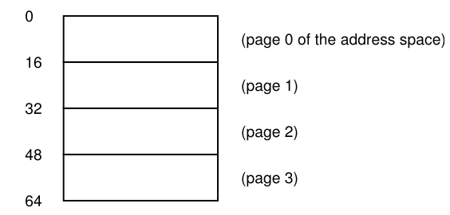
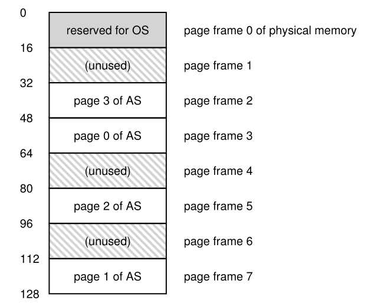
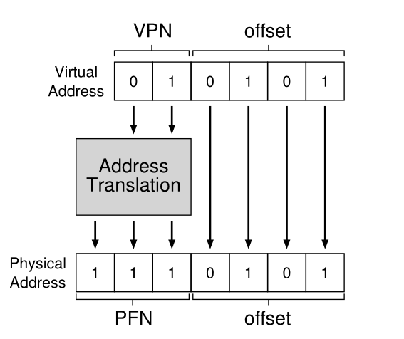
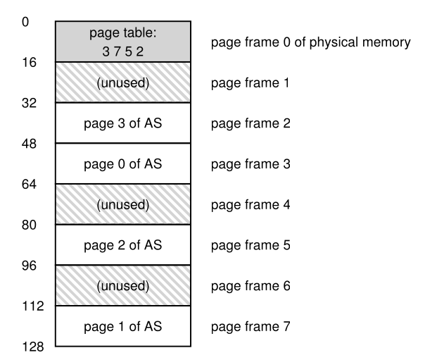
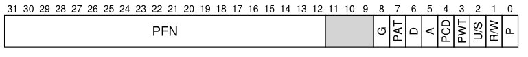
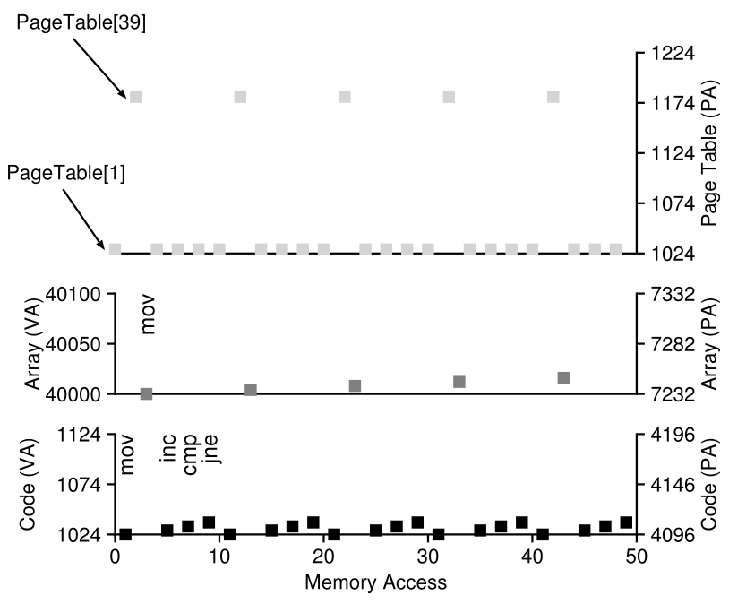

# Parte I &rarr; Virtualizacion

Temas:

* [Procesos](./Procesos.md)
* [API de procesos](./API-de-procesos.md)
* [Ejecucion directa limitada](./Ejecucion-directa.md)
* [Planificacion](./Planificacion.md)
* [Planificacion multinivel](./Planificador-multinivel.md)
* [La abstraccion del espacio de direcciones](./Espacio-direcciones.md)
* [API de memoria](./API-memoria.md)
* [El mecanismo de traduccion de direcciones](./Traduccion-direcciones.md)
* [Segmentacion](./Segmentacion.md)
* [Administracion de espacio libre](./Espacio-libre.md)
* [Paginacion](#paginacion-introduccion): &larr; Usted esta aqui

  * [Un ejemplo simple y una descripcion general](#un-ejemplo-simple-y-descripcion-general)
  * [Donde se guardan las page tables?](#donde-se-guardan-las-page-tables)
  * [Que hay realmente en una page table?](#que-hay-realmente-en-una-page-table)
  * [Paginacion: Demasiada Lenta](#paginacion-demasiada-lenta)
  * [Un rastro de memoria](#un-rastro-de-memoria)

* [TLBs](./TLBs.md)
* [Paginacion multinivel](./Paginacion-Multinivel.md/)

Bibliografia: [OSTEP Cap - 18 Paging: Introduction](https://pages.cs.wisc.edu/~remzi/OSTEP/vm-paging.pdf)

## Paginacion: Introduccion

&emsp;A veces se dice que el OS toma uno de dos enfoques cuando resuelve casi cualquier problema de admnistracion de espacio. El primer enfoque es cortar cosas en piezas de *tamaño variable*, como vimos con la **segmentacion** en la virtualizacion de memoria. Desafortunadamente, esta solucion tiene problemas inherentes. En particular, cuando divide un espacio en chunks de diferente tamaño, el mismo espacio se **fragmenta**, y por lo tando las asignaciones son mas dificiles.</br>
&emsp;Por lo tanto, debe ser bueno considerar el segundo enfoque: cortar el espacio en piezas de *tamaño fijo*. En la memoria virtual, llamamos a esta idea **paginacion**. En vez de dividir el espacio de direcciones de un proceso en segmentos logicos de tamaño variable (ej, code, heap, stack), lo dividimos en unidades de tamaño fijo, que las llamaremos paginas. Correspondientemente, vemos a la memoria fisica como un array de slots de tamaño fijo llamados **page frames**; cada uno de sos frames puede contener una solo pagina de memoria virtual.</br>
&emsp;Nuestro reto: Como podemos virtualizar memoria con paginas, y como evitar el problema de la segmentacion> Cuales son las tecnicas basicas? Como hacemos que esas tecnicas funcionen bien, con un espacio y costo de tiempo minimo?</br>

### Un ejemplo simple y descripcion general

&emsp;Para ayudar a entender mejor este enfoque, lo ilustremos con un ejemplo simple.</br>

\

&emsp;La imagen anterior presenta una espacio de direcciones pequeño, solo 64 bytes de tamaño total, con cuatro paginas de 16 bytes. Los espacios de direcciones reales son mucho mas grandes, obviamente, 32 bits, y por lo tanto 4GB de espacio de direcciones, o incluso 64 bits; en el libre, a menudo usaremo pequeños ejemplos para hacerlos mas faciles de digerir.</br>
&emsp;La memoria fisica, como se puede ver en la siguiente imagen, tambien contiene un numero de slots de tamaño fijo, en este caso ocho page frames (haciendo una memoria de 128 bytes, que tambien es ridiculamente chica). Como se puede ver en el diagrama, las paginas sel espacio de direcciones virtal ha sido ubicado en diferentes lugares a la largo de la memoria fisica; el diagrama tambien muestra el OS usando algo de memoria fiscia para el mismo.</br>



&emsp;La paginacion, como veremos, tiene ciertas ventajas sobre los enfoques previos. Probablemente la mejora mas importante sera la *flexibilidad*: con un enfoque desarrollado completamente a la paginacion, el sistema sera capaz de soportar la abstraccion de un espacio de direcciones efectivamente, sin importar como un proceso use el espacio de direcciones; por ejemplo, no asumiremos en que direccion crece el heap o el stack y como son usados.</br>
&emsp;Otra ventaja es la *simplicidad* de la administracion del espacio libre que ofrece la paginacion. Por ejemplo, cuando el OS quiere ubicar nuestro espacio de direcciones de 64 bytes en nuestra memoria fisica de ocho paginas,es simple encontrar cuatro paginas libres; dado que el OS mantiene una **free list** de todas las paginas libres, el OS tiene ubicada la pagina virtual 0 del espacio de direccoines (AS) en el frame fisico 3, la pagina virtual 1 del AS en el frame fisico 7, la pagina 2 en el frame 5, y la pagina 3 en el frame 2. Los page frames 1, 4 y 6 actualmente estan libres.</br>
&emsp;Para recordar donde esta ubicada cada pagina virtual del espacio de direcciones en la memoria fisica, el OS usualmente mantiene a una estrutura de datos conocida como **page table** *por proceso*. El rol principal de la page table es guardar **tradcciones de direcciones** para cada pagina virtual del espacio de direcciones, por lo tanto, permitiendonos saber en que lugar de la memoria fisica esta cada pagina. Para nuestro ejemplo simple, la page table deberia tener las siguientes cuatro entradas: (Virtual Page 0 &rarr; Physical Frame 3), (VP 1 &rarr; PF 7), (VP 2 &rarr; PF 5), y (VP 3 &rarr; PF 2).</br>
&emsp;Es importante recordar que esta page table es una estructura de datos por proceso. Si otro proceso se ejecuta en nuestro ejemplo de arriba, el OS deberia tener una page table por el, dado que sus paginas virtuales obviamente mapean a diferentes paginas fisicas.</br>
&emsp;Ahora, sabemos suficiente para hacer un ejemplo de traduccion de direccion. Imaginemos que el proceso con ese pequeño espacio de direcciones (64 bytes) esta haciendo un acceso a memoria.</br>

```assembly
movl <virtual address>, %eax
```

&emsp;Especificamente, prestemos atencion a la carga explicita de los datos de la direccion ```<virtual address>``` en el registro ```eax``` (y por lo tanto ignores la instruccion fetch que debe haber sucesido antes).</br>
&emsp;Para **traducir** esta direccion virtual que genero el proceso, perimero tenemos que dividirla en dos componentes: el **numero de pagina virtual (VPN)**, y el **offset** en la pagina. Para este ejemplo, dado que el espacio de direcciones virtuales es de 64 bytes, necesitamos 6 bits en total para nuestra direccion virtual ($2^6 = 64$). Por lo tanto, nuestra memoria virtual puede ser conceptualizada asi:</br>

| Va5 | Va4 | Va3 | Va2 | Va1 | Va0 |
|:---:|:---:|:---:|:---:|:---:|:---:|

&emsp;En estre diagrama, Va5 es el bit de mayor orden de la direccion virtual, y Va0 es el bit de menor orden. Dado que sabemos es tamaño de la pagina (16 bytes), ademas podemos dividir la direccion virtual asi</br>

| Va5 | Va4 | Va3 | Va2 | Va1 | Va0 |
|:---:|:---:|:---:|:---:|:---:|:---:|
| VPN | VPN | offset | offset | offset | offset |

&emsp;El tamaño de la pagina es de 16 bytes en un espacio de direcciones de 64 bytes; por lo tanto necesitamos ser capaces de sellecionar 4 paginas, y los primeros 2 bits de la direccion hacen justo eso. Por lo tanto, tenemos un VPN de 2 bits. Los bits restantes nos dicen en que bytes de la pagina estamos interesados, 4 bits en este caso; a esto le llamos offset.</br>
&emsp;Cuando un proceso genera una direccion virtual, el OS y el hardware deben combinarse para traducirla en una direccion fisica significativa. Por ejemplo, asumamos que la carga de arriba es a la direccion virtual 21:</br>

```assembly
movl 21, %eax
```

&emsp;Pasando "21" a la forma binaria, obtenemos "010101", y por lo tanto podemos examinar esta direccion virtual y ver como se descompone en un numero de pagina virtual (VPN) y offset:</br>

| 0 | 1 | 0 | 1 | 0 | 1 |
|:---:|:---:|:---:|:---:|:---:|:---:|
| VPN | VPN | offset | offset | offset | offset |

&emsp;Por lo tanto, la direccion virtual "21" esta en el quinto byte ("0101") de la pagina "01". Con nuestro numero de pagina virtual, podemos indexar nuestra page table y encontrar en que frame fisico recide la pagina virtual 1. En la page table de arriba el **numero de frame fisico (PFN)** o **numero de pagina fisica (PPN)** es 7 (111). Por lo tanto, podemos traducir esta direccion virtual reemplazando el VPN con el PFN y entonces emitir la carga a la memoria fisica.</br>



&emsp;Notar que el offset se mantiene igual (es decir, no se traduce), porque el offset solo nos dice que bit *dentro* de la pagina queremos. Nuestra direccion fisica es 1110101 (117 en decimal), y es exactamente  de donde queremos que nuestra carga busque datos.</br>
&emsp;Con esta idea general basica en mente, nos podemos preguntar (y esperar responder) alguna dudas basicas que debes tener sobre la paginacion. Por ejemplo, donde estan guardadas esas page tables? Cual es el contenido tipico de una page table, y que tan grandes son? Hacer paginacion hace que el sistema se muy lento? Estas y otras preguntas seductoras seran responidas, al menos en parte, en el texto de abajo.</br>

### Donde se guardan las page tables?

&emsp;Las page tables pueden ser terriblementes grandes, mucho mas grandes que las pequeñas tablas de segmentos o los pares bas/limite de los que hablamos antes. Por ejemplo, imagina un tipico espacio de direcciones de 32 bits, con 4KB de paginas. Esta direccion virtual se divide en VPN de 20 bits an offset de 12 bits (recuerda que se necesitarian 10 bits para un tamaño de pagina de 1 KB, con dos mas se llega a 4KB).</br>
&emsp;Un VPN de 20 bits implica que hay $2^10$ traducciones que el OS podria tener que administrar para cada proceso (cerca de un millon); asumiendo que necesitamos 4 bytes por **entrada de la page table (PTE)** para mantener la traduccion fisica y cual quier otra cosa util,necesitamos una inmensa memoria de 4MB para cada page table! Ahora imagina que hay 100 procesos ejecutandoce: esto significa que el OS deberia necesitar 400MB de memoria solo para todas las traducciones de direcciones! Incluso en la era moderna, donde las maquinas tinen gigabytes de memoria, parece loco usar un chunk tan grande solo para traducciones. Ni pensaremos que tan grande tendria que ser la tabla para un espacio de direcciones de 64 bits.</br>
&emsp;Dado que las page tables son tan grandes, no mantenemos ningun hardware espcial en el chip en la MMU para guardar la page table de un proceso en ejecucion. En cambio, guardamos la page table de cada proceso en algun lugar de la *memoria*. Asuamamos por ahora que las pabe tables viven en a memoria fisica que administra el OSl mas adelante veremos que gran parte de la memoria del OS puede ser virtualizada, y por lo tanto las page tables pueden ser guardadas en la memoria virtual del OS (e incluso intercambiadas al disco), pero esto es muy confuso ahora, entonces lo ignoraremos. La siguiente figura es una imagen de una page table en la memoria del OS; ves el pequeño conjunto de traducciones?</br>



### Que hay realmente en una page table?

&emsp;Hablemos un poco sobre la organiazcion de una page table. La page table es solo una estructura de datos que es usada para mapear direcciones virtual (o realmente, numeros de paginas virtuales) a direcciones fisicas (numeros de frame fisicos). Por lo tanto, cualquier estructura de datos funionaria. La forma mas simple es llamada **page table lineal**, la cual es solo un array. El OS *indexa* el array por el VPN, y mira la entrada de la page table (PTE) en el indice para encontrar el numero de frame fisico (PFN) deseado. Por ahora, asumiremos esta simple estructura lineal; en proximos capitulos, usaremos estructuras de datos mas avanzadas para ayudarnos a resolver algunos problemas de paginacion.</br>
&emsp;En cuanto al contenido de cada PTE, tenemos algunos bits diferentes que vale la pena entender en algun nivel. Un **valid bit** es comun para indicar si la traduccion particular es valida; por ejemplo, cuando un programa comienza a ejecutarse, tendra code y heap en un extremo de su espacio de direcciones, y el stack en el otro. Todo espacio no usado en medio sera marcado como **invalido**, y si el proceso intenta acceder a dicha memoria, generara un trap al OS el cual probablemente terminara el proceso. Por lo tanto, el valid bit es crucial para soportar un espacio de direcciones diperso; simplemente marcando todas las paginas sin usar en el espacio de direcciones invalido, removemos lo necesario para asignar frames fisicos para esas paginas y por lo tanto ahorra mucha memoria,</br>
&emsp;Tambien deberiamos tener **protection bits**, que indiquen ya sea si de donde la pagina puede ser leida, escrita o ejecutada. De nuevo, acceder a una pagina de una forma no permita por estos bits generara un trap al OS.</br>
&emsp;Hay un par mas de bits que son importantes pero no hablaremos de ellos por ahora. Un **present bit** indica si la pagina esta en la memoria fisica o en el disco. Entenderemos esta maquinaria mas adelane cuando estudiemos como **intercambiar** partes del espacio de direcciones de la memoria al disco para soportar espacios de direcciones que son mas grandes que la memoria fisica; intercambiarlos le permite al OS liberar memoria fisica moviendo las paginas que menos se usan al disco. Un **dirty bit** tambien es comun, indica si una pagina ha sido modificada desde que llego a la memoria.</br>
&emsp;Un **reference bit** (a.k.a. **accessed bit**) es usada para rastrear si una pagina ha sido accedida, es util para determinar que paginas son populares, y por lo tanto deberian mantenerse en la memoria; saber esto es critico durante el **reeemplazo de paginas**, un tema que estudiaremos con mas detalle en los proximos capitulos.</br>

&emsp;La siguiente imagen muestra un ejemplo de una page table entry (PTE) desde una arquitectura x86. Contiene un present bit (P); un bit de lectura/escritura (R/W) el cual determina si procesos en modo usuario pueden acceder a la pagina; algunos bit (PWT, PCD, PAT, y G) que determinar como trabaja el harwdware caching en esta paginasl un accessed bit (A) y un dirty bit (D); y finalmente, el numero de page frame (PFN).</br>



### Paginacion: Demasiada Lenta

&emsp;Con las page tables en memoria, sabemos que pueden ser demasiado grandes. Resulta que tambien pueden ralentizar las cosas. Por ejemplo, tomemos una simple instruccion:</br>

```assembly
movl 21, %eax
```

&emsp;De nuevo, solo examinemos la referencia explicita a la direccion 21 y no nos preocupemos de la instruccion fetch. En este ejemplo, asumiermos que el hardware hacer las traducciones por nosotros. Para buscar el dato deseado, el sistema primero debe **traducir** la direccion virtual 21 en la correspondiente direccion fisica 117. Por lo tanto, antes de buscar los datos de la direccion 117, el sistema primero busca la page table entry apropiada de la page table del proceso, hace la traduccion, y entonces carga los datos desde la memoria fisica.</br>
&emsp;Para hacerlo, el ahrdware debe saber donde esta la page table para el proceso en ejecucion. Asumamos por ahora que un solo **page-table base register** contiene la direccion fisica del comienzo de la ubicacion de la page table. Para encontrar la ubicacion de la PTE deseada, el hardware ejecutara las siguientes funciones:</br>

```assembly
VPN = (VirtualAddress & VPN_MASK) >> SHIFT
PTEAddr = PageTableBaseRegister + (VPN * sizeof(PTE))
```

&emsp;En nuestro ejemplo, ```VPN_MAS``` deberia estar seteado en 0x30 el cual selecciona los bits VPN de la direccion virtual completa; ```SHIFT``` es seteado a 4 (el numero de bits del offset), numero el cual movemos el VPN hacia abajo para formar el numero de pagina virtual entero correcto. Por ejemplo, con la direccion virtual 21 (010101), y la marcara lo tranforma en 010000; el shift lo transforma en 01, o pagina virtual 1, como deseabamos. Cuando usamos este valor cono un indice dentro del array de PTEs apuntado por la page table base register.</br>
&emsp;Una vez que conocemos esta direccion fisica, el hardware puede buscar el PTE desde la memoria, extraer el PFM, y concatenarlo con el offset de la direccion virtual para formar la direccion fisica deseada. Especificamente, puedes pensar que el PFN es shifteado a la izquierda por ```SHIFT```, y entonces un OR bit a bit con el offset para formal la direccion final deseada:</br>

```assembly
offset = VirtualAddress & OFFSET_MASK
PhysAddr = (PFN << SHIFT) | offset
```

&emsp;Finalmente, el hardware puede buscar los datos deseados de la meoria y ponerlos en el registro %eax. El programa ahora realizo exitosamente la carga de un valor desde la memoria.</br>

### Un rastro de memoria

&emsp;Antes de cerrar, rastreamos un ejemplo a traves de un simple acceso a memoria para demostrar todos los resultados de acceso a memoria que ocurren cuando usamos paginacion. El fragemnto de codigo en el que estamos interesados es el siguiente:</br>

```array.c```

```c
int array[1000];
...
for (int i = 0; i < 1000; i++){
  array[i] = 0;
}
```

&emsp;Compilamos y ejecutamos array.c con los siguientes comandos:</br>

```console
prompt> gcc -o array array.c -Wall -O
prompt> ./array
```

&emsp;Obviamente, para verdaderamente entender que accedo de memoria hara este fragmento de codigo, tenemos que saber un par de cosas. Primero, tenemos que **desensamblar** el binario resultante (usando objdump en Linux o otool en Mac) para ver que instruccion assembly son usadas para inicilizar el array en el loop. Este es el resultado:</br>

```assembly
movl $0x0,(%edi,%eax,4)
incl %eax
cmpl $0x03e8,%eax
jne 0x1024
```

&emsp;El codigo es facil de entender. La primera instruccion muevo el valor cero en la direccion de la memoria virtual de la ubicacion del array; esta direccion es computado tomando el contenido de %edi y sumando %eax multiplicado por cuatro. Por lo tanto, %edi matiene la direccion base del array, %eax mantiene el indice del array; lo multiplicamos por cuatro dado que el array es un array de enteros, cada posicion es de 4 bytes.</br>
&emsp;La segunda instruccion incrementa el indice del array que esta en %eax, y la tercera instruccion comapra el contenido de ese registro con el valor hexa 0x03e8, o decimal 1000. Si la comparacion muestra que los valores todavia no son iguales, la cuarte instruccion salta de nuevo la inicio del bucle.</br>
&emsp;Para entender que acceso de memoria hacer esta secuencia de instrucciones, asumiremos algo sobre la ubicacion dentro de la memoria virtual del fragemnto de codigo y el array, asi como el contenido y la ubicacion de la page table.</br>
&emsp;Para este ejemplo, asumiremos un espacio de direcciones de tamaño de 64KB. Tambien asumiremos un tamaño de pagina de 1KB.</br>
&emsp;Todo lo que necesitamos saber ahora es el contenido de la page table y la ubicacion en la memoria fisica. Asumiremos que tenemos una page table lineal y que esta ubicada en la direccion fisca 1KB(1024)</br>
&emsp;Por lo que nos concierne solo necesitamos unas pocas paginas virtuales sobre las que preocuaprnos para tener el mapeo de este ejemplo. Primero, esta la pagina virtual del codigo. Dado que el tamaño de pagina es de 1KB, la direccion virtual 1024 reside en la segunda pagina del espacio de direcciones. Asumamos que esta pagina virtual mapea al frame fisico 4 (VPN 1 &rarr; 4).</br>
&emsp;Lo siguiente, es el mismo array. Su tamaño es de 4000 bytes (1000 enteros), y asumimos que reside en la direccion virtual desde 40000 hasta 44000. Las paginas virtuales para este rango decimal son VPN = 39 .. VPN = 42. Por lo tanto, necesitamos mapear esas paginas. Asumamos este mapeo virtual-fisica para el ejemplo: (VPN 39 &rarr; PFN 47), (VPN 40 &rarr; PFN 41), (VPN 41 &rarr; PFN 9), (VPN 42 &rarr; PFN 10).</br>
&emsp;Ahora estamos listos para rastrear las referencias de memoria del programa. Cuando se ejecuta, cada instruccion fetch generara dos referencias a memoria: una a la page table para encontrar el frame fisico en la que la instruccion reside, y otra para la misma instruccion para llevarla a la CPU para procesarla. Ademas; hay una referencia a memoria explicita en la instruccion mov; primero agrega otro accedo a la page table (para traducir el array de direccion virtual a la correcta direccion fisica) y luego otro acceso al mismo array.</br>
&emsp;En la siguiente imagen se ve el proceso entero para las primeras cinco vueltas del ciclo.</br>



&emsp;En la parte mas baja del grapfico se muestran las referencias a memoria de la instruccion en el eje Y en engro (con las direcciones virtuales a la izquierda, y las direcciones fisicas a la derecha); la parte del medio del grafico muestro los accesos al array en gris; finalmente, la parte mas alta del grafico muestra los accesos a memoria de la page table en gris claro. El eje X, para el rastreo completo, muestra los accesos a memoria a lo largo de las primeras cinco iteraciones del loop; hay 10 accesos a memoria por cada iteracion, los cuales incluyen cuatro instrucciones fetch, una actualizacion explicita de memoria, y cinco accesos a memoria de page table para traducir esas cuatro fetch y una actualizacion explicita.</br>
&emsp;Mira si pueden encontrarle sentido a los patrones que aparecen en esta visualizacion. En partiuclar,  que cambiara cuando el loop continua su ejecucion mas alla de estas cinco iuteraciones?  Que nuevas ubicaciones de memoria seran accedidas? Puedes darte cuenta?</br>
&emsp;Este ha sido el mas simple de los ejemplos, y, sin embargo, es posible que ya seas capaz de sentir la complejidad de comprender el comportamiento real de la memoria de las aplicaciones reales. No te preocupes: esto definitivamente se vuelve peor, dado que el mecanismo que estamos por ver solo complica mas esta maquinaria ya compleja. Perdon!</br>

[Anterior](./Espacio-libre.md) [Siguiente](./TLBs.md)
