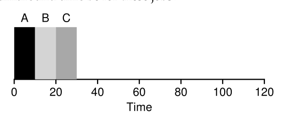
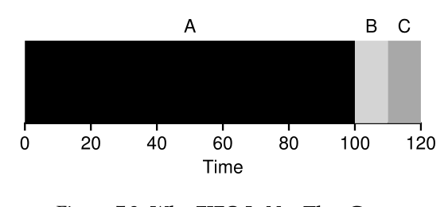
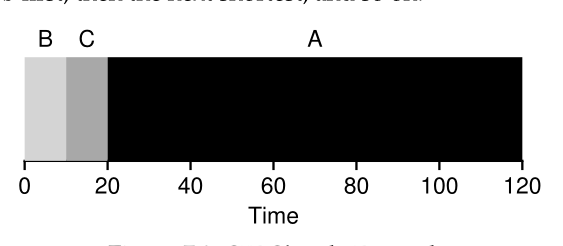
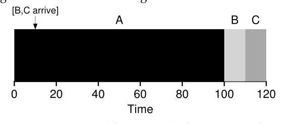
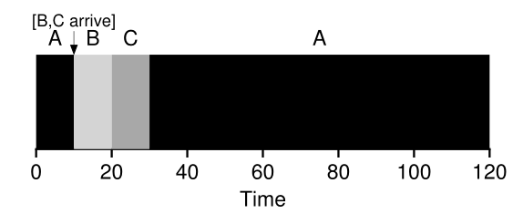

# Parte I &rarr; Virtualizacion

Temas:

* [Procesos](./Procesos.md)
* [API de procesos](./API-de-procesos.md)
* [Ejecucion directa limitada](#mecanismo-ejecucion-directa-limitada)
* [Planificacion](#introduccion-planificacion-scheduling): &larr; Usted esta aqui

  * [Suposiciones de carga de trabajo](#suposiciones-de-carga-de-trabajo)
  * [Metricas de planificacion](#metricas-de-planificacion)
  * [First In, First Out (FIFO)](#first-in-first-out-fifo)
  * [Shortest Job First (SJF)](#shortest-job-first-sjf)
  * [Shortest Time-to-Completion First (STCF)](#shortest-time-to-completion-first-stcf)
  * [Una nueva metrica: Tiempo de respuesta (Respose Time)](#una-nueva-metrica-tiempo-de-respuesta-response-time)

* [Planificacion multinivel](./Planificador-multinivel.md)
* [Espacio de direcciones](Virtualizacion-espacio-de-direcciones.md)
* [API de memoria](Virtualizacion-API-de-memoria.md)
* [El mecanismo de traduccion de direcciones](Virtualizacion-El-menismo-de-traduccion-de-direcciones.md)
* [Segmentacion](Virtualizacion-Segmentacion.md)
* [Administracion de espacio libre](Virtualizacion-Administracion-de-espacio-libre.md)
* [Paginacion](Virtualizacion-Paginacion.md)
* [TLBs](Virtualizacion-TBLs.md)
* [Archivo de intercambio, mecanismo y politica](Virtualizacion-Archivo-de-intercambio-mecanismos-politica.md)

Bibliografia: [OSTEP Cap - 7 Scheduling: Introduction](https://pages.cs.wisc.edu/~remzi/OSTEP/cpu-sched.pdf)

## Introduccion: Planificacion (Scheduling)

&emsp;Por ahora los mecanismos de bajo nivel (como el cambio de contexto) deben estar claros. Sin embargo, todavia tenemos que entender las **politicas** de alto nivel que emplea el OS. Ahora vamos a hacer eso, presentar un par de **politicas de planificacion** (a veces llamadas **disciplinas**). 
&emsp;El origen de la planificacion, de hecho, precede a los sistemas computacionales; los primeros enfoques fueron tomados del campo de gestion de operaciones y aplicadas a la computacion 

### Suposiciones de carga de trabajo

&emsp;Antes de entrar en el rango de las posibles politicas, hagamos algunas suposiciones simplificadoras sobre los procesos en ejecucion del sistema, a veces llamado **la carga de trabajo (workload)**. Determinar la carga de trabajo es una parte critica en la construccion de politicas, y mientras mas sepas sobre la carga de trabajo, estaran mejor desarrolladas tus politicas. 
&emsp;Las suposiciones de carga de trabajo que haremos son mayormente irrealistas, pero por ahora esta bien, porque las relajaremos a medida que avancemos, y eventualmente desarrollaremos lo que llamaremos... (*dramatic pause*) ... una **disciplina de planificacion completamente funcional** 
&emsp;Haremos las siguientes suposiciones sobre los procesos que se estan ejecutando en el sistema. 

  1. Cada proceso se ejecuta por la misma cantidad de tiempo
  2. Todos los procesos llegan al mismo tiempo
  3. Una vez empezado, se ejecuta hasta completarse
  4. Todos los procesos solo usan la CPU (es decir, no hacen I/O)
  5. El tiempo de ejecucion de cada proceso es conocido

### Metricas de planificacion

&emsp;Mas alla de asusmir la carga de trabajo, necesitamos una cosa mas para ser capaces de comparar diferentes politicas de planificacion: una **metrica de planificacion**. Una metrica es solo algo que usamos para *medir* algo, y hay muchas metricas diferentes que tienen sentida en la planificacion. 
&emsp;Sin embargo, por ahora, vamos a simplificarnos la vida, tomando una solo metrica: **turnaround time (tiempo de entrega?)**. El tiempo de entrega de un proceso esta definido por el tiempo en el que el proceso finalizo menos el tiempo en el que el proceso llego al sistema. Mas formalmente, el tiempo de entrega is: 

$$T_{turnaround} = T_{completion} - T_{arrival}$$

&emsp;Y como asumimos que todos los procesos llegan al mismo tiempo, por ahora, el tiempo de llegada es igual a 0 

$$T_{arrival} = 0$$
$$T_{turnaround} = T_{completion} - 0$$
$$T_{turnaround} = T_{completion}$$

&emsp;Como habras notado, el tiempo de entrega es una metrica de desempeño, en el cual estara nuestro foco de atencion. Otra metrica interesante es **equidad (fairness)**. Desempeño y equidad a menudo estan en conlifcto, en desacuerdo, en la planificacion; un planificador (scheduler), por ejemplo, podria optimizar el desempeño, pero con el costo de evitar que otros procesos se ejecuten, disminuyendo la equidad. Este problema nos muestra que la vida no siempre es perfecta.(filosofando ando) 

### First In, First Out (FIFO)

&emsp;El algoritmo mas basico que podemos implementar es conocido como planificacion **First In, First Out (FIFO)** o algunas veces **First Comes, Frist Served (FCFS)** 
&emsp;FIFO tiene muchas propiedades positvas: claramente es simple, y por lo tanto facil de implementar. Y, dadas nuestras suposisiones, funciona bastante bien. 
&emsp;Hagamos un ejemplo rapido. Imaginemos que tres procesos llegan al sistema, A, B, y C, aproximadamente al mismo tiempo (t arrival = 0).Dado que FIFO ubica a algun proceso primero, asumamos que A llego apenas antes que B, y que B llego apenas antes que C. Asumamos tambien que cada proceso se ejecuta por 10 segundos. Cual sera el **turnnaround time** promedio para estos procesos? 

&emsp;De la imagen anterior podemos ver que A termina al 10, B al 20, y C al 30. Por lo tanto, el tiempo de entrega promedio para los 3 procesos es simple: 

$$\frac{10+20+30}{3} = 20$$
&emsp;Ahora suavicemos una de nuestras suposiciones. En particular, suavicemos la suposicion 1, y por lo tanto no asumiremos mas que los procesos se ejecutan la misma cantidad de tiempo. Como funciona FIFO ahora? Que tipo de carga de trabajo podrias construir para que FIFO funcione mal? 
&emsp;Veamos ahora como procesos de diferente longitud pueden llevar problemas a la planificacion FIFO. En particular, de nuevo vamos a asumir 3 procesos (A, B, y C), pero esta vez A se ejecuta 100s y C y B 10s cada una. 

&emsp;Como puedes ver en la imagen, el proceso A se ejecuta primero los 100s completos antes de que B y C siquiera tengan oportunidad de ejecutarse. Por lo tanto, el tiempo de entrega promedio es alto: 

$$\frac{100+110+120}{3} = 110$$

&emsp;Generalmente se refiere a este problema como **efecto convoy (convoy effect)**, donde un numero de potenciales consumidores de un recurso relativamente cortos quedan en colados detras de un consumidor de recursos de alto peso. 
&emsp;Entonces, que deberiamos hacer? Como podriamos desarrolar un mejor algoritmo para tratar con nuestra nueva realidad de procesos que se ejecutan por diferentes cantidades de tiempo. 

### Shortest Job First (SJF)

&emsp;Resulta que un enfoque muy simple resuelve este problema; de hecho, es una idea robada de investigacion de operaciones y aplicada a la planificacion de trabajos en los sistemas computacionales. Esta nueva disciplina de planificacion es conocida como **Shortest Job First (SJF)**, y el nombre es facil de recordar porque describe la politica casi por completo: ejecuta el proceso mas corto primero, y luego el siguiente mas corto, y asi sucesivamente. 

&emsp;Tomemos el mismo ejemplo de antes pero esta vez con SJF como nuestra politica de planificacion. La imagen anterios muestra los resultados de ejecutar A, B, y C. El diagrama muestra porque SJF se desempeña mucho mejor con respecto al tiempo de entrega promedio. Simplemente ejecutando B y C antes que A, SJF reduce el tiempo promedio de 110 a 50 segundo, menos de la mitad del tiempo. 
&emsp;Por lo tanto llegamos a un buen enfoque al planificar con SJF, pero nuestras suposiciones todavia son irrealistas. Vamos a suavizar otra. En particular, la suposicion 2, y ahora asumimos que los procesos pueden llegar en cualquier comento, y no todos a la vez. A que problemas conduce esto? 

&emsp;Usaremos un ejemplo similiar, pero esta vez asumiremos que A llega en t = 0 y necsita ejecutarse por 100s, mientras que B y C llegan en t = 10 y cada uno necesita ejecutarse 10s. Con SJF puto, obtendremos una planificacion como la siguiente. 

&emsp;Como se puede ver en la imagen, a pesar de que B y C llegaron poco despues que A, ellos son forzados a esperar a que A termine su ejecucion, y por lo tanto sufre el mismo efecto convoy. El tiempo de entrega promedio para estos tres procesos es de 103.33. Que puede hacer el planificador? 

$$\frac{100 + (110 - 10) + (120 - 10)}{3} = 103.33$$

### Shortest Time-to-Completion First (STCF)

&emsp;Para abordar esta preocupacion, necesitamos suavizar la suposicion 3 (los procesos se ejecutan hasta terminarse). Tambien necsitamos algo de maquinaria en el planificador. El planificador puede hacer algo cuando B y C llegan: puede **remplazar (preempt)** y decidir ejecutar otro proceso, y quizas continuar ejecutando A despues. SJF por nuestra definicion es un planificador sin reemplazos, y por lo tanto sufre de los problemos descritos arriba. 
&emsp;Afortunadamente, hay un planificador que hace exactamente eso, agregar reemplazos a SJF, y es conocido como planificador **Shortest Time-to-Completion First (STCF)** o **Preemtive Shortest Job First(PSJF)**. Cuando entra un nuevo proceso al sistema, el planificador STCF determina a cual de los procesos que quedan le queda el menor tiempo, y planifica ese. Por lo tanto, en nuestro ejemplo, STCF reemplazara A y ejecutara B y C hasta completarse; solo entonces podra planificarse el tiempo que le queda a A. 

&emsp;Como resultado, hay un tiempo de entrega promedio mucho mejor: 50 segundos 

$$\frac{(120 - 0) + (20 - 10) + (30 - 10)}{3} = 50$$

&emsp;Y como antes, dadas nuestras suposiciones, STCF es comprobablemente optimo; dado que SJF es optimo si todos los procesos llegan al mismo tiempo, probablemente serias capaz de ver la intuicion detras de la optimizacion de STCF. 

### Una nueva metrica: Tiempo de respuesta (Response Time)

&emsp;Si conocemos la longitud de los procesos, y que procesos usarian solo la CPU, y nuestra unica metrica fuera el tiempo de entrega, STCF seria una gran politica. De hecho, para un numero de los primeros sistemas de computacion por lotes, ese tipo de algoritmos de planificacion tenian sentido. Sin embargo, la introduccion de maquinas de tiempo compartido cambio eso. Ahora los usuarios se podian sentar en una terminal y demandar un desempeño interactivo del sistema. Y por lo tanto, una nueva metrica nacio, **tiempo de respuesta (response time)**. 
&emsp;Definimos el tiempo de respuesta como el tiempo desde que el proceso llego al sistema hasta el tiempo en que fue planificado por primera vez. Mas formalmente: 

$$T_{response} = T_{firstrun} - T_{arrival}$$

&emsp;Por ejemplo, si tenemos la planificacion como en el caso anterior (Con A llegando al 0, y B y C al 10), el tiempo de respuesta de cada proceso seria: 0 para A, 0 para B, y 10 para C (promedio 3.33) 
&emsp;STCF y las disciplinas relacionas no son buenas para el tiempo de respuesta. Si, por ejemplo, los tres procesos llegan a la vez, el tercero tendria que esperar a que los primeros dos terminen antes de poder ejecutarse una vez. Mientras que es bueno para el tiempo de entrega, este enfoque es malo para el tiempo de respuesta y la interactividad. Como podriamos construir un planificador que sea sensible al tiempo de respuesta? 

[Anterior](./Ejecucion-directa.md) [Siguiente](./Planificador-multinivel.md)
