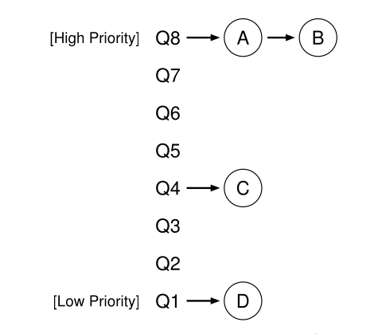
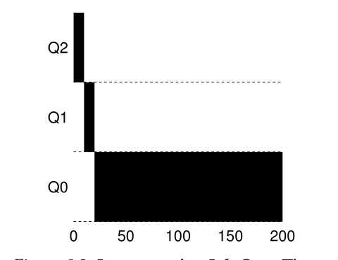
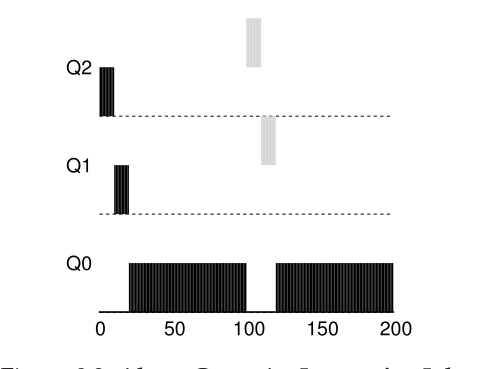
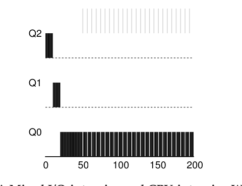
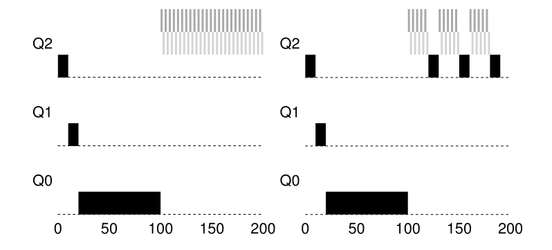
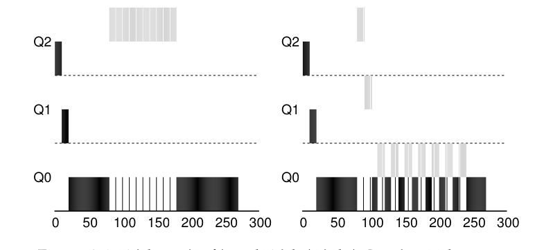
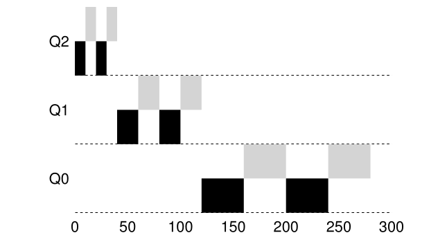

# Parte I &rarr; Virtualizacion

Temas:

* [Procesos](./Procesos.md)
* [API de procesos](./API-de-procesos.md)
* [Ejecucion directa limitada](./Ejecucion-directa.md)
* [Planificacion](./Planificacion.md))
* [Planificacion multinivel](#planificador-la-cola-de-retroalimentacion-multinivel): &larr; Usted esta aqui

  * [MLFQ: Reglas Basicas](#mlfq-reglas-basicas)
  * [Intento #1: Como cambiar prioridades](#intento-1-como-cambiar-prioridades):

    * [Ejemplo 1: Un solo proceso de larga ejecucion](#ejemplo-1-un-solo-proceso-de-larga-ejecucion)
    * [Ejemplo 2: A lo largo llegp un proceso corto](#ejemplo-2-a-lo-largo-llego-un-proceso-corto)
    * [Que hay sobre I/O](#ejemplo-3-que-hay-sobre-io)
    * [Problemas con nuestro MLFQ actual](#problemas-con-nuestro-mlfq-actual)

  * [Intento 2: el impulso de prioridad](#intento-2-el-impulso-de-prioridad)
  * [Intento 3: un mejor conteo](#intento-3-un-mejor-conteo)
  * [Modificando MLFQ y otros inconvenientes](#modificando-mlfq-y-otros-invonvenientes)
  * [MLFQ final](#mlfq-final)

* [La abstraccion del espacio de direcciones](./Espacio-direcciones.md)
* [API de memoria](./API-memoria.md)
* [El mecanismo de traduccion de direcciones](./Traduccion-direcciones.md)
* [Segmentacion](./Segmentacion.md)
* [Administracion de espacio libre](./Espacio-libre.md)
* [Paginacion](./Paginacion.md)
* [TLBs](./TLBs.md)
* [Paginacion multinivel](./Paginacion-Multinivel.md/)

Bibliografia: [OSTEP Cap - 8 Scheduling: The Multi-Level Feedback Queue](https://pages.cs.wisc.edu/~remzi/OSTEP/cpu-sched-mlfq.pdf)

## Planificador: La cola de retroalimentacion multinivel

&emsp;En este capitulo vamos a desarrollar unos de los enfoques de planificacion mas conocidos, **Multi-Level Feedback Queue**. 
&emsp;El problema que intenta abordar MLFQ es doble. Primero, trata de optimizar el tiempo de entragra, que como sabemos se logra ejecutando los procesos mas cortos primero; desafortunadamente el OS, muchas veces, no sabe que tan largo es un proceso, la informacion que algoritmo como SJF o STCF necesitan. Segundo, MLFQ intenta hacer que el sistema se sienta interectivo, y por lo tanto minimizar el tiempo de respuesta; desafutunadamente algoritmos como RR reducen el tiempo de respuesta pero aumnetando muchisimo el tiempo de entrega. Por lo tanto, nuestro problema es: dado que, en general, no sabemos nada sobre los procesos, como podemos contruir un plinificador que logra todos nuestro objetivos? Como podria el sistema aprender, mientras se ejecuta, sobre las caracteristicas de los procesos que se ejecutan, y por lo tanto tomar mejores decisiones de planificacion? 

### MLFQ: Reglas Basicas

&emsp;Para construir un planificador como ese, en este capitulo vamos a describir el algoritmo basico detras de la colo de retroalimentacion multinivel; a pesar de que las especificaciones de muchos MLFQs implementados difieren, muhcos enfoques son similares. 
&emsp;En nuestro caso, el MLFQ tiene un numero de diferentes **colas (queues)**, cada una asignada a un **nivel de prioridad (priority level)** diferente. En un momento dado, un procesos que esta listo para ejecutarse esta en una sola cola. MLFQ usa prioridades para decidir que proceso debe ejecutarse en cierto momento: un proceso con una mayor prioridad (es decir, en una cola mas alta) es elegido para ejecutarse. 
&emsp;POr supuesto, muchos procesos estaran en la misma cola, y por lo tanto, tendran la misma prioridad. En ese caso, usameros RR para planificar entre ellos. 

* **Regla 1**: If Priority(A) > Priority(B) &rarr; A runs (B doesn't).
* **Regla 2**: If Priority(A) = Priority(B) &rarr; A & B runs in RR.

&emsp;Por lo tanto, la clave de MLFQ radica en como el planificador establece las prioridades. En vez de dar una prioridad fija a cada proceso, MLFQ *varia* la prioridad de cada proceso basado en *comportamiento observado*. Si, por ejemplo, un procesos cede el control de la CPU repetidamente mientras espera por una accion del teclado, MLFQ mantendra su prioridad alta, porque asi es como debe comportarse un proceso interactivo. Si, encambio, un proceso usa la CPU intensivamente por largos periodos de tiempo, MLFQ reducira su prioridad. De estra forma, MLFQ tratara de *aprender* sobre los procesos a medida que se ejecutan, y por lo tanto, usar la *historia* de esos procesos para predecir su *futuro* comportamiento 
&emsp;Si tuvieramos que mostrar en una imagen como se verian las colas en un momento dado, seria algo asi. 

&emsp;En la imagen, dos procesos (A y B) estan en el nivel de maxima prioridad, mientras que el proceso se esta en el medio y el proceso D esta en el nivel de prioridad mas bajo. Dado nuestro concimiento sobre como funciona MLFQ, el planificador solo deberia alternar porciones de tiempo entre A y B dado que son los que tienen maxima prioridad en el sistema, los procesos B y D nunca llegarian a ejecutarse. 
&emsp;Obviamente, mostrar una imagen estatica de alguna colas no nos da una realmente una idea de como funciona MLFQ. Lo que necesitamos es saber como las prioridades de los procesos cambian en el tiempo. 

### Intento #1: Como cambiar prioridades

&emsp;Ahora debemos decirdir como MLFQ cambiara los niveles de prioridades de un proceso (y por lo tanto en que cola estara) a traves del tiempo de vida del trabajo. Para hacer esto, debemos mantener en mente nuestra carga de trabajo: una mezcla de procesos de corta ejecucion (y pueden ceder la CPU frecuentemente), y algunos procesos de larga duracion que necesitan mucho tiempo de CPU pero que el tiempo de respuesta no es importante. Aquie esta nuestro primer intento de un algoritmo de ajuste de prioridades: 

* **Regla 3:** Cuando un trabajo entra en el sistema, es ubicado en la cola de mas alto nivel de prioridad.
* **Regla 4a:** Si un proceso usa una porcion de tiempo completa durante su ejecucion, re reduce su prioridad.
* **Regla 4b:** Si un procesos entrega la CPU antes de que la porcion de tiempo se acabe, se mantiene en el mismo nivel.

#### Ejemplo 1: Un solo proceso de larga ejecucion

&emsp;Veamos algunos ejemplos. Primero, veamos que sucede cuando se ha estado ejecutando un proceso largo en el sistema. La siguiente imagen muestra que le sucede a un proceso a lo largo del tiempo en un planificador de tres colas. 

&emsp;Como se puede ver en este ejemplo, el proceso entra en la cola de maxima prioridad (Q2). Duespues de una porcion de tiempo de 10ms, el planificador reduce su prioridad en uno, y por lo tanto el proceso para a la cola Q1. Despues de ejecutarse en Q1 por una porcion de tiempo, el trabajo finalmente es bajado a la cola de mas baja prioridad en el sistema (Q0), donde se queda. Bastante simple, no? 

#### Ejemplo 2: A lo largo llego un proceso corto

&emsp;Ahora veamos un ejemplo mas complicado, y esperemos ver como MLFQ intenta aproximarse a SJF. En este ejemplo hay dos procesos: A, el cual es un proceso de larga duracion de usu intensivo de la CPU, y B, el cual es un proceso de corta duracion e interactivo. Asumamos que A se ha estado ejecutando un tiempo, y entonces llego B. Que sucedera? 
&emsp;En la siguiente imagen se muestran los resultados de este escenario. A (mostrado en negro) se esta ejecutando en la cola de prioridad mas baja; cuando B (mostrado en gris) llega en el tiempo T = 100, y por lo tanto en insertado en la cola de prioridad mas alta; como su tiempo de ejecucion es corto (solo 20ms), B termina su ejecucion antes de llegar a la cola de ejecucioni mas baja, en dos porciones de tiempo; entonces A retomara su ejecucion (en baja prioridad). 

&emsp;De este ejemplo entendimos uno de los principales objetivos del algoritmo: dado que no sabe si un proceso sera corto o largo, primero asume que es uno corto, por eso lo ubica en la cola de prioridad mas alta. Si realmente es un proceso corto, se ejecutara rapidamente y terminara; y si no es corto, lentamente ira bajando de cola y mostrara ser un proceso largo. De esta manera MLFQ se aproxima a SJF. 

#### Ejemplo 3: Que hay sobre I/O?

&emsp;Ahora veamos un ejemplo con algo de I/O. Como la regla 4b declarada arriba, si un proceso entraga la CPU antes de usar su porcion de tiempo, mantendra el mismo nivel de prioridad. La intencion de esta regla es simple: si un proceso interactivo, esta haciendo, por ejemplo, muchas I/O (digamos que esta esperando una entrada del teclado o el mouse), cedera el control de la CPU antes de que se complete su porcion de tiempo; en tal caso, no queremos penalizar el proceso y por lo tanto simplemente se mantiene en el mismo nivel. 

&emsp;La siguiente figura muestra como funciona esto. 

&emsp;Un proceso interactivo B (mostrado en gris) que necesita la CPU solo 1ms antes de hacer un I/O compitiendo con un proceso de larga ejecucion A (mostrado en negro). El enfoque MLFQ mantiene a B en la maxima prioridad dado que B mantiene liberada la CPU; si B es un proceso interactivo, MLFQ logra aun mas su objetivo de ejecutar procesos interactivo rapidadmente. 

#### Problemas con nuestro MLFQ actual

&emsp;Hasta ahora tenemos un MLFQ basica. Parece que hace un buen y equitativo trabajo, compartiendo la CPU entre los procesos largos y dejando que los procesos cortos o interactivos se ejecuten rapidamente. Desafortunadamente, el enfoque que hemos desarrollado tiene un par de defectos. 
&emsp;Primero, hay un problema de **inanicion (starvation)**: si hay demasiados procesos interactivos en el sistema, combinados consumiran todo el tiempo de CPU, y por lo tanto los procesos de larga duracion nunca recibiran nada del tiempo de la CPU **(pasan hambre (*they starve*))**. Nos gustaria hacer un progreso con estos procesos incluse en este escenario. 
&emsp;Un usuario inteligente podria reescribir su programa para jugar con nuestro planificador. Con "jugar con el planificador" nos referimos a la idea de hacer algo sigiloso (sneaky) para engañar al planificador y que le de mas de los recursos de los que tendria equitativamente. El algoritmo que describimos es suceptible al siguiente ataque: antes de que finalice la porcion de tiempo, lanza una operacion de I/O (para algun archivo que no nos interesa) y por lo tanto cede la CPU; hacer esto nos permite mantenernos en la misma cola de prioridad, y por lo tanto ganar el maximo porcentaje de CPU. Cuando se hace correctamente (es decir, usando el 99% de la porcion de tiempo antes de ceder la CPU), un proceso puede monopolizar la CPU. 
&emsp;Finalmente, un proceso puede cambiar su comportamiento a lo largo del tiempo, el que estaba vinculado al uso intensivo de la CPU puede cambiar a una fase interactiva. Con nuestro enfoque actual, tal proceso no tendria suerte y no seria tratado como los demas procesos interactivos en el sistema. 

### Intento 2: El impulso de prioridad

&emsp;Intentemos cambiar las reglas y veamos si podemos evitar el problemas de inanicion. Que podriamos hacer para que los procesos que consuman mucha CPU hagan algun progreso (aunque no sea mucho)? 
&emsp;La idea es elevar la prioridad de todos los procesos periodicamente. Hay muchas formas de lograr esto, pero vamos a hacer algo simple: subirlos todos a la cola de maxima prioridad, por lo tanto hay una nueva regla: 

* **Regla 5:** Despues de un periodo de tiempo S, mover todos los procesos del sistema a la cola de maxima prioridad.

&emsp;Nuestra nueva regla soluciona dos problemas a la vez. Primero, grantizamos que los procesos tengan algo de tiempo de CPU: ubicandolos en la cola mas alta, un proceso compartira la CPU con otro proceso de maxima prioridad en una forma de RR, por lo tanto, eventualmente recivira servicio. Segundo, si un proceso consumidor de CPU se vuelve interactivo, el planificador lo tratara apropiadamente una vez que reciba el impulso de prioridad. 
&emsp;Veamos un ejemplo. En este escenario, vamos a mostrar el comportamiento de un proceso de larga duracion cuando compite por la CPU con un proceso interactivo de corta duracion 

&emsp;Ver los dos graficos de la siguiente imagen 

&emsp;A la izquierda, no hay impulso de prioridad, por lo tanto el proceso largo no se alimenta (no consume CPU) una vez que llegan los dos procesos cortos; a la derecha, hay impulso de prioridad cada 50ms (el cual es un valor muy bajo, pero es usado a modo de ejemplo), por lo tanto al menos nos aseguramos que el proceso largo hara algun avance, siendo impulsado a la cola mas alto de prioridad cada 50ms y por lo tanto siendo ejecutado periodicamente. 
&emsp;Por supuesto, agregar el periodo de tiempo S no guia a la pregunta obvia: cuanto tiempo deber ser S?, Jonh Ousterhout solia llamar a esos valores en los sistemas **voo-doo constants**, dado que parecia que para darles un valor correcto era necesaria alguna forma de magia negra. Desafortunadamente, S es asi. Si es muy alto, los procesos largos no comeran; y si es muy chico, a los procesos interactivos no se les compartira CPU apropiadamente. 

### Intento 3: Un mejor conteo

&emsp;Ahora tenemos un problema mas para resolver: como prevenir que los procesos jueguen con el planificador? Los verdaderos culpables, como debes suponer, son las reglas 4a y 4b, la cual le permite a un proceso mantener su prioridad cediendo la CPU antes de que se agote su porcion de tiempo. Entonces, que deberiamos hacer? 
&emsp;La solucion es hacer un mejor conteo del tiempo de CPU en cada nivel del MLFQ. En vez de olvidar cuanto de una porciond de tiempo uso un proceso en un nivel dado, el planificador le hara un seguimiento, una vez que un proceso haya hecho su parte, sera degradado de cola. Entonces si usa su porcion de tiempo de una sola vez o en varias partes no importara. Por lo tanto reescribiremos las regla 4a y 4b en una sola regla: 

* **Regla 4:** Una vez que un proceso haya usado su tiempo asignado en un nivel (independientemende de cuantas veces haya cedido la CPU), su prioridad sera reducida (es decir, se movera una cola abajo).

&emsp;Veamos un ejemplo: 

&emsp;La imagen (a la izquierda) muestra que sucede cuando una carga de trabajo intenta jugar con el planificador con las reglas 4a y 4b, y que sucede con la nueva regla 4 (a la derecha). Sin ninguna proteccion, un proceso puede lanzar una I/O justo antes de que finalice su porcion de tiempo y por lo tanto dominara la CPU. En cambio, con proteccion, sin importar el comportamiento del proceso sobre las I/O, lentamente se movera hacia abajo en las colas, y no puede ganar injustamente tiempo de CPU. 

### Modificando MLFQ y otros invonvenientes

&emsp;Algunos otros inconvenientes surgen con la planificacion MLFQ. Una de las grandes preguntas es como **parametrizar** tal planificador. Por ejemplo, cuantas colas deberia tener? Que tan grande deberia ser la porcion de tiempo para cada cola? Cada cuanto tiempo deberia hacer el impulso de prioridad para evitar que procesos no se alimenten y tomar los chambios en el comportamiento? Estas preguntas no son faciles de responder, por lo que solo la expericiencia con la carga de trabajo y la subsecuente modificacion del planificador guiaran a un balance sasisfactorio. 
&emsp;Por ejemplo, muchas variantes de MLFQ permiten modificar la porcio de tiempo en diferentes colas. La cola con mas prioridad por lo general tiene una menor porcion de tiempo; ya que estan compremetidas para procesos interactivos, despues de todo, alternar rapidamente entre ellos tiene sentido (10ms o menos). Las colas de baja prioridad, en contraste, contienen procesos de larga durancion que usan mucha CPU; por lo tanto una porcion de tiempo mas larga funciona bien (100ms o mas) 

&emsp;En la imagen se ve un ejemplo en el cual dos procesos se ejecutan por 20ms en la cola de prioridad mas alta (con una porcion de tiempo de 10ms), 40ms en la cola del medio (20s de porcion de tiempo), y con una porcion de tiempo de 40ms en la cola mas baja. 
&emsp;La implementacion MLFQ Solaris (**Time-Sharing cheduling class or TS**) es particularmente facil de configrar; proporsiona una tabla que determina exactamente como la prioridad de los procesos es altera a lo largo de su tiempo de vida, y que tan a menudo impulsar la prioridad de los procesos; un administrador puede modificar esta tabla para hacer que el planificador se comporte de forma diferente. Los valores por defecto son 60 colas, con un lento incremento de porcion de tiempo desde los 20ms en la prioridad mas alta hasta unos cientos de ms en la prioridad mas baja, y las prioridades son impulsadas cada un segundo aproximadamente. 
&emsp;Otros planificadores MFLQ no usan una tables, o las reglas exactas descriptas en este capitulo; aun mas, usa sus propias prioridades usando una formula matematica. Por ejemplo, el planificador FreeBSD (v4.3) usa una formula para calcular el nivel actual de prioridad de un proceso, basandose en cuanta CPU haya usado; ademas el uso decae a lo largo del tiempo, proporsionando el impulso de prioridad deseado de una forma diferente a la que vimos. 
&emsp;Finalmente, muchos planificadores tiene mas caracteristicas. Por ejemplo, algunos reservan la cola de prioridad mas alta para el trabajo del OS. ALgunos otros sistemas permiten a los usuarios modificar (aconsejar) la prioridad; por ejemplo, usando la utilidad *nice* de la linea de comandos para incrementar o decrementar la prioridad de un proceso y por lo tanto aumentar o disminuir sus posibilidades de ejecucion en un tiempo dado. 

### MLFQ final

&emsp;Conjunto de reglas 

* **Regla 1:** If Priority(A) > Priority(B) &rarr; se ejecuta A (B no)
* **Regla 2:** If Priority(A) = Priority(B) &rarr; se ejecuta A y B con RR
* **Regla 3:** Cuando un proceso entra al sistema es ubicado con la prioridad mas alta
* **Regla 4:** Una vez que un proceso usa su porcion de tiempo en un nivel, se baja su prioridad
* **Regla 5:** Despues de un periodo de tiempo S, todos los procesos pasan a la prioridad mas alta

[Anterior](./Planificacion.md) [Siguiente](./Espacio-direcciones.md)
