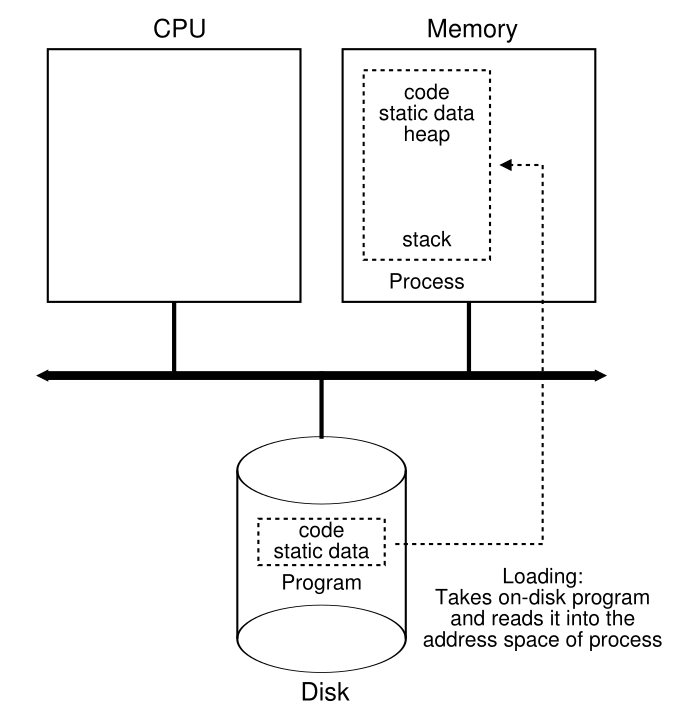
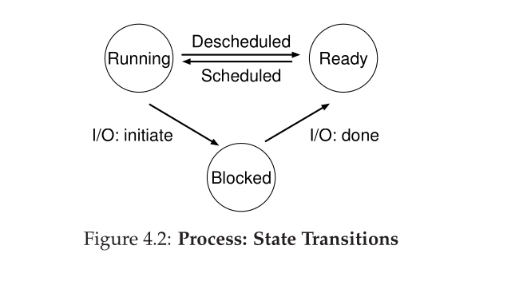

# Parte I &rarr; Virtualizacion

Temas:

* [Procesos](#procesos): &larr; Usted esta aqui

  * [La abtraccion: Un proceso](#la-abstraccion-un-proceso)
  * [API de procesos](#api-de-procesos)
  * [Creacion de un proceso](#creacion-de-un-proceso-mas-detalles)
  * [Estado de los procesos](#estado-de-los-procesos)
  * [Estructuras de Datos](#estructuras-de-datos)

* [API de procesos](./API-de-procesos.md)
* [Ejecucion directa limitada](./Ejecucion-directa.md)
* [Planificacion](./Planificacion.md)
* [Planificacion multinivel](./Planificador-multinivel.md)
* [La abstraccion del espacio de direcciones](./Espacio-direcciones.md)
* [API de memoria](./API-memoria.md)
* [El mecanismo de traduccion de direcciones](./Traduccion-direcciones.md)
* [Segmentacion](./Segmentacion.md)
* [Administracion de espacio libre](./Espacio-libre.md)
* [Paginacion](./Paginacion.md)
* [TLBs](Virtualizacion-TBLs.md)
* [Archivo de intercambio, mecanismo y politica](Virtualizacion-Archivo-de-intercambio-mecanismos-politica.md)

Bibliografia: [OSTEP Cap 4 - Processes](https://pages.cs.wisc.edu/~remzi/OSTEP/cpu-intro.pdf)

## Procesos

&emsp;Los procesos son la abstracion mas fundamental que los OSes proporcionan al usuario. la definicion (informal) de procesos es simple: es un programa en ejecucion. El programa por si mismo el algo sin vida, solo esta ahi en el disco, un puñado de instrucciones esperando entrar en accion. Es el OS el que toma esos bytes y los pone en ejecucion, tranformando el programa en algo util.</br>
&emsp;Resulta que a menudo mas de un programa quiere ejecutarse a la vez</br>
&emsp;Para dar la ilusion de que se ejecutan al mismo tiempo, el OS **virtualiza** la CPU. Ejecutando un procesos, parandolo, ejecutando otro, y parandolo, y asi sucesivamente. El OS puede fomentar la idea de que hay muchas CPUs virtuales cuando enrealidad solo hay una CPU fisica, o unas pocas. Esta tecnica basica, conociada como tiempo comparido de CPU (**time sharing of CPU**), permite a los usuarios correr tantos procesos de forma concurrente como ellos quieran; el costo potencial es el desempeño, cada proceso se ejecutara mas lento si las CPUs deben ser compartidas.</br>
&emsp;Para implementar la virtualizacio de la CPU, e implementarla bien, el OS necesita dos cosas, maquinaria de bajo nivel, e inteligencia de alto nivel. A la maquinaria de bajo nivel la llamamos **mecanismos**; los mecanismos son metodos de bajo nivel o protocolos que implementan una pieza necesaria de funcionalidad.</br>
&emsp;Arriba de estos mecanismos reside parte de la inteligencia en el OS, en forma de politicas. Las politicas son algoritmos para tomar algun tipo de decision dentro del OS, como que programa deberia ejecutar el OS. Una politica de programacion en el OS toma esta decision, usando **informacion historica**, como que procesos se ejecutaron ultimamente, **conocimiento de carga de trabajo**, que tipos de programas se estan ejecutando, y **metricas de desempeño**.</br>

### La abstraccion: Un proceso

&emsp;La abstaccion que el OS proporciona de un programa en ejecucion es llamada proceso (**process**). Como dijimos, un proceso es un programa en ejecucion; en cualquier instante de tiempo, podemos resumir un proceso haciendo un inventario de las diferentes partes del sisteme al que este accede o afecta durante el curso de su ejecucion.</br>
&emsp;Para entender que constituye un proceso, tenemos que entender su maquina de estado **machine state**: lo que un programa puede leer o actualizar mientras se esta ejecutando. En cualquier tiempo dado, que partes de la maquina son importantes para la ejecucion de ese programa?</br>
&emsp;Un componente obvio de la maquina de estado que comprende un proceso es la memoria. Las intruccione viven en la memoria; los datos que el programa lee y escribe tambien estan en la memoria. Por lo tanto la memoria que el proceso puede direccionar (llamada su espacio de memoria) es parte del proceso.</br>
&emsp;Tambien parte de la maquina de estado del proceso son los *registros*; muchas instrucciones leen o actualizan registros explicitamente y por lo tanto son importantes para la ejecucion del proceso</br>
&emsp;Notar que hay alguno registros particularmente especiales que forman parte de la su maquina de estado. Por ejemplo, el **program counter (PC)** (a veces llamado **instruction pointer o IP**), que nos dice cual es la siguien instrucion del programa que se ejecutara.</br>
&emsp;Finalmente, tambien a menudo los programas acceden a dispostivos de guardado permanente. Dicha información de E/S podría incluir una lista de los archivos que el proceso tiene abiertos actualmente.</br>

### API de procesos

Lo que cualquier interfaces de un OS deberia incluir. Estas APIs, de alguna forma, estan dispinbles en cualquies OS moderno.

* **Crear (Create)**: metodo para crear un proceso nuevo.
* **Destruir (Destroy)**: metodo para destruir de un proceso, forzar la detencion del proceso.
* **Esperar (Wait)**: metodo esperar a un proceso, por ejemplo esperarlo antes de terminar la ejecucion.
* **Control Miscelaneo (Miscellaneous Control)**: metodo para suspender un proceso por un tiempo y, detener si ejecucion y despues continuar ejecutandolo.
* **Estado (Status)**: metodo para obtener informacion de estado de un proceso, como por cuanto tiempo se estuvo ejecutando o su estado interno.



### Creacion de un proceso: Mas detalles

&emsp;Un misterio que debemos desenmascarar, es como los programas son transformados en procesos. Especificamente como el OS toma un programa y lo ejecuta y como funciona funciona el proceso de creacion de procesos</br>
&emsp;La primera cosa que debe hacer el OS para ejecutar un programa es cargar su codigo y cualquier data estatico (como variables inicializadas) dentro de la memoria, en el espacio de memoria del proceso. Los programas incialmente residen en el disco en algun tipo de formate ejecutable; por lo tanto, el proceso de cargar un programa y datos estaticos en la memoria requiere que el OS lea esos bytes del disco y los ubique en algun lugar de la memoria.</br>
&emsp;En los primeros OS, la carga de procesos era realizada "ansiosamente" (**eagerly**), es decir, todos a la vez antes de ejecutar el programa; los OSes modernos lo hacen "perezosamente" (**lazily**), es decir, van cargando las partes de codigo o datos solo cuando son necesarias durante la ejecucion del programa.</br>
&emsp;Una vez el codigo y los datos estaticos estan cargados en la memoria, hay un par de cosas mas que el OS debe hacer antes de ejecutar el proceso. Como asignar (**allocate**) algo de memoria para el (**runt-time stack** o solo **stack**). Los programas escritos en C usan el stack para variables locales, parametros de funciones, y return de direcciones. El OS tambien debe inicializar el stack con argumentos; especificamente, llenara los parametros para la funcion ```main()``` del proceso.</br>
&emsp;El OS tambien puede asignar algo de memoria para el **heap** del programa. En los programas en C, el heap es usado cuando se solicita explicitamente guardas datos dinmicamente. Los programas solicitan ese espacio llamando a ```calloc()``` o ```malloc()``` y liberandolo explicitamente llamando a ```free()```. El heap es necesitado por estructuras de datos como las listan enlazadas, tablas hash, arboles, etc.</br>
&emsp;El OS tambien hara algunas otras tareas de inicializacion, particularmente relaciondas con I/O. Por ejemplo, en los sistemas UNIX, cada proceso por defecto, tiene abierto tres **file descriptors**, para **stanard input**, ***standar output*** y para **errores**; esos file descriptors le permiten a los programas leer entradas de la terminal e imprimir salidas en la pantalla.</br>

Resumen de las tareas que hace el OS para crear un proceso:

* Cargar el codigo y los datos estaticos en la memoria
* Crear e inicializar el stack
* Crear e inicializar el heap
* Hacer tareas relacionadas a I/O
* Inciar la ejecucion del programa en el puntro de entrada, llamado ```main()```
  
  * Al saltar a la rutina ```main()```, el OS transfiere el control de la CPU al proceso recien creado, y por lo tanto el programa entra en ejecucion

### Estado de los procesos

De forma simplificada un proceso puede estar en uno de tres estados:

* En ejecucion (**Running**): En el estado *en ejecucion*, un proceso esta ejecutandose en un procesador. Es decir, esta ejecutando instrucciones.
* Listo (**Ready**): En el estado *listo*, un proceso esta listo para ejecutarse, pero por alguna razon el OS ha decidido no ejecutarlo en ese momento.
* Bloqueado (**Blocked**): En el estado *bloqueado*, el proceso a realizado algun tipo de operacion que lo hace no estar listo para ejecutarse hasta que algun otro evento tome lugar. Un ejemplo comun: cuando un proceso inicia una peticion de I/O al disco, pasa a estar bloqueado y por lot anto algun otro proceso puede usar el procesador.



### Estructuras de Datos

&emsp;El OS es un programa, y como cualquier programa, tiene algunas estructuras de datos clave que rastrean varias partes relevantes de informacion. Para rastrear el estado de cada proceso, por ejemplo, el OS probablmente mantendra algu tipo de **lista de procesos** para todos los procesos que estan listos, y alguna informacion adicional para saber que procesos estan actualmente en ejecucion. Tambien el OS debera rastrear de alguna manera los procesos bloqueados; y cuando un evento de I/O se complete debera asegurarse de levantar (**wake**) el proceso correcto y cambiar su estado a *listo* para ejecutarlo nuevamente.</br>
&emsp;Hay algunos otros estados en los que un proceso puede estar:

* Incial (**Initial**): un proceso esta en estado *inicial* cuando es recien creado
* Final (**Final**): un proceso puede ser puesto en estado *final* donde a salido, pero todavia no ha sido limpiado (en sistemas basados en UNIX, este estado es llamado **zombie**).

[Anterior](../Introduccion/Introduccion.md) [Siguiente](./API-de-procesos.md)
