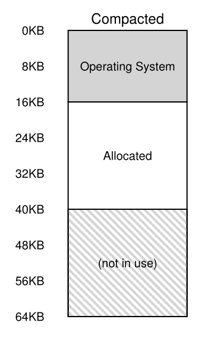

# Parte I &rarr; Virtualizacion

Temas:

* [Procesos](./Procesos.md)
* [API de procesos](./API-de-procesos.md)
* [Ejecucion directa limitada](./Ejecucion-directa.md)
* [Planificacion](./Planificacion.md)
* [Planificacion multinivel](./Planificador-multinivel.md)
* [La abstraccion del espacio de direcciones](./Espacio-direcciones.md)
* [API de memoria](./API-memoria.md)
* [El mecanismo de traduccion de direcciones](./Traduccion-direcciones.md)
* [Segmentacion](#segmentacion): &larr; Usted esta aqui

  * [Segmentacion: Base/Limite Generalizado](#segmentacion-baselimite-generalizado)
  * [A que segmento nos referimos?](#a-que-segmento-nos-referimos)
  * [Que pasa con el stack?](#que-pasa-con-el-stack)
  * [Soporte para compartir](#soporte-para-compartir)
  * [Segmentacion: Grano fino vs Grano grueso](#segmentacion-grano-fino-vs-grano-grueso)
  * [Soporte del OS](#soporte-del-os)

* [Administracion de espacio libre](./Espacio-libre.md)
* [Paginacion](./Paginacion.md)
* [TLBs](./TLBs.md)
* [Paginacion multinivel](./Paginacion-Multinivel.md/)

Bibliografia: [OSTEP Cap - 16 Segmentation](https://pages.cs.wisc.edu/~remzi/OSTEP/vm-segmentation.pdf)

## Segmentacion

&emsp;Hasta ahora hemos estado poniendo todo el espacio de direcciones de cada proceso en memoria. Con los registros base y limite, el OS puede facilmente reubicar procesos a diferentes partes de la memoria. Sin embargo, habras notado algo interesante sobre estos espacios de direcciones: tiene un gran chunk de espacio libre justo en el medio, entre el satack y el heap.</br>
&emsp;Como puedes suponer de la siguiente imagen, a pesar de que el espacio entre el stack y el heap no esta siendo usado por el proceso, aun toma memoria fisica cuando reubicamos el espacio de direcciones entero en algun lugar de la memoria fisica; por lo tanto, el enfoque simple de usar registros base y limite es poco economico. Tambien hace un poco dificil ejecutar un programa cuando el espacio de direcciones entero no esta en memoria; por lo tanto, base y limite no es tan flexible como nos gustaria. Lo que nos lleva a la pregunta clave. Como soportar un espacio de direcciones grande?</br>
&emsp;Como podemos soportar un espacio de direcciones grande con mucho espacio libre entre el stack y el heap? Notar que en nuestro ejemplos, con un espacio de direcciones chico, el costo no es muy malo. Sin embargo, imagina un espacio de direcciones de 32-bits (4GB en memoria) un programa tipico solo usa megabytes de memoria, pero aun podria exigir que su espacio de direcciones entero permanezca en la memoria.</br>


### Segmentacion: Base/Limite Generalizado

&emsp;Para resolver este problema, nacio una idea, y fue llamada **segmentacion**. Es una idea un poco vieja, mas o menos de la decada de los 60's. La idea es simple: porque en vez de tener solo un par base-limite en nuestra MMU, no tenemos un par base-limite por cada **segmento logico** del espacio de direcciones? Un segmento es solo una porcion contigua del espacio de direcciones de un largo particular, y en nuestro espacio de direcciones canonico, tenemos tres segmentos logicos diferentes: code, stack, y heap. Lo que le permite la segmentacion hacer al OS es ubicar cada uno de esos segmentos en partes diferentes de la memoria fisica, y poder evitar llenar la memoria fisica con espacio de direcciones virtuales sin usar.</br>
&emsp;Veamos un ejemplo. Asumamos que queremos ubicar el espacio de direcciones de la imagen anterior en la memoria fisica. Con un par base-limite por segmento, podemos ubicar cada segmento *independientemente* uno de otro en la memoria fisica. Por ejemplo, en la siguiente imagen se puede ver una memoria fisica de 64KB con ese tres segmentos en ella (y 16KB reservados para el OS).</br>


&emsp;Como se puede ver en el diagrama, solo memoria usada tiene asignado un espacio en la memoria fisica, y por lo tanto, espacios de direcciones mas grandes con mas cantidad de espacios de direcciones no usadas (llamdos **sparse address spaces**) se pueden accomodar.</br>
&emsp;Lo que se espera es que la estructura de hardware de nuestra MMU requiera soporte de segmentacion: en este caso, un conjunto de tres pares de resgistros base y limite. La tabla de abajo muestra el valor de los registros para el ejemplo de arriba; cada segmento limite mantiene el tamaño de un segmento.</br>

| Segment | Base | Size |
| :---: | :---: | :---: |
| Code | 32K | 2K |
| Heap | 34K | 3K |
| Stack | 28K | 2K |

&emsp;En la tabla se puede ver que el segmento de codigo fue ubicado en la direccion fisica 32KB y que tiene un tamaño de 2KB y el segmento del heap fue puesto en la direccion 34KB con un tamaño de 3KB. El tamaño del segmento aqui es lo mismo que el resgistro limite que vimos previmente; le dice al hardware exactamente cuantos bytes son validos para esse segmento.</br>
&emsp;Veamos un ejemplo de traduccion del ejemplo de la introccion de este capitulo. Asumamos que se hizo una referencia a la direccion virtual 100 (la cual este en el segmento del codigo). Cuando la referencia toma lugar (digamos una instruccion fetch), el hardware agregara el valor base al *offset* dentro de ese segmento (100 en este caso) para llegar a la direccion fisica deseada: 100 + 32KB, o 32868. Estonces verificara que la direccion este dentro de los limites (100 , 2KB), la encontrara, y emitira un referencia a la direccion de la memoria fisica 32868.</br>
&emsp;Ahora veamos en una direccion del heap, direccion virtual 4200. Si solo agregamos la direccion virtual 4200 a la base del heap (34KB), obtendremos la direccion fisica 39016, la cual no es la direccion fisica correcta. Lo que necesitamos hacer primero es extraer el offset dentro del heap, es decir, a que byte(s) de este segmento se refiere. Dado que el heap comienza en la direccion virtual 4KB (4096), el offset de 4200 es realmente 4200 menos 4096, osea 104. Entonces tomamos ese offset y se lo sumamos al registro base de la direccion fisica (34KB) para obtener el resultado deseado: 34920.</br>
&emsp;Que pasa si intentamos hacer referencia a una direccion ilegal (es decir, una direccion virtual de 7KB o mayor), la cual esta mas alla del final del heap? Puedes imaginar que sucedera: el hardware detectara que la direccion esta fuera de los limites, salta dentro del OS, probablemente terminando con el proceso. Y ahora ya sabes es origen del famoso termino al que todo programador de C aprendio a termerle: **segmentation violation** o **segmentation fault**.)</br>

### A que segmento nos referimos?

&emsp;El hardware usa registros de segmentos durante la traduccion. Como sabe el offset dentro de un segmento, y a que segmente se refiera una direccion?</br>
&emsp;Un enfoque comun, a veces referido como un enfoque **explicito**, es cortar el espacio de direcciones en funcion de los bits superores de una direccion virtual; esta tecnica fue usad en el sistema VAX/VMS. En nuestro ejemplo de arriba, tenemos tres segmentos; por lo tanto necesitamos dos bits para lograr nuestra tarea. Si usamos los primero dos bits de nuestra direccion virtual de 14bits para seleccionar el segmento, nuestra direccion virtual luciria asi:</br>


&emsp;En nuestro ejemplo, si los primeros dos bits son 00, el hardware sabra que la direccion virtual esta en el segmento de codigo, y por lo tanto usara el par base-limite del codigo para reubicar la direccion a la ubicacion fisica correcta. Si los primeros dos bits son 01, el hardware sabra que la direccion es del heap, y por lo tanto usara el par base-limite del heap. Tomemos de nuestro ejemplo la direccion virtual del heap de arriba (4200) y la traduzcamos, solo para asegurarnos que quedo claro. La direccion virtual 4200, en binario, es asi</br>

$$01_{segment}|000001101000_{offset}$$

&emsp;Como puedes ver, los primeros dos bits (01) le dicen al hardware a que segmento nos estamos refiriendo. Los ultimos 12 bits son el offset del segmento: 0000 0110 1000, o 0x068 en hexa, o 104 en decimal. Por lo tanto, el hardware simplemente toma los primero dos bits para determinar los registros de que segmento usar, entonces toma los siguientes 12 bits como el offset del segmento. Sumando el registro base al offset, el hardware llega a la direccion fisica final. Notar que el offset facilita verificar el limite: podemos simplemente verificar que el offset sea menos que el limite; si no lo es, la direccion es ilegal. Por lo tanto, si la base y limites son arrays el hardware debera hacer algo como esto para obtener la direccion fisica deseada:</br>

```c
//get top 2 bits of 14-bit VA
Segment = (VirtualAddress & SEG_MASK) >> SEG_SHIFT
//now get offset
Offset - VirtualAddress & OFFSET_MASK
if(Offset >= Bounds[Segment])
  RaiseException(PROTECTION_FAULT)
else
  PhysAddr = Base[Segment] + Offset
  Register = AccessMemory(PhysAddr)
```

&emsp;En nuestro ejemplo, podemos llenar los valores de las contantes. Especificamente, SEGM_MASK deber ser inicializado en 0x3000, SEG_SHIFT en 12, y OFFSET_MASK en 0xFFF</br>
&emsp;Tambien habras notado que usamos los primeros dos bits, y solo tenemos tres segmentos (code, heap, stack), un segmento del espacio de direcciones no sera usado. Para usar completamente el espacio de direcciones (y evitar un segmento sin usar), algunos sistemas ponen el codigo en el mismo segmento que el heap y por lo tanto solo usan un bit para seleccionar que segmento usar.</br>
&emsp;Otro problema al usar los primeros bits para seleccionar el segmento es que limita el uso del espacio de direcciones. Especificamente, cada segmento es limitado a un tamaño maximo, el cual en nuestro ejemplo es de 4KB (usar los primeros 2 bits para elegir el segmento implica que los 16KB de espacio de direcciones son cortados en cuatro piezas, de 4KB en este ejemplo). Si un programa en ejecucion desea aumentar un segmento (digamos el heap, o el stack) mas alla del maximo, el programa no podra.</br>
&emsp;Hay otras formas en que el hardware puede terminar en que segmento esta una direccion en particular. En el enfoque **implicito**, el hardware determina el segmento dandose cuenta por la forma de la direccion. Si, por ejemplo, la direccion fue generada del PC (es decir, una instruccion fetch), entonces la direccion esta en el segmento del codigo; si la direccion esta basada del stack o el puntero base, deber estar en el stack; cualquier otra direccion debe estar en el heap.</br>

### Que pasa con el stack?

&emsp;Hemos dejado fuera un componente clave del espacio de direcciones: el stack. El stack a sido reubicado en la direccion fisica 28KB en el diagrama de arriba, pero con una diferencia critica: *crece hacia atras*. En la memoria fisica, comienza en 28KB y crece hacia atras hasta 26KB, que corresponde a las direcciones virtuales 16KB a 14KB; la traduccion debe hacerse diferente.</br>
&emsp;Lo primero que necesitamos es un poco mas de ayuda del hardware. En vez de solo valores de base y limite, el hardware tambien necesita saber en que direccion crece el segmento (por ejemplo, un bit, 1 cuando el segmento crezaca en direccion positva o 0 para direccion negativa). Vista actualizada del seguimiento del hardware:</br>

| Segment | Base | Size(max 4K) | Grows positive? |
| :---: | :---: | :---: | :---: |
| $$Code_{00}$$ | 32K | 2K | 1 |
| $$Heap_{01}$$ | 34K | 3K | 1 |
| $$Stack_{11}$$ | 28K | 2K | 0 |

&emsp;Con el hardware conciendo que los segmentos pueden crecer de forma negativa, ahora debe traducir las direcciones virtual de forma un poco diferente. Tomemos un ejemplo de direcciones virtuales del stack y las traduzcamos para entender el proceso.</br>
&emsp;En este ejemplo, asumamos que queremos acceder a la direccion virtual 15KB, la cual debe ser mapeada a la direccion fisica 27KB. Nuestra direccion virtual, en binario es 11 1100 0000 0000 (hex 0x3C00). El hardware usa los primeros dos bits (11) para designar el segmento, pero entonces estamos dejando un offset de 3KB. Para obtener el offset negativo correctamente, debemos restarle a los 3KB el tamaño maximo del segmento: en este ejemplo, un segmento puede ser de 4KB, y por lo tanto el offset negativo correcto es 3KB menos 4KB, lo cual es igual a -1KB. Simplemente sumamos el offset negtivo a la base (28KB) para llegar la direccion fisica correcta: 27KB. La verificaion del limite se peude calcular asegurando que el valor absoluto del offset negativo es menor o igual que el tamaño del segmento actual (en este caso, 2KB).</br>

### Soporte para compartir

&emsp;Como soporte para el crecimiento de la segmentacion, los diseñadores de sistemas se dieron cuenta que podrian realizar nuevos tipos de eficiencia con un poco mas de ayuda del hardware. Especificamente, para guardar memoria, a veces es util **compartir** ciertos segmentos de memoria entre espacios de direcciones. En particular, **code sharing** es comun y todavia se usa en los sistema de hoy.</br>
&emsp;Para soportar compartir, necesitamos mas ayuda del hardware, de la forma de **proteccion de bits**. Soporte basico agrega unos pocos bits por segmento, indicando ya sea que un segmento puede o no puede leer o escribir un segmento. Seteando un segmento de codigo como solo lectura, el mismo codigo puede ser compartido a traves de multiples procesos, sin preocuparnos de dañar el aislamiento; mientras que cada proceso aun cree que esta accediendo a su propia memoria privada, el OS secretamente esta compartiendo memoria que no puede ser modificada por el proceso, y por lo tanto la ilusion se mantiene.</br
&emsp;Un ejemplo de informacio adicional de rastreo se muestra en la siguiente imagen:</br>


&emsp;Como puedes ver el segmento del codigo esta seteado como lectura y ejecucion, y por lo tanto el mismo segmento fisico en memoria puede ser mapeado en multiples espacios de direcciones.</br>
&emsp;Con los bits de proteccion, el algoritmo del hardware descrito antes tambien tendria que cambiar, el hardware tambien tendria que verificar si un acceso particular esta permitido. Si un proceso de usuario intenta escribir un segmento de solo lectura, o ejecutar desde un segmento no ejecutable, el hardware lanzara una excepcion, y por lo tanto le permitira al OS tratar con el proceso.</br>

### Segmentacion: Grano fino vs Grano grueso

&emsp;Muchos de nuestro ejemplos han estado centrados en sistemas con algunos pocos segmentos (code, stack, heap); podemos pensar que nuestra segmentacion es de **grano grueso**, como corta los espacios de direcciones en granos de chunks relativamente grandes. Sin embargo, algunos de los primeros sistemas eran mas flexibles y le permitian a las espacios de direcciones consisir de un mayor nuemero de segmentos mas chicos, y se conocia como segmentacion de grano **grano fino**.</br>
&emsp;Soportar muchos segmentos requeria incluso mas ayuda del hardware con una **tabla de segmentos** de algun tipo guardada en la memoria. Como las tablas de segmentos soportaban la creacion de un numero mas grande de segmentos, por lo tanto le permitia al sistemas usar de forma mas flexible los segmentos. Por ejemplo, las primeras maquinas tenian soporte para miles de segmentos, y esperando que un compilador corte el codigo y los datos en segmentos separados para los cuales el OS y el hardware tenian soporte. El pensamiento en ese momento era que teniendo segmentos de grano fino el OS podria saber mejor sobre que segmentos estaban en uso y cuales no y podes usar mejor y mas efectivamente la memoria principal.</br>

### Soporte del OS

&emsp;Ahora debes tener una idea basica de como funciona la segmentacion. Piezas de espacios de direcciones son reubicadas en la memoria fisica mientras el sistema se ejecuta, y asi se consigue en enorme ahorra de memoria fisica en comparacion de nuestro enfoque mas simple con solo un par base-limite para el espacio de direcciones entero. Especificamente, todo el espacio no usado entre el stack y el heap no necesita ser asignado en la memoria fisica, permitiendonos poner mas espacios de direcciones en la memoria fisica y soportar un gran y esparcido espacio de direccion por proceso.</br>
&emsp;Sin embargo, de la segmentacion surge un nuevo numero de problemas para el OS. El primero y el mas viejo: que debe hacer el OS en un cambio de contexto? Como deber bien suponer, los registros de los segmentos deben ser guardados y recuperados, Claramente, cada proceso tiene su proprio espacio de direcciones, y el OS debe asegurarse de inciar estos registros correctamente antes de permitirle a un proceso ejecutarse nuevamente.</br>
&emsp;El segundo es la interaccion del OS cuando un segmento crece o se reduce. Por ejemplo, un programa puede llamar a *malloc()* para guardar un objeto. En algunos casos, el heap existente sera capaz de cumplir el requrimiento, y por lo tanto *malloc()* entcontrara espacio libre para el objeto y retornara un puntero a el. En otro casos, sim embargo, el segmento heap necesitara crecer. En este caso, la libreria de asignacion de memoria hara una system call para agrandar el heap. El OS entonces proporsionara mas espacio, actualizando el registro del tamaño del segmento por el nuevo tamaño, e informando a la libreria el exito; entonces la libreria puede asignar espacio para el nuevo objeto y retornar exitosamente. Notar que el OS podria rechazar la peticion si no hay mas memorio fisica disponible o si decide que el proceso que la pidio ya tiene demasiada.</br>
&emsp;El ultimo problema, y quiza el mas importante, es la gestion del espacio libre en la memoria fisica. Cuando se crea un nuevo espacio de direcciones, el OS tiene que ser capaz de encontrar espacio en la memoria fisica para sus segmentos. Previamente, asumimos que cada espacio de direcciones tenian el mismo tamaño, y por lo tanto la memoria fisica se podia pensar como un puñado de slots donde se podian poner los procesos. Ahora, tenemos un numero de segmentos por proceso, y cada segmento tiene un tamaño diferente.</br>
&emsp;El problema general que surge es que rapidamente la memoria fisica se llena de pequeños huecos de espacio libre, haciendo dificil la asignacion de memoria a nuevos segmentos, o que crezcan los ya existentes. Llamaremos a este problema **fragmentacion externa**, se puede ver un ejemplo en la siguiente imagen.</br>


&emsp;En el ejemplo, llega un proceso y desea guardar un segmento de 20KB. En este ejemplo, hay 24KB libres, pero no es un segmento contiguo (en tres segmentos no contiguos). Por lo tanto, el OS no puede satisfacer la peticion de 20KB. Problemas similares pueden ocurrir cuando llega una peticion para agrandar un segmento; si los siguientes bytes no estan disponlibes el OS debere rechazar la peticion, incluse a pesar de que alla bytes libres disponiles esparcidos por la memoria fisica.</br>
&emsp;Una solucion para este problema podria ser **compactar** la memoria fisica reorganizando los segmentos existentes. Por ejemplo, el OS podria frenar cualquier proceso que se este ejecutando, copiar sus datos en una region contigua de la memoria, cambiar sus valores de los registros del segmento al punto de la nueva ubicacion, y por lo tanto tener una extencion mas grande de memoria libre con la cual trabajar. Sin embargo, compactar es caro, copiar segmentos usa mucha memoria y una gran cantidad de tiempo de procesador; en la siguiente imagen se ve un ejemplo de memoria compactada:</br>



&emsp;Compactar tambien, ironicamente, hace peticiones para agrandar segmentos existentes dificles de cumplir y causar aun mas reogranizaciones para acomodar dichas peticiones.</br>
&emsp;Un enfoque mas simple podria ser un algoritmo de administracion con una **free-list** que intente mantener grandes extenciones de memorio disponibles para asignaciones. Literalmente hay cientos de enfoques que tomo la gente, incluidos algoritmos clasicos como **best-fit** (el cual mantiene una lista de espacios libre y devuelve el que tiene el tamaño mas parecido que satisfaga la peticion de asignacion), **worst-fit, first-fit**, y esquemas mas complejos como **buddy algorithm**.</br>

[Anterior](./Traduccion-direcciones.md) [Siguiente](./Espacio-libre.md)
