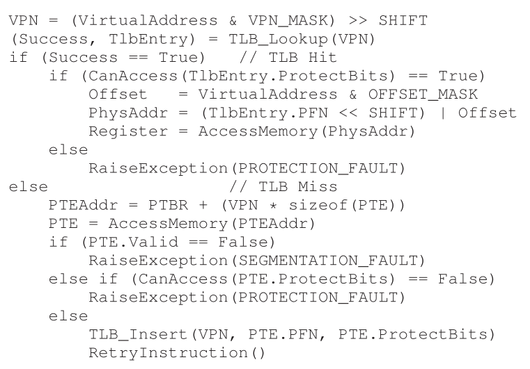
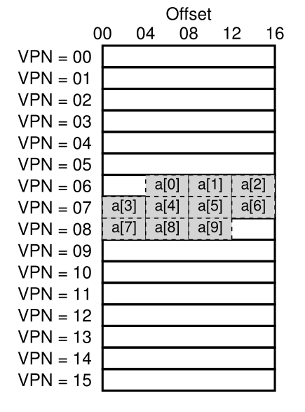
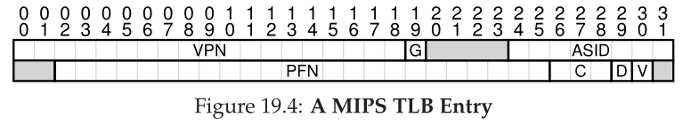

# Parte I &rarr; Virtualizacion

Temas:

* [Procesos](./Procesos.md)
* [API de procesos](./API-de-procesos.md)
* [Ejecucion directa limitada](./Ejecucion-directa.md)
* [Planificacion](./Planificacion.md)
* [Planificacion multinivel](./Planificador-multinivel.md)
* [La abstraccion del espacio de direcciones](./Espacio-direcciones.md)
* [API de memoria](./API-memoria.md)
* [El mecanismo de traduccion de direcciones](./Traduccion-direcciones.md)
* [Segmentacion](./Segmentacion.md)
* [Administracion de espacio libre](./Espacio-libre.md)
* [Paginacion](./Paginacion.md)
* [TLBs](#paginacion-traduccion-mas-rapida-tlbs): &larr; Usted esta aqui

  * [TLB Algoritmo Basico](#tlb-algoritmo-basico)
  * [Ejemplo: Acceddiendo a un array](#ejejmplo-accediendo-a-un-array)
  * [Quien maneja los TLB miss?](#quien-maneja-los-tlb-miss)
  * [Contenido del TLB: que hay adentro?](#contenido-del-tlb-que-hay-adentro)
  * [Problema con TLB: cambio de contexto](#problema-con-tlb-cambio-de-contexto)
  * [Problema: Política de reemplazo](#problema-política-de-reemplazo)
  * [Una entrada de TLB real](#una-entrada-de-tlb-real)

* [Paginacion multinivel](./Paginacion-Multinivel.md)

Bibliografia: [OSTEP Cap - 19 Paging: Faster Translations (TLBs)](https://pages.cs.wisc.edu/~remzi/OSTEP/vm-tlbs.pdf)

## Paginacion: Traduccion mas rapida (TLBs)

&emsp;Usar paginacion como mecanismo central para soportar memoria virtual puede traer grandes gastos de desempeño. Cortar el espacio de direcciones en pedazos mas chicos, unidades de tamaño fijo (es decir, paginas), la paginacion requiere una gran cantidad de mapeo de informacion. Dado que el mapeo de informacion generalmente es cargado en la memoria fisica, la paginacion logicamente requiere una busqueda de memoria adicional para cada direccion virtual generada por el programa. Ir a la memoria para traducir informacion antes de cada instruccion fecth o carga/guarado explicito es prohibivamente lento. Por lo tanto nuestro problema es:</br>

&emsp;Como podemos acelerar la traduccion de direcciones, y evitar la mayor parte de referencias a memoria extra que parece requerir la paginacion? Que ayuda del hardware necesitamos? Que participacion del OS se necesita?</br>

&emsp;Cuando queremos hacer las cosas mas rapido, el OS usualmente necesita algo de ayuda. Y a menudo viene del viejo amigo del OS: el hardware. Para celerar la traduccion de direcciones, vamos a agregar lo que historicamente se llama **buffer de busqueda de traduccion (translation-lookaside buffer &rarr; TLB)**. Un TLB es parte de la **unidad de adminsitracion de memoria (memory-management unit &rarr; MMU)**, y es simplemente una **cache** de hardware de traducciones populares de direcciones virtuales a fisicas; por lo tanto, un mejor nombre seria **address-translation cache**. Sobre cada referencia de memoria virtual, el hardware primero verifica el TLB para ver si la tracuccion deseada esta ahi; si lo esta, la traduccion se hace rapidamente sin tener que consultar la page table. Dado este tremendo impacto en el desempeño, los TLBs en un sentido real hacen la memoria virtual posible.</br>

### TLB Algoritmo Basico

&emsp;La siguiente figura muestra un bosquejo aproximado de como el hardware debe manejar a traduccion de una direccion virtual, asumiendo una simple **table page lineal** y un **hardware-managed TLB**;</br>



&emsp;El algoritmo que el hardware sigue funciona asi: primero, extrae el numero de pagina virtual (VPN) de la direccion virtual, y verifica si la TLB tiene la traducion para ese VPN. Si la tiene, tenemos un **TLB hit**, que signidica que el TLB tiene la traduccion. Exito! Ahora podemos extraer el numero del page frame (PFN) de la entra relevante del TLB, concatenarla en el ofset de la direccion virtual original, y formar la direccion fisica deseada (PA), y acceder a la memoria, asumiendo que al proteccion verifica que no falla.</br>
&emsp;Si la CPU no encuentra la traduccion en la TLB (**TLB miss**). Tenemos mas trabajo para hacer. En este ejemplo, el hardware accede a la page table para encontrar la traduccion. y, asumiendo que la referencia de memoria virtual generada por el proceso es valida y accesible, actualiza el TLB con la traduccion. Este conjunto de acciones son costosas, principalmente por culpa de las referencias extra a memoria necesitadas para acceder a la page table. Finalmente, una vez que el TLB esta actualzado, el hardware reintenta la instruccion; esta vez, la traduccion esta en el TLB, y la referencia a memoria se hace rapido.</br>
&emsp;EL TLB, como todos los caches, es contruida con la premisa que en el caso comun, las traducciones estan ahi. Si lo estan (un hit), se agregas costos bajos, ya que el TLB esta cerca del nucleo procesador y esta diseñado para ser rapido. Cuando ocurre un miss, se incurre en un alto costo de paginacionl la page table debe ser accedida para encontrar la traduccion, y resulta una referencia extra de memoria. Si esto sucede a menudo, el programa probablemente se ejcutara notablemente mas lento; los accesos a memoria, en relacion con la mayoria de las instruccion de CPU, son un poco costosos, un TLB miss no deja mas accesos a memoria. Por lo tanto, esperamos evitar los TLB miss tanto como podamos.</br>

### Ejejmplo: Accediendo a un array

&emsp;Para dejar claro el funcionamiento de un TLB, examinemos el seguimiento de una direccion virtual simple y vemamos como un TLB puede mejorar su desempeño. En este ejemplo, vamos a asumir que tenemos un array de 10 enteros de 4 bytes en la memoria, comenzando en la direccion virtual 100. Asumamos tambien que tenemos un espacio de direcciones chico de 8 bits, con paginas de 16 bytes; por lo tanto una direccion virtual tiene un VPN de 4 bits ($2^{4(VPN)} = 16 (pages)$) y un offset de 4 bits(hay 16 bytes en cada una de estas paginas).</br>
&emsp;La siguiente imagen muestra el array dispuesto en las 16 paginas de 16 bytes del sistema.</br>



&emsp;Como puedes ver, la primera entrada del array (*a[0]*) inicia en (VPN = 06, offest = 04); solo tres enteros de 4 bytes entran en esa pagina. El array continua en la siguiente (VPN = 07), donde estan las siguientes cuatro entradas (*a[3] ... a[6]*). Finalmente, las ultimas tres entradas de las diez del array (*a[7] ... a[9]*) estan localizadas en la siguiente pagina del espacio de direcciones (VPN = 08).</br>
&emsp;Ahora consideremos un loop simple que accede a cada elemento del array, algo que deberia lucir algo asi en C:</br>

```c
int sum = 0;
for (i = 0; i < 10; i++) {
  sum += a[i];
}
```

&emsp;En aras de la simplicidad, pretenderemos que los unicos accesos a memoria que genera el loop son al array (ignorando las variables *i* y *sum*, como tambien las mismas instrucciones). Cuando se accede al primer elemento del array (*a[o]*), la CPU vera una carga a la direccion virtual 100. El hardware extrae el VPN de la direccion (VPN = 06), y lo usa para verificar el TLB para una traduccion valida. Asumiendo que es la primera vez que el programa accede al array, el resultado sera un TLB miss.</br>
&emsp;El siguiente acceso es a *a[1]*, y hay buenas noticias: un TLB hit! Dado que el segunto elemento del array esta empaquetado al lado del primero, vive en la misma pagina y dado que ya accedimos a la primera pagina cuando accedimos al primer elemento del array, la traduccion ya esta cargada dentro del TLB. Y esa es la razon de nuestro exito. Acceder a *a[2]* encuentra otro exitos, dado que vive en la misma pagina que *a[0]* y *a[1]*.</br>
&emsp;Desafortunadamente, cuando el programa accede a *a[3]*, nos encontramos con otro TLB miss. Sin embargo, una vez mas, las siguientes entradas (*a[4] ... a[6]*) seran un TLB hit, dado que todas residen en la misma pagina en la memoria.</br>
&emsp;Finalmente, acceder a *a[7]* causa un ultimo TLB miss. El hardware una vez mas consulta la page table para averigurar la ubicacion de esta pagina virtual en la memoria fisica, y actualiza el TLB acoordemente. Los ultimos dos accesos (*a[8]* y *a[9]*) reciven los befecios de esta actualiazcion del TLB; cuando el hardware mira en el TLB para sus traducciones, hay dos hits mas.</br>
&emsp;Resumamos la actividad de un TLB durante nuestros 10 accesos a memoria del array: **miss**, hit, hit, **miss**, hit, hit, hit, **miss**, hit, hit. Por lo tanto, nuestro TLB **hit rate**, el cual es el numero de hits dividido el numero total de accesos, es 70%. A pesar de que no es muy alto, de hecho desemaos que sea 100%, no es ceroo, lo cual puede ser una sorpresa. A pesar de que es la primera vez que se ejecuta el programa, el TLB mejora el desempeño debido a la **spatial locality**. Los elementos del array son empaquetados en páginas (es decir, estan cerca uno de otros en espacio), y por lo tanto solo el primer acceso a un elemento de una página da un TLB miss.</br>
&emsp;Tambien hay que notar el role que juega el tamaño de pagina de este ejejmplo. Si el tamaño de pagina fuera el doble de grande (32bytes, no 16), el acceso al array sufriria incluso menos misses. Un tamaño más típico es como 4KiB, estos tipos de accesos densos basado en matrices logran un excelente rendimiento de TLB, encontrando solo un miss por pagina de acceso.</br>
&emsp;Un último punto sobre el desempeño de TLB: si el programa, justo después de que se complete el loop, accede al array nuevamente, veremos un mejor resultado, suponiendo que tenemos en TLB suficientemente grande para tener en cache las traducciones necesarias: hit, hit, hit, hit, hit, hit, hit, hit, hit, hit. En este caso, el TLB hit rate será mayor dado la **temporal locality**, es decir, la rápida re-referencia de los items de memoria en el tiempo. Como cualquier cache, TLBs se basan en localidad espacial y temporal para el exito, lo cual son propiedades del programa. Si el programa de interes exhibe tales localidades (y muchos programas lo hacen), el TLB hit rate sera alto.</br>

### Quien maneja los TLB miss?

&emsp;Una pregunta que debemor responder: quién maneja los TLB miss? Dos respuestas son posibles: el hardware, o el software (OS). Antes, el hardware tenia un set de instrucciones complejo, y las personas que construian el hardware no confiaban en esas austas persona del OS. Por lo tanto, el hardware manejaba los TLB miss completamente. Para hacerlo, el hardware tiene que saber exactamente donde estan las pages tables en la memoria, en caso de una falla, el hardware recorrería la page table y extrería la traducción deseada, actualizaría el TLB con la traduccion, y reintentaria la instruccion.</br>
&emsp;Las arquitecturas más modernas tienen lo que se concoe como **software-managed TLB**. En un TLB miss, el hardware simplemente lanza una excepción, lo que pausa el acutal stream de instrucciones, cambia a kernel mode, y salta a un **trap handler**. Como debes suponer, este trap handler es codigo del OS que esta escrito con el propósito de manejar los TLB misses. Cuando se ejecute, buscara la traducción en la page table, y usara una instrucción provilegiada para actualizar el TLB, y volvera del trap; en este punto, el hardware reintentará la instrucción.</br>
&emsp;Discutiremos un par de detalles importantes. Primero, la instrucción return-from-trap necesita ser un poco diferente que el return-from-trap que vimos antes cuando servia a una syscall. En el ultimo caso el return-from-trap reanuda la ejecución despues de el trap en el OS, como un return de una llamada a un procedimiento que vuelte en la instruccion que esta exactamente después de la llamada a dicho procedimiento. En el caso anterior, cuando volvemos de un TLB-miss-handling trap, el hardware debe reanudar la ejecución en la instruccion que causo el trap; se reintenta ejecutar, y esta vez resultad un TLB hit. Por lo tanto, dependiendo de como fue causada una excepción de trap, el hardware debe guardar un PC diferente cuando trapea en el OS, para reanudar apropidamente la ejecución.</br>
&emsp;Segundo, cuando se ejecuta el código de manejo de TLB miss, el OS necesita ser extracuidadoso de no causar una cadena infinita de TLB miss, puedes tener el manejador de TLB miss en la memoria física (que está sin mapear y no esta sujeta a traducciones de memoria), o revervar algunas entradas en el TLB para una traduccion permanente, y usar algunos slots de traduccion permanente para manejar el mismo codigo; en estas traducciones "cableadas" siempre hay un TLB hit.</br>
&emsp;La princial ventaja del enfoque *software-managed* es la *flexibilidad*: el OS puede usar cualquier estructura de datos para implementar la page table, sin necesitar cambios en el hardware. Otra ventaja es la *simplicidad*, como vimos en el flujo de control de TLB. El hardware no hace mucho en un miss: solo lanza una excepción y deja al OS manmejar el TLB miss.</br>

### Contenido del TLB: que hay adentro?

&emsp;Veamos el contenido del hardware del TLB en más detalle. un TLB típico debe tener 32, 64, o 128 entradas y deber ser lo que se llamada **completamente asociativo**. Básicamente, esto significa que cualquier traducción dada puede estar en cualquier lugar del TLB, y que el hardware buscara en todo el TLB en paralelo para encontrar la traduccion deseada. Una entrada de TLB luce así:</br>

| VPN | PFN | other bits |
|:---:|:---:|:---:|

&emsp;Notar que VPN y PFN estan presentes en cada entrada, como una traducción puede terminar en cualquiera de esas ubicaciones (en terminos de hardware, el TLB es conocido como una cache **completamente asociativa**). El hardware busca la entradas en paralelo para ver si alguna coincide.</br>
&emsp;Son mas interesantes los "otros bits". Por ejemplo, el TLB comunmente tiene un **valid** bit, el cual dice si la entrada tiene una traduccion valida o no. También son comunes los bits de **protección**, los cuales indican como puede ser accedida una page table. Por ejemplo, las paginas con código deben ser marcadas como *read and execute*, las heap pages deben ser marcadas como *read adn write*. Tambien hay otros campos, incluyendo un identificador de espacio de direcciones, un dirty bit, y más.</br>

### Problema con TLB: Cambio de contexto

&emsp;Con TLBs, algunas nuevos problemas surgen cuando cambiamos entre procesos. Específicamente, el TLB contiene traducciones virtuales a fisica que son válidas solo para el proceso actual; esas traducciones no son significativas para otros procesos. Como resultado, cuando cambiamos de un proceso a otro, el hardware, o el OS (o ambos) deben ser cudiadosos que el proceso que se esta por ejecutar no use accidentalmente traducciónes de algún proceso previo.</br>
&emsp;Para entender mejor esta situación, veamos un ejemplo. Cuando un proceso (P1) se esta ejecutando, se asume que el TLB esta guardado en cache las traducciones que son validad para P1, es decir, vienen de la page table de P1. Asumamos para este ejemplo, que la décima página virtual de P1 es mapeada al frame físico 100.</br>
&emsp;En este ejemplo, asumamos que existe otro proceso (P2), y que el OS decide hacer un cambio de contexto y ejecutarlo. Asumamos aquí que la décima pagina virtual de P2 es mapeada al frame físico 170. Si las entradas de ambos procesos estan en la TLB, el contenido de la TLB sería:</br>

| VPN | PFN | valid | prot |
|:---:|:---:|:---:|:---:|
| 10 | 100 | 1 | rwx |
| -- | -- | 0 | -- |
| 10 | 170 | 1 | rwx |
| -- | -- | 0 | --- |

&emsp;En el TLB de arriba, claramente hay un problema: VPN 10 se traduce a PFN 100 (P1) o PFN 170 (P2), pero el hardware no puede distinguir que entrada es significatia para que proceso. Por lo tanto, necesitamos trabajar más para el correcto soporte de TLB a la virtualización a través de multiples procesos. De lo cual surge el siguiente problema: **Cómo manejar el contenido del TLB en un cambio de contexto?** Cuando se se produce un cambio de contexto entre procesos, las traducciones en el TLB para el último proceso no son significativas para el proceso a punto de ejecutarse. Que debería hacer el hardware o el OS para solucionar este problema?</br>
&emsp;Hay varias posibles soluciones a este probelma. Un enfoque es simplmente **limpiar** el TLB en un cambio de contexto. En un sistema basado en software, esto puede ser realizado con una expolícita y privilegiada instruccion de hardware; con un manejo de TLB por ahrdware, la limpieza puede ser recreada cuando el registro base de la page table es cambiado (el OS debe cambiar el PTBR en un cambio de contexto). En cualquier caso, la limpieza es setear todos los bits validos a 0, escencialmente limpiando el contenido del TLB.</br>
&emsp;Limpiando el TLB en cada cambio de contexto, tenemos una solucioón que funciona, ya que un proceso nunca encontrara una traducción erronea en el TLB. Sin embargo tiene un costo: cada vez que un proceso se ejecuta, debe incurrir en TLB misses si toca sus datos y paginas de código. Si el OS cambia entre procesos frecuentemente, el costo será alto.</br>
&emsp;Para reducir este costo, algunos sistemas agregan soporte de hardware para permitir compartir el TLB a través de los cambios de contexto. En particular, algunas sistemas de hardware proveen un campo **address space identifier (ASID) (identificador de espacio de direcciones)** en el TLB. Puedes pensar en el ASID como un **process identifier (PID) idenfificador de proceso**, pero usualmente tiene menos bits (8 bits para el ASID versus 32 bits para un PID).</br>
&emsp;Si tomamos el TLB de nuestro ejemplo de arriba y le agregamos ASIDs, es claro que los procesos pueden compartir TLB facilmente: solo se necesita el campo ASID para diferenciar cualquier traduccion idénticas. Aquí hay una representacion de un TLB con el campo ASID agregado:</br>

| VPN | PFN | valid | prot | ASID |
|:---:|:---:|:---:|:---:|:---:|
| 10 | 100 | 1 | rwx | 1 |
| -- | -- | 0 | -- | -- |
| 10 | 170 | 1 | rwx | 2 |
| -- | -- | 0 | -- | -- |

&emsp;Por lo tanto, con los identificadores de espacios de direcciones podemos mantener las traducciones de diferentes procesos al mismo tiempo sin una confusión. Obviamente, el hardware también necesita saber que proceso se está ejecutando actualmente para relizar la traducción, y por lo tanto el OS debe, en un cambio de contexto, setear algunos registros privilegiados para el ASID del proceso actual.</br>
&emsp;Por un lado, hay otro caso donde dos entradas del TLB con muy similares. En este ejemplo, hay dos entradas para dos procesos diferentes con dos diferentes VPNs que apuntan a la misma página física:</br>

| VPN | PFN | valid | prot | ASID |
|:---:|:---:|:---:|:---:|:---:|
| 10 | 101 | 1 | rwx | 1 |
| -- | -- | 0 | -- | -- |
| 50 | 101 | 1 | rwx | 2 |
| -- | -- | 0 | -- | -- |

&emsp;Esta situacion puede surgir, por ejemplo, cuando dos procesos comparten una página. En el ejemplo de arriba, el proceso 1 esta compartiendo la página física 101 con el proceso 2; P1 mapea esta pagina en la 10th página de su espacio de direcciones, y P2 mapea la 50th página de su espacio de direccioens. Comparit páginas de código es útil para reducir el número de páginas físicas en uso, y por lo tanto reduciendo el gasto de memoria.</br>

### Problema: Política de reemplazo

&emsp;Como con cualquier cache, y por lo tanto con el TLB, otro problema que debemo considerar es el **reemplazo de cache**. Específicamente, cuando insertamos una nueva entrada en la TLB, tenemos que **reemplazar** una entrada vieja, entonces la pregunga" cuál reemplazamos?</br>
&emsp;Como diseñamos las políticas de reemplzazo del TLB? Cuál de las entradas de la TLB debería ser reemplazada cuando agregamos una entrada nueva a la TLB? El objetivo, obviamente, es minimizar el **miss rate** (aumentando el **hit rate**) y por lo tanto mejorar el desempeño.</br>
&emsp;Discutiremos en más detalle esas políticas cuando veamos el prblema de swapear páginas al disco; aquí solo vamos a remarcar un par de las políticas mas típicas. Un enfoque común de desechar la entrada menos usada recientemente **least-recently-used LRU**. LRU intenta tomas ventaja en la localidad en la cadena de referencias a memoria, asumiendo esto es probable que una entrada que no ha sido usada recientemente sea buena candidata para desechar. Otro enfoque típico es usar una politica **aleatoria**, la cual desecha una entrada de la TLB aleatoriamente. Esta política es util dado su simplicidad y capacidad para evitar los casos extremos; por ejemplo, una política "razonable" como LRU se comporta de manera irrazonable cuando el programa recorre n+1 páginas con un TLB de tamaño n; en este caso, LRU falla en cada acceso, mientras que de forma aleatoria lo hace mucho mejor.</br>

### Una entrada de TLB real

&emsp;Finalmente, vemos brevemente una TLB real. Este ejemplo es de MIPS, un sistema moderno que una TLBs manejadas por sofwatare; en la siguente imágen se puede ver una entrada simpleficada de una MIPS TLB.</br>



&emsp;EL MIPS R4000 soporta un espacio de direcciones de 32 bits con páginas de 4KiB. Por lo tanto, contamos con un VPN de 20 bits y 12 bits de offset en nuestra dirección virtual típica. Sin embargo, como se puede ver solo hay 19 bits para la VPN; resulta que, las direcciones de usuario vienen de la mitad del espacio de direcciones (el resto esta reservado para el kernel) y por eso solo se necesitan 19 bits. La VPN se traduce hasta un physical frame de 24 bits (PFN) y , por lo tanto, puede admitir sistemas con memoria física de hasta 64 GB ($2^{24}$ páginas de 4KB).</br>
&emsp;Hay otros bits interesantes en la MIPSTLB. Veamos el *global bit (G)*, es usadado para páginas que son compartidas globalmente entre procesos. Por lo tanto, si el bit global está seteado, el ASID es ignorado. También vemos el ASID de 8 bits, el cual es usado por el OS para distinguir entre espacios de direccioens. Una pregunta para pensar: que debería hacer el OS si hay mas de 256 ($2^8$) procesos en ejecución al mismo tiempo? Finalmente, vemos 3 bits de *Coherence (C)*, los cuales determinan como una página es cacheada por el hardware; un *dirty* bit el cual indica si la página ha sido escrita; un *valid* bit el cual le dice al harwadare si en esa entrada hay una traducción valida.. Tambien hay un campo *page mask*, el cual soporta multiples tamaños de página. Finalmente algunos de los 64 bits estan sin usar.</br>
&emsp;MIPS TLBS usalmente tienen 32 o 64 de estas entradas, muchas de las cuales son usadas por los procesos cuando se ejecutan. Sin embargo, algunas están reservadas para el OS. Un registro *cableado* puede ser seteado por el OS para decirle al hardware cuántos slots de la TLB reservar para el OS; el OS usa esos mapeos reservados para código y datos a los que quiere acceder en tiempos críticos, donde un TLB miss podría ser un problema.</br>
&emsp;Dado que el MIPS TLB es manejado por software , en necesaria que haya instrucciones para actualizar la TLB. El MIPS provee 4 instrucciones: TLBP, la cual explora la TLB para ver si existe una traduccion; TLBR, lee el conteniado de una entrada de TLB en los registros; TLBWI, reemplaza una entra específica; y TLBWR, la cual reemplaza una entrada TLB aleatoria. El OS usa estas instrucciones para manejar el contenido de la TLB. Obviamente es crítico que esas instrucciones sean privilegiadas.</br>

[Anterior](./Paginacion.md) [Siguiente](./Paginacion-Multinivel.md)
