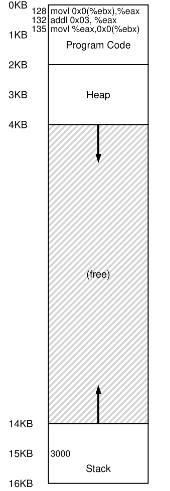
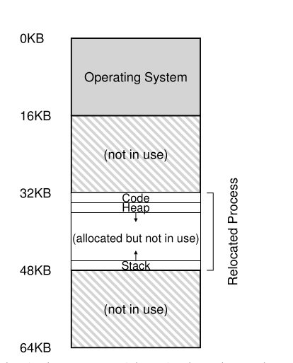
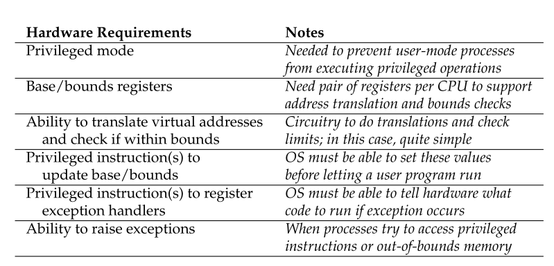

# Parte I &rarr; Virtualizacion

Temas:

* [Procesos](./Procesos.md)
* [API de procesos](./API-de-procesos.md)
* [Ejecucion directa limitada](#mecanismo-ejecucion-directa-limitada)
* [Planificacion](#introduccion-planificacion-scheduling)
* [Planificacion multinivel](#planificador-la-cola-de-retroalimentacion-multinivel)
* [La abstraccion del espacio de direcciones](#la-abstraccion-espacios-de-memoria)
* [API de memoria](#interlude-api-de-memoria)
* [El mecanismo de traduccion de direcciones](#mecanismo-traduccion-de-direcciones): &larr; Usted esta aqui

  * [Suposiciones](#suposiciones)\
  * [Un ejemplo](#un-ejemplo)
  * [Reubicacion Dinamica (Hardware-based)](#reubicacion-dinamica-hardware-based)

    * [Ejemplo de traduccion](#ejemplo-de-traduccion)

  * [Soporte del Hardware: Resumen](#soporte-del-hardware--resumen)
  * [Problemas del OS](#problemas-del-os)

* [Segmentacion](./Segmentacion.md)
* [Administracion de espacio libre](./Espacio-libre.md)
* [Paginacion](Virtualizacion-Paginacion.md)
* [TLBs](Virtualizacion-TBLs.md)
* [Archivo de intercambio, mecanismo y politica](Virtualizacion-Archivo-de-intercambio-mecanismos-politica.md)

Bibliografia: [OSTEP Cap - 15 Mechanism: Address Translation](https://pages.cs.wisc.edu/~remzi/OSTEP/vm-mechanism.pdf)

## Mecanismo: Traduccion de Direcciones

&emsp;En el desarrollo de la **virtualizacion de la CPU**, nos centramos en un mecanismo general conocido como **ejecucion directa limitada (LDE)**. La idea detras de LDE es simple: para la mayor parte, dejar al programa ejecutarse directamente en el hardware; sin embargo, en ciertos puntos clave de tiempo (como cuando un procesos hace una system call, o cuando ocurre una interrupcion), organizar que el OS se involucre y se asegure de que pasen cosas "correctas". Por los tanto, el OS, con un poco de ayuda del hardware, hace todo lo posible para salir del camino del programa en ejecucion, para entregar una virtualizacion eficiente; sin embargo, interponiendose en puntos criticos, el OS se asegura de mantener el control sobre el hardware. Eficiencia y control son de de los objetivos principales de cuanlquier OS moderno.</br>
&emsp;En la **virtualizacion de la memoria**, propusimos una estrategia similar, logrando eficiencia y control mientras proveiamos la virtualizacion deseada. La eficiencia dicta que hagamos uso del soporte del hardware, el cual al principio sera un poco rudimentario (solo un par de registros) pero que crecera hasta ser bastante complejo(TBLs, soporte de tablas de paginas, etc.). El control implica que el OS se asegure que ninguna aplicacion puede entrar a cuaquier parte de la memoria que no sea la de la misma aplicacion; por lo tanto, para proteger aplicaciones una de la otra, y al OS de las aplicaciones, necesitaremos ayuda del hardware. Finalmente, necesitaremos un poco mas que solo VM, en terminos de *flexibilidad*; especificamente, nos gustaria que los programas sean capaces de usar su espacio de direcciones en la forma que ellos quieran, haciendo al sistema mas facil de programar. Y llegamos al punto crucial: Como virtualizar memoria de forma eficiente y flexible? Como podemos mantener control sobre a que direcciones de memoria puede acceder una aplicacion, y asegurar que el acceso a memoria de la aplicacion esta restringido apropiadamente? Como hacemos todo esto eficientemente?</br>

&emsp;la tecnica general que vamos a usar, la cual puede considerar una adicion a la ejecucion derecta limitada, es algo a lo cual nos referimos como **traduccion de direccion basada en el hardware**, o simplemente **traduccion de direccion** para resumir. Con la traduccion de direcciones, el hardware tranforma cada acceso a memoria (fetch, load, store), cambiando la direccion **virtual** provista por la instruccion a una direccion **fisica** donde esta guardada la informacion deseada. Por lo tanto, en cada referencia a memoria, un traductor de direcciones es ejecutado por el hardware para redirigir referencia de memoria de la aplicacion a la ubicacion real en memoria.</br>
&emsp;Por supuesto, el hardware solo no puede virtualizar memoria, solo provee los mecanismos de bajo nivel para hacerlo de forma eficiente. El OS debe involucrarse en puntos clave para configurar el hardware para que se realicen las traducciones adecuadas; y, por lo tanto, debe administrar memoria, haciendoles seguimiento de cuales estan usadas y cuales libres, y juiciosamente intervenir para mantener el control de como esta siendo usada la memoria.</br>
&emsp;Otra vez, el objetivo de este trabajo es crear una hermosa **ilusion**: que el programa tiene su propia memoria privada, donde su codigo y datos estan. Detras de esta realidad virtual yace la hoorible verdad fisica: que realmente muchos programas estan compartiendo memoria al mismo tiempo, mientras que el/las CPU/s intercambian entre un programa en ejecucion y otro. A traves de la virtualizacion, el OS (con ayuda del hardware) transforma la fea relidad de la maquina es una util, podera y facil de usar abstraccion.</br>

### Suposiciones

&emsp;Nuestro primer ejemplo de virtualizacion de memoria sera muy simple, casi para reirse. Adelante, riete todo lo que quieras; muy pronto sera el OS el que se ria de ti, cuando intentes entender las entradas y salidas de TLBS, tablas de paginas multinivel, y otras maravillas tecnicas.</br>
&emsp;Especificamente, por ahora asumiremos que el espacio de direcciones del usuario debe ser ubicada contiguamente en la memoria fisica. Tambien asumiremos, para simplicidad, que el tamaño del espacio de direcciones no es muy grande; especificamente, que es *mas chico que el tamaño de la memoria fisica*. Finalmente, tambien asumiremos que cada espacio de direccion tiene el *mismo tamaño*. No te preocupes si estas suposiciones suenan irrelaistas; las relajaremos a medida que avancemos, hasta obtener una virtualizacion de memoria realista.</br>

### Un ejemplo

&emsp;Para entender mejor que necesitamos para implementar la traduccion de direcciones, y porque necesitamos tal mecanismo, vemos un simple ejemplo. Imagina un procesos cuyo espacio de direcciones es el siguiente:</br>



&emsp; Lo que vamos a examinar es una secuencia de codigo que carga un valor desde la memoria, lo incrementa en 3, y lo guarda de nuevo en la memoria. Puedes imaginar la representacion de este codigo en C seria algo asi: </br>

```c
void func(){
  int x = 3000;
  x = x + 3; //lide of code we are interesed in
}
```

&emsp;El compilador traduce esta linea de codigo a assembly, la cual se ve algo asi (en assembly x86). Usa *objdump* en Linux o *otool* en Mac para desensamblarla:</br>

```assembly
  movl 0x0 (%ebx), %eax  ;load 0+ebx into eax
  addl $0x03, %eax       ;add 3 to eax register
  movl %eax, 0x0 (%ebx)  ;store eax back to mem
```

&emsp;Este fragmento de codigo es bastante directo; asume que la direccion de *x* ha sido puesta en el registro *ebx*, entonces carga el valor de esa direccion en el resgistro de proposito general *eax* usando la instruccion *movl*. La siguiente instruccion add 3 a *eax*, y la instruccion final guarda el valor de *eax* de nuevo en la memoria en la misma ubicacion.</br>
&emsp;En la imagen observamos como el cogido y los datos son dispuestos en el espacio de direcciones del proceso; la secuencia de codigo de tres instrucciones esta ubicada en la direccion 128, y el valor de la variable *x* en la direccion 15KB. El valor incial de x es 3000.</br>
&emsp;Cuando se ejecutan las instrucciones, desde la perspectiva del proceso, se ejecutan los siguientes accesos a memoria:</br>

* **Fetch**: se busca al instruccion en la direccion 128
* **Execute**: se ejecuta la instruccion (cargar de la direccion 15KB)
* **Fetch**: se busca la instuccion en la direccion 132
* **Execute**: se ejecuta la instruccion (sin referencia a memoria)
* **Fetch**: se busca la instruccion en la direccion 135
* **Execute**: se ejecuta la instruccion (guardar en la direccion 15KB)

&emsp;Desde la perspectiva del programa, su **espacio de direcciones** comienza en la direccion 0 y crece hasta un maximo de 16KB; todas las referencias de memoria que genera deben estar en ese rango. Sin embargo, al virtualizar memoria, el OS quiere ubicar el proceso en cualquier parte de la memoria fisica, no necesariamente en la direccion 0. Por lo tanto, tenemos un problema: como podemos **reubicar** ese proceso en la memoria de forma que sea **transparente** para el proceso? Como podemos proprosionar la ilusion de un espacio de direcciones virtual que empiece en 0, cuando en realidad el espacio de direcciones esta ubicado en algun otro lugar de la memoria fisica?</br>
&emsp;En la siguiente imagen hay un ejemplo de como se deberia ver la memoria fisica una vez que el espacio de direcciones de este proceso ha sido ubicado en memoria.</br>



&emsp;En la figura, puedes ver al OS usando el primer slot de la memoria fisica para el mismo, y que ha reubicado el proceso en el slot que empieza en la direccion 32KB de la memoria fisica. Los otros dos slots estan libres.</br>

### Reubicacion Dinamica (Hardware-based)

&emsp;Para entender mas sobre la traduccion de direcciones basada en el hardware, primero discutiremos su primera encarnacion. Introducida en las primeras maquinas de tiempo compartida a finales de los 50's es una idea simple a la cual nos referimos como **base y limites**; aunque tambien se la conoce como **reubicacion dinamica**; usaremos ambos terminos de forma indiscriminada.</br>
&emsp;Especificamente, necesitaremos dos registros de hardware en cada CPU: uno es llamada resgistro **base**, y el otro **limite**. Este par base-limite nos permitira ubicar el espacio de direcciones en cualquier lugar que querramos de la memoria fisica, y asi asegurarnos que el proceso solo puede accedera su espacio de direcciones.</br>
&emsp;En esta configuracion, cada programa es escrito y compilado como si hubiera sido cargado en la direccion creo. Sin embargo, cuando un programa comienza a ejecutarse, el OS decide donde ubicarlo en la memoria fisica y configura el registro base con ese valor. En el ejemplo de arriba el OS decidio cargar el proceso en la direccion fisica 32KB y por lo tanto configura el el registro base con ese valor.</br>
&emsp;Cosas interesantes comienzan a suceder cuando el proceso se ejecuta. Ahora, cuando cualquier referencia a memoria es generada por el proceso, es **traducida** por el procesador de la siguiente manera:</br>

$$physical\_address = virtual\_address + base$$

&emsp;Cada referencia de memoria genreda por el proceso es una **direccion virtual**; el hardware de turno agrega el contenido del registro base a esa direccion y el resultado es una **direccion fisica** que puede ser emitida al la memoria del sistema.</br>
&emsp;Para entender esto mejor, analicemos que sucede cuando se ejecuta una sola instruccion. Especificamente, veamos una instruccion de la secuencia anterior:</br>

```assembly
  movl 0x0 (%ebx), %eax    
```

&emsp;El program counter (PC) es setteado en 128; cuando el hardware necesita buscar una instruccion, primero agrega el valor al valor del registro base de 32KB (32768) para obtener la direccion fisica 32896; entonces el hardware busca la instruccion desde la memoria fisica. Despues, el procesador comienza a ejecutar al instruccion. En algun punto, emite una carga desde la memoria virtual 15KB, la cual el procesador la toma y de nuevo agrega al registro base (32KB), obteniendo la deireccion fisica final de 47KB y por lo tanto el contenido deseado.</br>
&emsp;Transformar una direccion virtual en una direccion fisica es la tecnica a la que nos referiamos con **traduccion de direcciones**; el hardware toma una direccio virtual que el proceso cree que esta referenciando y la transforma en una direccion fisica la cual es donde realmente estan los datos. Dado que la reubicacion de la direccion sucede en tiempo de ejecucion, y dado que podemos mover el espacio de direcciones incluso despues de que el proceso comienza a ejecutarse, esta tecnica a veces es conocida como **reubicacion dinamica**.</br>
&emsp;Ahora te estaras preguntando: que le sucede a ese registro limite? Despues de todo, este no es un enfoque de base *y* limite? Por supuesto que lo es. Como habras supuesto, el registro limite esta para ayudar con la proteccion. Especificamente, el proceso primero verificara que la memoria refenciada este dentro de los *limites* para asegurarse que es legal; en el ejemplo de arriba, el registro limite siempre estara seteado en 16KB. Si un proceso genera una direccion virtual que es mas grande que el limite, o es negativa, la CPU lanzara un excepcion, y probablemente el proceso sera detenido. El punto del limite es asugurarse que todas las direcciones generadas por el procesos sean legales y esten dentro de los limites de ese proceso.</br>
&emsp;Debemos notar que los registros base y limite son estructuras de hardware que estan ubicados en el chip (un par por cada CPU). A veces la gente llama a esta parte del procesador que ayuda con la traducciones de direcciones **memory management unit (MMU) (Unidad de Administracion de Memoria)**; a medida que desarrollemos tecnicas de administracion de memoria mas avanzadas, agregaremos mas circuitos a las MMU.</br>
&emsp;Una pequeña cosa sobre los registros de limites. Los cuales pueden ser definidos de una de dos formas. Una forma (como la de arriba), mantiene el *tamaño* del espacio de direcciones, y por lo tanto el hardware verifica la memoria virtual primero, antes de agregarle la base. Y la segunda forma, mantiene la *direccion fisica* del final del espacio de direcciones, y por lo tanto el hardware primero agrega la base y entonces se asegura que este dentro de los limites; por simplicidad, asumiremos el primer metodo.</br>

#### Ejemplo de traduccion

&emsp;Para entender la traduccion de direcciones via base-y-limite con mas detalle veamos un ejemplo. Imagina un proceso con un espacio de direcciones de tamaño de 4KB (si, irrealisticamente chica) ha sido cargada en la direccion fisica 16KB. Aqui estan los resultados de algunas traducciones de direcciones.</br>

| Vitual Address | | Physical Address |
| :---: | :---: | :---: |
| 0 |&rarr;| 16KB |
| 1KB |&rarr;| 17KB |
| 3000 |&rarr;| 19384 |
| 4400 |&rarr;| *Fault (out of bounds)* |

&emsp;Como puedes ver en el ejemplo, es facil simplemente agregar la direccion base a la direccion virtual (la cual puede ser vista correctamente como un *offset* dentro del espacio de direcciones) para obtener la direccion fisica resultante. Solo si la direccion virtual es demasiado grande o negativa resultara en una falla de resultado, causando que se lance una excepcion.</br>

### Soporte del Hardware : Resumen

&emsp;Permitenos resumir el soporte que necesitamos del hardware (primero mira la siguiente imagen)</br>



&emsp;Primero, como discutimos en el capitulo de la virtualizacion de la CPU, necesitamos dos modos diferentes de CPU. El OS corre en **modo privilegiado** o **modo kernel**, donde tiene acceso a la maquina entera; las aplicaciones corren en modo **modo usuario**, donde estan limitados en que pueden hacer. Un solo bit, obviamente guardado en algun tipo de **palabra del estado del procesador**, indica en que modo esta actualmente el CPU, en ciertas ocasiones especiales el CPU cambia de modo.</br>
&emsp;El hardware tambien debe proporsionar los registros base y limite, cada CPU tiene un par adicional de registros, parte de la unidad de administracion de memoria **MMU** de la CPU. Cuando un programa de usuario se esta ejecutando, el hardware traducira cada direccion, agregando el valor base a la direccion virtual generada por el programa. El hardware tambien de ser capaz cuando la direccion es valida, lo cual se logra usando el registro limite y algun circuito en la CPU.</br>
&emsp;El hardware debe proporsionar instrucciones espaciales para modificar los registros base y limite, permitiendole al OS modificarlos cuando se ejecutan diferentes procesos. Esas instrucciones son **privilegiadas**; solo en modo kernel pueden modificarse los registros. Imagina el desastre que podria infligir un usuario si pudiera cambiar arbitrariamente esos registros mientras se ejecuta su programa.</br>
&emsp;Finalmente, la CPU debe ser capaz de generat **excepciones** en situaciones donde un programa de usuario intene acceder a memoria ilegalmente; en ese caso, la CPU deberia detener la ejecucion del programa de usuario y hacer arreglos para que se ejecute el manejador de excepciones "fuera-de-limites" del OS. El manejador del OS puede averiguar como reaccionar, en este caso probablmente terminado el proceso. Similarmente, si un programa de usuario intenta cambiar los valores de los registros base y limite, la CPU deberia lanzar una excepcion y ejecutar el manejador "tired to execute a privileged operation while in user mode". La CPU tambien debe proporsionar un metodo para informar la ubicacion de estos controladore, y por lo tanto son necesarias mas instrucciones privilegiadas.</br>

### Problemas del OS

&emsp;Solo porque el hardware proporsiona nuevas caracteristicas para soportar reubicacion dinamica, el OS ahora tiene nuevos problemas que debe manejar; la combinacion de soporte de hardware y administracion del OS guia a la implementacion de una simple memoria virtual. Especificamente, hay varias coyunturas criticas donde el OS debe intervenir para implementar nuestra version base-y-limites de memoria virtual.</br>
&emsp;Primero, el OS debe entrar en accion cuando un procesos es creado, encontrar espacio en la memoria para su espacio de direcciones. Afortunadamente, dadas nuestras suposiciones , (a) que cada espacio de direcciones es mas chica que el tamaño de la memoria fisica y (b) que todos los espaciones de direcciones son del mismo tamaño, es un poco facil para el OS; simplemente ve la memoria fisica como una cadena de slots, y rastrea si alguno esta libre o en uso. Cuando un proceso nuevo es creado, el OS tiene que buscar una estrutura de datos (a menudo llamada **free list**) para encontrar espacio para el nuevo espacio de direcciones y entonces marcarlo como usado. Con el espacio de direcciones es variable, la vida es mas complicada.</br>
&emsp;Veamos un ejemplo.</br>


&emsp;Puedes ver al OS usando el primer slot de la memoria fisica para el mismo, y que tiene al proceso de ese ejemplo reubicado en el slot que empieza en la direccion de la memoria fisica 32KB. Los otros dos slots estan libres; por lo tanto, la free list deberia consistir de esas dos entradas.</br>
&emsp;Segundo, el OS deberia hacer algun trabajo cunado un proceso se termina, reclamando toda su memoria para usar en otro proceso o en el OS.En la terminacion de un proceso el OS pone de vuelta esa memoria en la free list, y limpia cualquier estructura de dato asociada.</br>
&emsp;Tercero, el OS debe hacer algunos pasos adicionales cuando ocurre un cambio de contexto. Hay solo un par de registros base y limite en cada procesador, despues de todo, y sus valores difieren por cada programa en ejecucion, ya que cada programa es cargado en una direccion de memoria fisica diferente. Por lo tanto el OS debe *guardar y retomar* el par base-y-limite cuando cambia entre procesos. Especificamente, cuando el OS decide parar de ejecutar un proceso, debe guardar esos valores en memoria, en alguna estructura por proceso como la **process structure** o el **process control block (PCB)**. Similarmente, cuando el OS remota un proceso, o lo ejecuta por primera vez, debe establecer los valores de base y limite en la CPU a los valores corrector de ese proceso.</br>
&emsp;Debemos darnos cuenta que cuando un proceso esta parado, es posible para el OS mover un espacio de direcciones de una ubicacion a otra mas facilmente. Para mover el espacio de direcciones de un proceso, el OS primero desplanifica el proceso; luego, el OS copia el espacio de direcciones de la ubicacion actual a una nueva ubicacion; finalmente, el OS actualiza el registro base guardado al punto de la nueva ubicacion. Cuando un proceso es retomado, su nuevo resgistro base es recuperado, y comienza a ejecutarse de nuevo, sin saber que sus instrucciones y datos ahora estan en un lugar completamente difertente de la memoria.</br>
&emsp;Cuarto, el OS debe proporsionar un **manejador de excepciones**, o funciones para ser llamadas, como discutimos arriba; el OS instala esos manejadores en tiempo de booteo. Por ejemplo, si un proceso intenta acceder a memoria fuera de sus limites, el OS lanzara una excepcion; el OS debe estar preparado para entrar en accion cunado surga una excepcion como esa. La reaccion comun del OS sera un hostil: probablemente terminara con el proceso. El OS debe ser tremendamente de la maquina en la que se esta ejecutando, por lo tanto no tomara amablemente a un proceso que intenta acceder a memoria o ejecutar una instruccion que no deberia.</br>
&emsp;Los siguientes cuadros ilustran mucho de la interaccion hardware/OS en una linea de tiempo.</br>

| **OS @ boot (kernel mode)** | **Hardware** |
| :---: | :---: |
| **initialize trap table** | |
| | remember addresses of... |
| | system call handler |
| | timer handler |
| | illegal mem-access handler |
| | illegal instruccion handler |
| **start interrupt timer** | |
| | start timer; interrupt after X ms |
| **initilize process table** | |
| **initialize free list** | |

| **OS @ run (kernel mode)** | **Hardware** | **Program (user mode)** |
| :---: | :---: | :---: |
| **To start process A:** | | |
| allcoate entry in process table | | |
| alloc memory for process | | |
| set base/bound registers | | |
| **return-from-trap** (into A)| | |
| | restore registers of A | |
| | move to **user mode** | |
| | jump to A's (intial) PC | |
| | | **Proces A runs** |
| | | Fecth instruccions |
| | translate virtual address | |
| | perform fecth | |
| | | execute instruccion |
| | if explicit load/store: | |
| |   ensure address is legal | |
| | trnslate virtual address | |
| | perform loas/store | |
| | | (A runs..) |
| | **Timer interrupt** | |
| | move to **kernel mode** | |
| | jump to handler | |
| **Handler timer** | | |
| decide: stop A, run B | | |
| call *switch()* routine | | |
| save regs(A) | | |
| to proc-struct(A) | | |
| (including base/bounds) | | |
| restore regs(B)| | |
| (including base/bounds) | | |
| **return-from-trap** (into B) | | |
| | restore registers of B | |
| | move to **user mode** | |
| | jump to B's PC | |
| | | **Process B runs** |
| | | execute bad load |
| | load is oput-of-bounds; |  |
| | move to **kernel mode** | |
| | jump to trap handler | |
| **Handle the trap** | | |
| decide to kill proces B | | |
| deallocate B's memory | | |
| free B's entry | | |
| in process table | | |

&emsp;La primera tabla muestra que hace al OS al iniciarse para preparas la maquina para su uso, y la segunda muestra que sucede cuando un proceso (A) empieza a ejecutarse; notar como su traduccion de memoria es manejada por el hardware sin intervencion del OS. En algun punto, una interrucion ocurre, y el OS cambia al proceso B, el cual ejecuta una mala carga; en este punto, el OS debe intervenir, terminando el proceso y limpiandolo liberando la memoria de B y remiviendo su entrada de la tabla de procesos. Como puedes ver en los cuadros, todavia estamos siguiendo el enfoque de ejecucion directa limitada. En muchos casos, el OS solo configura el hardware apropiadamente y deja a los procesos ejecutarse directamente en la CPU; solo cuando el proceso se comporta mal hace que el OS se involucre.</br>

[Anterior](./API-memoria.md) [Siguiente](./Segmentacion.md)
